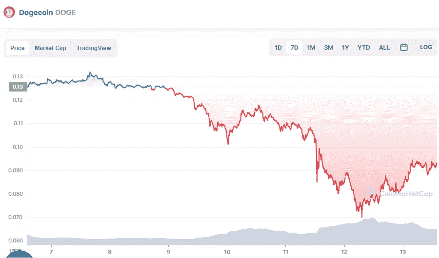

# DogeCoin 五月投资好吗？

> 原文：<https://medium.com/coinmonks/is-dogecoin-a-good-investment-in-may-cc6515ff139d?source=collection_archive---------38----------------------->

Source photo [Dogecoin price today, DOGE to USD live, marketcap and chart | CoinMarketCap](https://coinmarketcap.com/currencies/dogecoin/)

DOGe 价格走势图 DOGE 的价格在过去一天上涨了 25.19%，交易价格为 0.0923 美元。另一方面，迷因币在上周下跌了 28.17%。在看相对强弱指数(RSI)时，DOGE 处于欠买区。对于投资者来说，这个 RSI 是买入 DOGE，随市场攀升的绝佳时机。