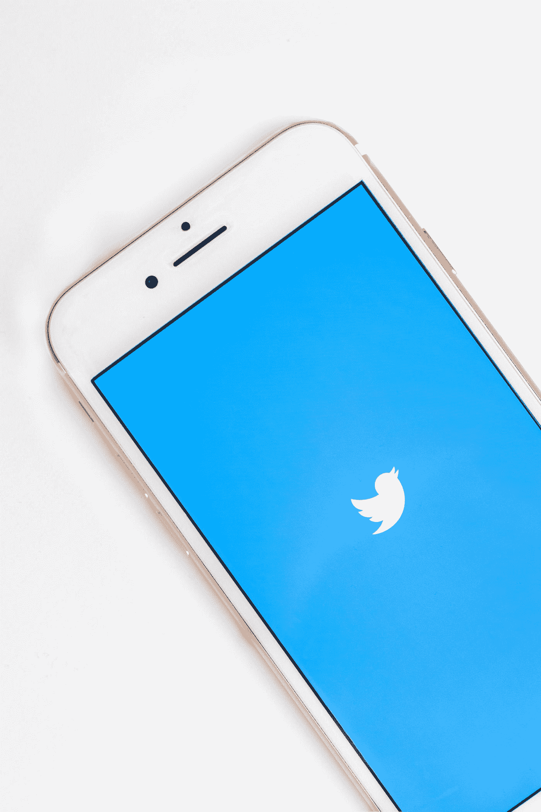

# 最新消息:埃隆·马斯克希望 Twitter 更加民主。他成为最大的股东之一。

> 原文：<https://medium.com/coinmonks/is-elon-musk-going-to-buy-twitter-d713f0b1c715?source=collection_archive---------8----------------------->

这位独一无二的特斯拉和 SpaceX 的创始人，也是世界上最富有的人之一，因其不同寻常的言论而闻名。他现在做了什么？

Photo by [Sara Kurfeß](https://unsplash.com/@stereophototyp?utm_source=medium&utm_medium=referral) on [Unsplash](https://unsplash.com?utm_source=medium&utm_medium=referral)

***更新 4.4.2022:真不敢相信是他干的。***

***他真的买了 Twitter 的股份*** [***成为最大股东***](https://www.nbcnews.com/tech/tech-news/elon-musk-takes-9-percent-stake-twitter-slamming-companys-free-speech-rcna22805) ***r .难以置信*** …