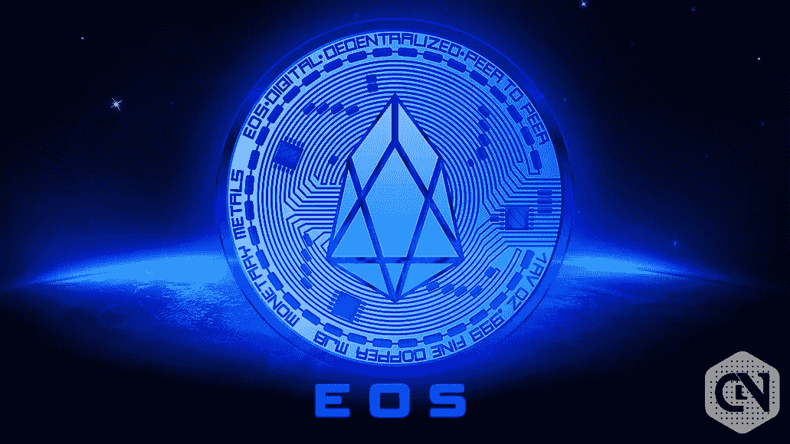

# EOS 是一个好的投资吗？

> 原文：<https://medium.com/coinmonks/is-eos-a-good-investment-285c2630e7d5?source=collection_archive---------20----------------------->

Source photo [eos crypto — Bing images](https://www.bing.com/images/search?view=detailV2&ccid=DjL%2fjNX%2f&id=FE0790B8C925DF12EAF0E20D8C7288CC0B058871&thid=OIP.DjL_jNX_N1HSfpUrBm6mTQHaEK&mediaurl=https%3a%2f%2fwww.cryptonewsz.com%2fwp-content%2fuploads%2f2019%2f04%2fEOS-Cryptonewsz-14.jpg&cdnurl=https%3a%2f%2fth.bing.com%2fth%2fid%2fR.0e32ff8cd5ff3751d27e952b066ea64d%3frik%3dcYgFC8yIcowN4g%26pid%3dImgRaw%26r%3d0&exph=580&expw=1031&q=eos+crypto&simid=608007837144845131&FORM=IRPRST&ck=8B3EE9E23FFBA7D7A60B9E6AFE563F56&selectedIndex=0&ajaxhist=0&ajaxserp=0)

就最初的硬币发行而言，EOS 是其中较好的一个。根据 CoinMarketCap 的数据，该价格在 2018 年 4 月 29 日达到了 22.89 美元的历史新高。许多人认为这将提供更大的回报，因为包括比特币、以太币、莱特币和 XRP 在内的五大加密货币中的大多数目前都在经历调整。然而，目前的数据显示，EOS 是性能最低的…