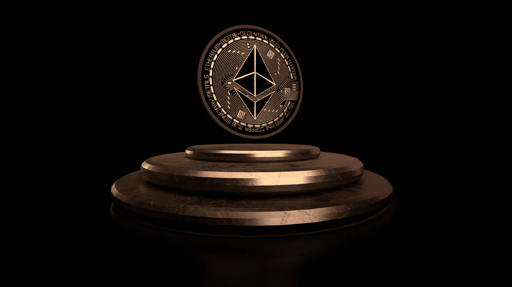

# 以太坊和索拉纳是今天的好买卖吗？

> 原文：<https://medium.com/coinmonks/is-ethereum-and-solana-a-good-buy-today-295dbbcc06e5?source=collection_archive---------53----------------------->

Source photo Unsplash.com

# 以太坊

加密货币市场上最受欢迎的 altcoin 是以太坊。分散应用程序(dapp)覆盖了从 DeFi 计划到不可替代的令牌(NFT)市场的所有内容，由于其先发优势，现在是最大的分散应用程序网络。

此次合并是目前正在开发中的网络大修。它将通过切断气体来帮助以太坊的发展…