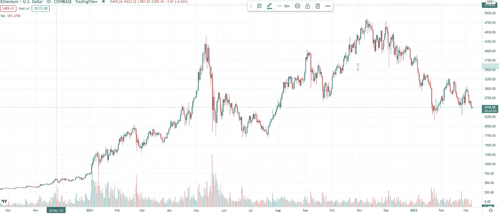
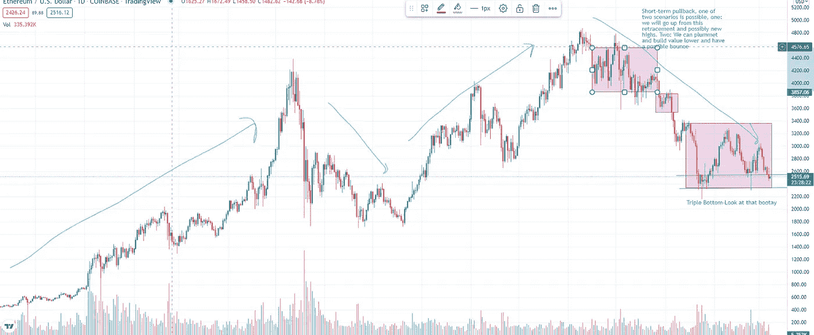

# 以太坊是摔死的吗？

> 原文：<https://medium.com/coinmonks/is-ethereum-falling-to-death-127a7ab2fb3b?source=collection_archive---------52----------------------->

“vitalik buterin clearly still alive

“帮助某人拯救以太坊吧，它正处于死亡的边缘，”他说。一边看着市场恐慌，一边像莎翁戏剧的悲剧结局一样慢慢摔死。这将是以太坊的终结吗？这基本上是大多数人开始交易时的共识。他们看到人们在互联网上告诉他们“嘿，看看我的，甜蜜的车库，我从加密中赚了一大笔钱，你也可以”。他们最喜欢的唯一有效的方法就是金融教育这种营销策略。可笑；当这些大师告诉你各种各样的堆应该是有效的，而实际上却是一派胡言时，真是可笑。让我们进入需要回答的最重要的问题。以太坊近期走向何方？如果你不了解以太坊的基本原理，让我给你一个简单的介绍。基本上，以太坊是一个去中心化的平台，用于创建各种东西，比如代币和智能合约。像大多数密码一样，它们需要有一个目的，以便作为加密货币蓬勃发展。简短，但仍然让我们看一下图表(仅供参考，我不是财务顾问，所以对我的预测要有所保留。)并画出一些技术分析，因为一个规则而像魔咒一样起作用:未来行为，影响当前行为。这部作品是一个自我实现的预言。因为如果人们使用它，它一定会起作用。

A daily chart

所以，当我们看图表时，我们希望从最大的时间框架到最小的时间框架。我们希望看到水平和垂直时间框架上的成交量。交易量非常重要，因为没有交易量，你不可能有任何动作，因此也就不可能交易(有趣的事实交易者称之为“缺乏流动性”))所以让我画出支撑线、阻力线和成交量曲线图。在我看来，这些是最重要的，因为其他指标都是从价格中衍生出来的。

My predictions

好的，看看这个图表，正如你所看到的这是以太坊的图表，写这篇文章的时间是 2022 年 3 月 7 日，也就是瞌睡虫乔的那一周。我们处于长期看涨的背景下，中期看跌，现在我们正在最短的时间框架内进行平衡。这是我的预测，因为我们在平衡，如果我们打破平衡，我们肯定可以走得更高。大概破 3000，4000 测试阻力。如果这没有发生，我们可能会花更多的时间来平衡，并最终打破这种或那种方式。因为这是市场往往会出现的情况，平衡日或趋势日，当你看到纯动力表明趋势朝两个方向移动时。因此，如果我们打破目前的平衡，我们可能会以这样或那样的方式发展。如果你是个空头，就要小心了。因为你真的会像一瓶番茄酱一样被挤压。真是一团糟。所以记得做你的研究，每天学习，当有疑问的时候就出来。

真诚的，乔纳森