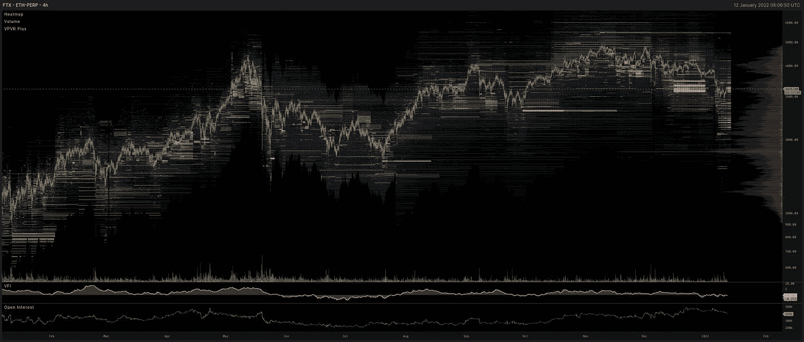

# 以太坊会再次下跌吗？

> 原文：<https://medium.com/coinmonks/is-ethereum-in-line-for-another-hit-to-the-downside-11c76cd01d77?source=collection_archive---------6----------------------->

从山顶上看，照耀在下面大地上的光线能给我们留下一种庄严的、近乎神圣的感觉。我们生活在一个多么美丽的世界啊。真是一个神奇的地方。当我们下山时，离雾越来越远，我们必须再次满足于现实，我们不能永远生活在云里。我们必须回到原点，重新开始爬山。然后一次又一次。永远永远地。

我们又回到了那座隐喻的小山上。市场暂时打破了下降趋势，至少暂时如此。在今天早上 FTX 的订单簿上，在整个市场的协调下，我们可以看到交易商正在推高价格。

过去 24 小时在**3230 美元**产生了一个支撑 VPVR 控制点，阻力徘徊在 **3260** 附近，在我写这篇文章时，我们正在试图克服这个阻力。

同样可见的是，下一袋流动性可能会在 **3340** 区域充当短期阻力，比当前价格上涨约 100 美元(3%)。

缩小一个月，我们注意到在 1 月 5 日暴跌前几天，我们现在交易的范围内有大量订单被取消。管理这个订单的人现在“买入”的可能性有多大？在我看来，相当不错。这就是建立支持的方式。鉴于 **3200** 和 **3800** 之间的 VPVR 差距如此之大，我们应该花一些时间填补漏洞，以确保我们开始回升时的流动性。

如果我们在未来几周不出现市场普遍抛售的暴跌，那么这就是我预计 ETH 近期的交易区间。

进一步支持，VPVR(特定范围内的交易量)表明在 **2.3k** 和 **2.1k** 之间有强有力的支撑，尽管两者之间的流动性很少。只要这些区间没有被彻底交易，预计大幅度的剧烈波动将持续下去。如果我们回来交易它们，也不要惊讶。

关掉订单簿，看着一些 FIB，我可以看到阻力的证据就在我们目前的水平之上，下跌支撑在 **3k** ，每天都在上涨。如果我们错过了 3k ，我不会惊讶地看到接下来会有大的痛苦。即使我们上涨到 3.4k，然后跌破支撑线，这也是为空头设置的陷阱。

再一次，与之前的观察结果汇合， **3.4k** 至 **3.5k** 阻力是黄金。

我们目前所处的模式可以被发现在过去多次重复。

对比 11 月 15 日从**4.7k**(ATH 附近)回撤至 **4k** 的实例，我们看到以下情况。壳里的鬼。

LEFT: Current Pattern in play. RIGHT: How pattern played out from November 15th.

正如我们所说的，历史可能不会完全重演，但它肯定会有*节奏*。如果我们看看它是什么，不管我们现在是否有一个泵达到 **3.4k** 阻力，如果做市商像以前一样沿着类似的轨迹前进， ***我们应该期待价格在未来几周内多次重新测试当前水平。前方更多横盘动作，除非我们攻克 3.4k 并守住它作为支撑。*** 哎哟。我不想说出来，这种想法太不愉快了。很抱歉。

在另一个喜忧参半的消息方面，我看到了来自 Intothecryptoverse.com 的 Ben Cowen 的一个很好的分析视频，他在视频中看了一眼 LINKETH 的估值。从一个链接持有者的角度来看，它并不好。他展示了一个代表泡沫周期的简单模型，显然可以在一些标准教科书中找到。

LINKETH pair, building up steam or continued drawdowns in sight?

我看了一下 ETHBTC。如果我们继续简单地寻找形状，无可否认，充其量是牵强的想象，所以要有所保留……基于这个广义泡沫模型，在已经经历了 2017 年爆发的低阶泡沫之后，现在可能会继续扩展。

如果它发挥出来，瑞士联邦理工学院可能会期待峰值看到超过 100%的收益，但仍然对 BTC。如果 BTC 持平，我们可以预期在当前水平上有 100%的增长。BTC 不会是平坦的。BTC 也会崛起，使 ETH 的发展更快。

真实与否。我们走着瞧。不管怎么说，这是个美好的想法。我就此结束，做个总结。

*ETH 价格正试图从 3.2k 区间向 3.8k 移动。中途~3.4k 我们面临着 FIB 黄金口袋，所以在从更高水平拉回后，这可能是一个期待拒绝或确认重新测试的好地方。如果我们不能很快走出这个区间，预计未来几周价格会多次试探当前水平。前方更多横盘动作，除非我们攻克 3.4k 并守住它作为支撑。* *范围底侧看起来是 3k 偶数。我们需要保持这个水平，否则我们会承受更多的痛苦。这将是我们真正处于熊市的一个潜在的致命一击，官方的，非官方的。*

谢了。冷静点。学习。找到你的水平。设定你的买入限额、止损限额和止盈限额。观察。不要反应。赢了。 ***鼓掌，喜欢，+1，订阅并关注更多！***

*   每月新增免费指标:[https://www.tradingview.com/u/calmrat/](https://www.tradingview.com/u/calmrat/)
*   分析，预测，交易:[https://medium.com/@calmrat](/@calmrat)
*   https://twitter.com/calmrat 的
*   insta gram:【https://www.instagram.com/calmratcrypto/ 
*   https://www.facebook.com/calmratcrypto:[脸书](https://www.facebook.com/calmratcrypto)

交易奖金，折扣和更多…

*   *Crypto.com—*[*https://crypto.com/exch/v4n3pauckj*](https://crypto.com/exch/v4n3pauckj)
*   *https://accounts.binance.com/en/register?ref=346510770—*
*   **Bybit—*[*https://www.bybit.com/en-US/invite?ref=EKJRL*](https://www.bybit.com/en-US/invite?ref=EKJRL)*
*   **https://ftx.com/profile#a=60256726—*[*FTX*](https://ftx.com/profile#a=60256726)*
*   *交易视图—[https://www.tradingview.com/gopro/?share_your_love=calmrat](https://www.tradingview.com/gopro/?share_your_love=calmrat)*

> *加入 Coinmonks [电报频道](https://t.me/coincodecap)和 [Youtube 频道](https://www.youtube.com/c/coinmonks/videos)了解加密交易和投资*

## *另外，阅读*

*   *[3 商业评论](/coinmonks/3commas-review-an-excellent-crypto-trading-bot-2020-1313a58bec92) | [Pionex 评论](https://blog.coincodecap.com/pionex-review-exchange-with-crypto-trading-bot) | [Coinrule 评论](/coinmonks/coinrule-review-2021-a-beginner-friendly-crypto-trading-bot-daf0504848ba)*
*   *[莱杰 vs n rave](/coinmonks/ledger-vs-ngrave-zero-7e40f0c1d694)|[莱杰 nano s vs x](/coinmonks/ledger-nano-s-vs-x-battery-hardware-price-storage-59a6663fe3b0) | [币安评论](/coinmonks/binance-review-ee10d3bf3b6e)*
*   *[Bybit 交易所评论](/coinmonks/bybit-exchange-review-dbd570019b71) | [Bityard 评论](https://blog.coincodecap.com/bityard-reivew) | [Jet-Bot 评论](https://blog.coincodecap.com/jet-bot-review)*
*   *[3 commas vs crypto hopper](/coinmonks/3commas-vs-pionex-vs-cryptohopper-best-crypto-bot-6a98d2baa203)|[赚取加密利息](/coinmonks/earn-crypto-interest-b10b810fdda3)*
*   *最好的比特币[硬件钱包](/coinmonks/hardware-wallets-dfa1211730c6) | [BitBox02 回顾](/coinmonks/bitbox02-review-your-swiss-bitcoin-hardware-wallet-c36c88fff29)*
*   *[block fi vs Celsius](/coinmonks/blockfi-vs-celsius-vs-hodlnaut-8a1cc8c26630)|[Hodlnaut 审核](/coinmonks/hodlnaut-review-best-way-to-hodl-is-to-earn-interest-on-your-bitcoin-6658a8c19edf) | [KuCoin 审核](https://blog.coincodecap.com/kucoin-review)*
*   *[Bitsgap 审查](/coinmonks/bitsgap-review-a-crypto-trading-bot-that-makes-easy-money-a5d88a336df2) | [Quadency 审查](/coinmonks/quadency-review-a-crypto-trading-automation-platform-3068eaa374e1) | [Bitbns 审查](/coinmonks/bitbns-review-38256a07e161)*
*   *[加密复制交易平台](/coinmonks/top-10-crypto-copy-trading-platforms-for-beginners-d0c37c7d698c) | [Coinmama 评论](/coinmonks/coinmama-review-ace5641bde6e)*
*   *[印度加密交易所](/coinmonks/bitcoin-exchange-in-india-7f1fe79715c9) | [比特币储蓄账户](/coinmonks/bitcoin-savings-account-e65b13f92451)*
*   *[OKEx vs KuCoin](https://blog.coincodecap.com/okex-kucoin) | [摄氏替代品](https://blog.coincodecap.com/celsius-alternatives) | [如何购买 VeChain](https://blog.coincodecap.com/buy-vechain)*
*   *[币安期货交易](https://blog.coincodecap.com/binance-futures-trading)|[3 commas vs Mudrex vs eToro](https://blog.coincodecap.com/mudrex-3commas-etoro)*
*   *[如何购买 Monero](https://blog.coincodecap.com/buy-monero) | [IDEX 评论](https://blog.coincodecap.com/idex-review) | [BitKan 交易机器人](https://blog.coincodecap.com/bitkan-trading-bot)*