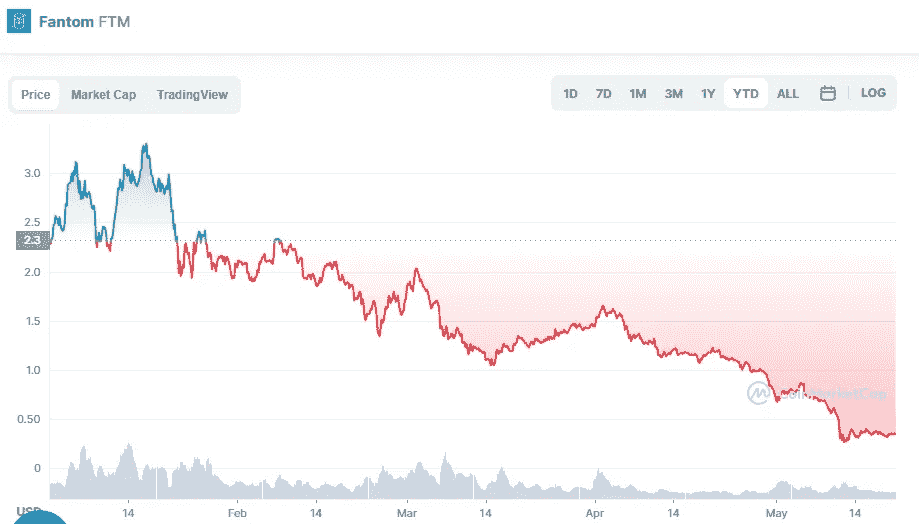

# Fantom (FTM)是一项好的投资吗？

> 原文：<https://medium.com/coinmonks/is-fantom-ftm-a-good-investment-802ad957efa?source=collection_archive---------17----------------------->

Source photo [Fantom price today, FTM to USD live, marketcap and chart | CoinMarketCap](https://coinmarketcap.com/currencies/fantom/)

由于速度快、成本低，自 2021 年以来，Fantom 在分散金融(DeFi)市场上迅速获得了认可。基于 Fantom 基于 DAG 的智能合约(d apps)的分散式应用平台。当前公共分布式分类帐系统的可扩展性困难是本研究的重点。FTM 是 Fantom 网络的首选货币。