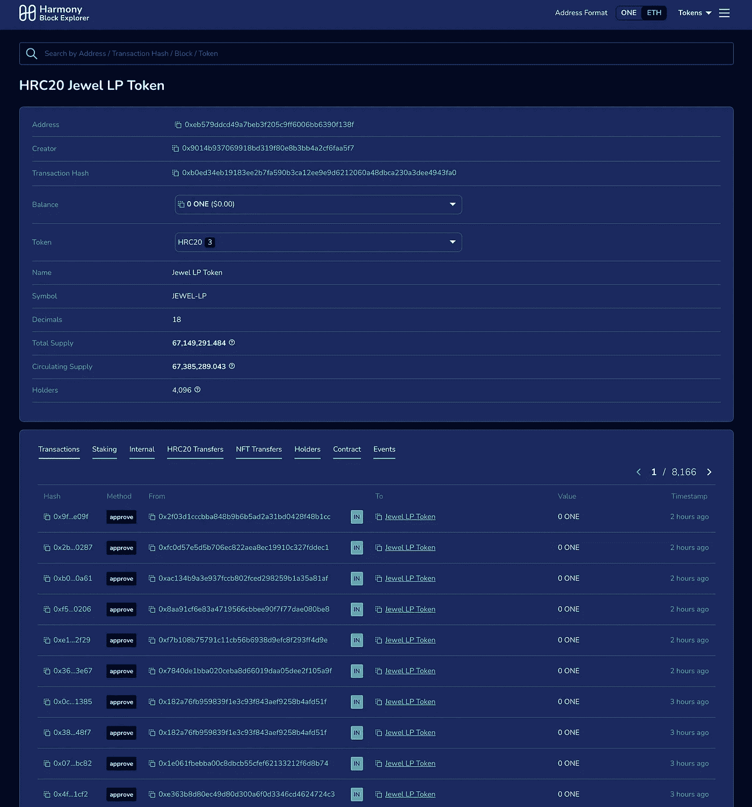
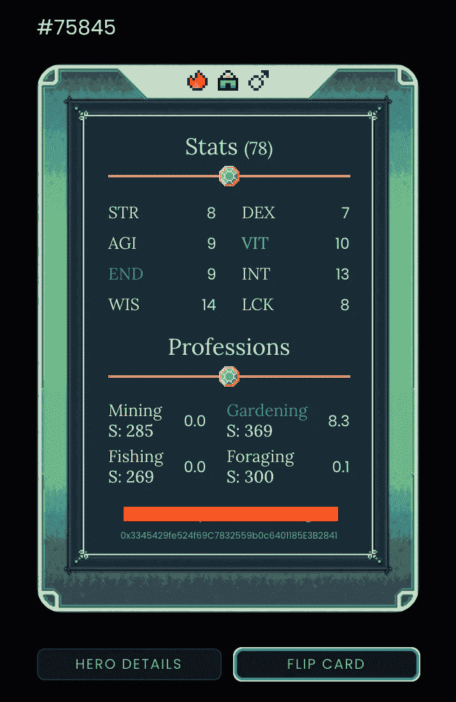

# 园艺值得努力吗？一次挑战王国的深潜

> 原文：<https://medium.com/coinmonks/is-gardening-worth-the-effort-a-defi-kingdoms-deep-dive-4c65b597226a?source=collection_archive---------6----------------------->

DeFi 王国的英雄可以通过执行任务获得珠宝代币。园艺就是这样一种探索。

2/每次任务获得的宝石数量由以下公式决定:

> **= launch bonus *(奖励池*池分配* LPowned *(0.1+(WIS+VIT)/1222.22+(grd skl)/244.44))/(43，200-(7200*geneBonus))**

**3/让我们用 JEWEL-ONE LP 中的一个具体例子来计算这个值。为此，我们将分别评估每个参数:**

**4/ **launchBonus:** 启动时应用的乘数，从 5 开始，每两周递减 0.5，直到值为 1.0。我们将把它设置为 5。**

**5/ **奖励池:**这是任务池钱包的余额，位于:[0 C5 ca 5 BCD 91929 c 7152 ca 577 E8 c 001 c 9 b5 a 185 f 568](https://explorer.harmony.one/address/0xeb579ddcd49a7beb3f205c9ff6006bb6390f138f)**

**奖励池= 67，149，291**

**6/ **池分配:**等于分配给 LP 的奖励池的百分比。对于 JEWEL-ONE LP:池分配= 49.56%**

**7a/ **LPowned:** 等于玩家拥有 LP 的百分比。这可以通过在市场上拜访德鲁伊来找到。不幸的是德鲁伊给出了一个截断的数字。幸运的是，我们可以通过访问 JEWEL LP 地址找到实际数量:[https://explorer . harmony . one/address/0 xeb 579 ddcd 49 a 7 beb 3f 205 c9ff 6006 bb 6390 f 138 f](https://explorer.harmony.one/address/0xeb579ddcd49a7beb3f205c9ff6006bb6390f138f)**

****

**[0xeb579ddcd49a7beb3f205c9ff6006bb6390f138f](https://explorer.harmony.one/address/0xeb579ddcd49a7beb3f205c9ff6006bb6390f138f)**

**7b/ LPowned = 392.5 / 67，149，291 = 0.0006%。我们还可以通过进一步检查 JEWEL LP 地址来计算 LPowned 的值…**

**JEWEL LP 持有 11，736，643 枚 JEWEL 和 432，021，145 枚 ONE tokens。按照目前的市场汇率，这等于总价值 152，423，415 美元，因此我们的价值为 152，423，415 美元* 0.0006% = 890 美元。**

**8/ **WIS，VIT，GrdSkl，geneBonus** :这些都是专门针对园艺的英雄。在我们的例子中，WIS = 14，VIT = 10，GrdSkl = 8.3，geneBonus = 1(因为我们的英雄是园丁)**

****

**9/我们终于有了需要计算的一切:earnRate(每点)= 5*(67，149，291 * 0.4956 * 0.000006 *(0.1+(14+10)/1222.22+(8)/244.44))/(43，200-(7200*1)) = 0.000845**

**10/将收益率乘以珠宝的当前价格(6.5 美元)将得到:赚得美元(每点)= $0.0055**

**11/因为我们的英雄有 26 的耐力，所以它可以每跑 26 次来赚取 26*0.0055 = $0.143。**

**12/我们的英雄可以以每 10 分钟一次的速度种花。所以每分钟赚的金额是:赚$(每分钟)= $0.143 / 260 = $0.00055。如果英雄持续种植，他将获得:收入$(每年)= $0.00055*60*24*365 = $289**

**13/我们的英雄需要休息 8 个小时，然后才能有效地进行下一次运行，因此我们每天只能运行 2 个完整周期，等于 260*2 = 520 分钟，这就给出:收入$(每天)= $0.00055*520 = $0.286 或每年$104。**

**14/ APR:我们在 LP 上投资了 891 美元，我们的英雄每年赚 104 美元。所以我们的 **APR 大概是 11.7%** = 104 / 891。**

> ****这个四月值得吗？你是法官。****

> **加入 Coinmonks [电报频道](https://t.me/coincodecap)和 [Youtube 频道](https://www.youtube.com/c/coinmonks/videos)了解加密交易和投资**

# **另外，阅读**

*   **[BigONE 交易所评论](/coinmonks/bigone-exchange-review-64705d85a1d4) | [电网交易机器人](https://coincodecap.com/grid-trading)**
*   **[氹欞侊贸易评论](https://coincodecap.com/anny-trade-review) | [CoinSpot 评论](https://coincodecap.com/coinspot-review)**
*   **[新加坡十大最佳加密交易所](https://coincodecap.com/crypto-exchange-in-singapore) | [购买 AXS](https://coincodecap.com/buy-axs-token)**
*   **[投资印度的最佳加密软件](https://coincodecap.com/best-crypto-to-invest-in-india-in-2021) | [WazirX P2P](https://coincodecap.com/wazirx-p2p)**
*   **[7 个最佳零费用加密交易平台](https://coincodecap.com/zero-fee-crypto-exchanges)**
*   **[最佳网上赌场](https://coincodecap.com/best-online-casinos) | [期货交易机器人](/coinmonks/futures-trading-bots-5a282ccee3f5)**