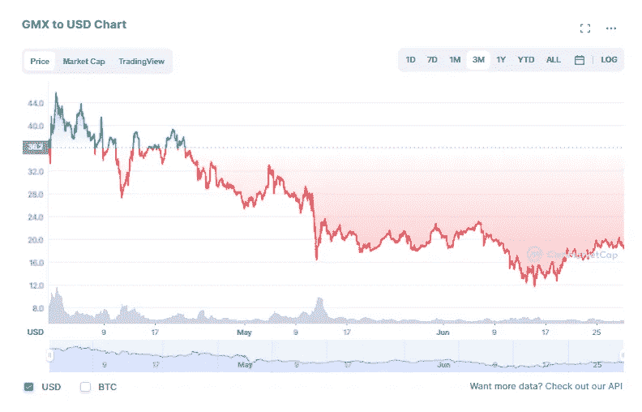

# GMX 是熊市的最佳选择吗？深入审查

> 原文：<https://medium.com/coinmonks/is-gmx-a-option-for-the-bear-market-an-in-depth-review-2c2eff249b7b?source=collection_archive---------1----------------------->

A casino or just another Dex?

当我们在等待市场发现它在做什么的时候，对我个人来说，我发现这是一个很好的时间来埋头研究我以前没有机会研究的新事物。**GMX 是我一直想深入研究的平台之一，所以我想借此机会分享我学到的一些东西，以及我对这个项目总体上是乐观还是悲观。**

# **什么是 [GMX](https://gmx.io/trade?ref=Jaik83) ？**

**好吧，那么“ [GMX](https://gmx.io/trade?ref=Jaik83) ”显然真的不代表什么(从我在 discord 上读到的内容来看，它们过去被称为 Gambit，对“GM”有意义，“X”可能代表“交换”，但这都是猜测)。从本质上来说，GMX 是一个分散式交换机(DEX ),同时存在于 Arbitrum 和 Avalanche 网络中。像大多数其他交易所一样，在 GMX 你可以进行 degen-30x 杠杆交易、掉期交易等。，他们也有自己的本土令牌$GMX。他们还有一种叫做 GLP 的东西，我稍后会详细介绍，但简单来说，它更像 ETF，而不是代币。为了防止本文中的进一步混淆，我要澄清，当我说“GMX”时，我指的是平台本身，当我说“$GMX”时，我指的是平台的令牌。**

# ****$GMX 令牌****

**像许多其他原生 DEX 令牌一样，$GMX 从协议费用(即互换/交易费用和令牌排放)中获得其价值和效用。平台收取的费用越多，GMX 代币的价值就越高。更确切地说，协议费总额的 30%流向了 GMX 的股东，70%流向了 GLP 的股东。然而，真正将$GMX 与其他代币区分开来的是，如果你下注$GMX，你得到的奖励将以$ETH(如果你在 Arbitrum 上)或$AVAX(如果你在 Avalanche 上)的形式分发。在大多数其他平台上，你背负着更多的平台原生令牌，这些令牌通常市值小，波动性高，排放计划失控。就代币的价格行为而言，情况并不乐观，但我可以说，现在整个密码市场都是如此:**

****

**除了目前大约 22%的 APY，你可以从下注你的$GMX 中赚取，还有其他值得注意的特点，激励下注者更长时间地下注。押下的$GMX 以 100%的年利率累积“乘数点”，这反过来可以用来从平台上收取更多的奖励费，基本上与你拥有更多$GMX 的利率相同，因此你的奖励是“成倍增加的”**

**GMX 还通过 esGMX 建立了一个托管系统，每月向 GLP 持有者分发这些代币，以进一步刺激流动性。去年 5 月投票通过的$esGMX 的授权时间表可在此处找到，但基本上从 2022 年 6 月开始，$esGMX 的排放量将是每月和动态的。**

> **交易新手？试试[密码交易机器人](/coinmonks/crypto-trading-bot-c2ffce8acb2a)或者[复制交易](/coinmonks/top-10-crypto-copy-trading-platforms-for-beginners-d0c37c7d698c)**

# **GLP——建立在德根斯失败的梦想之上**

**这就是事情变得有点有趣的地方。GLP 主要从交易商清算中获得收入(确切地说，占协议总收入和排放量的 70%)。换句话说，你将从那些通过杠杆化失败的多头和空头获利的人身上赚钱。**

**正如我之前提到的，GLP 本身更类似于 ETF，而不是加密货币。据我所知，它与 [Midas Investment 的 Stable YAP 或 Defi Yap](https://yaps.midas.investments/?p=0191) 产品非常相似，因为它由一篮子加密货币组成。正如我之前提到的，因为 GMX 在两条不同的链上，所以有两种不同类型的 GLP。在雪崩链上，GLP 包括:**

****

**在阿尔比特鲁姆，GLP 主要由以下几部分组成:**

****

**在比较这两者时，你会注意到，Arbitrum 的 GLP 更加多样化，但本质上两者在稳定股中的权重都很高，约为 50%，其余为蓝筹股。另一个主要区别是 Avalanche 的 GLP 在$AVAX 中的权重更大，约占 12.5%。对于$AVAX 的高风险价格行为，这最有可能解释反映了两者之间市值的巨大差异:**

****

**在这个熊市中，越来越多的人不愿购买风险更高的替代硬币，难怪越来越多的资本进入了拥有更多 BTC/ETH 和 stables 的 Arbitrum 的资金池。**

****没有非永久性损失:**最后，GLP 最显著的特点之一是它在技术上不受永久性损失的影响。与大多数有限合伙人不同，GLP 的价格基本上与代币价格保持一致，这意味着权重与代币的数量无关(在平衡池中，代币的数量会明显变高或变低)，而是直接反映在代币价格本身。换句话说，如果$AVAX 的价值下降 20%,它将反映在$GLP 本身的价格中，而不是$AVAX 或其他 GLP 指数代币的代币数量。**

# ****风险因素****

**我们知道，在密码领域，没有什么是没有风险的，GMX 也不例外。在我的研究中，我发现的主要问题包括:**

**如果赌场可以失败，GMX 也可以:所以我在很多[地方听说/读到过](https://blog.switcheo.com/gmx-the-casino-you-can-own/)在 GLP 投资就像拥有自己的赌场。这可能是一个公平的比较，因为那些疯狂举债的人通常会进行一些相当重要的赌博，以获得大笔支出。然而，问题是，就像赌场一样，GMX 协议的收入结构是基于赌场会赢的事实。换句话说，GMX 认为总会有人因为做空和做多而被清算。**

**在很大程度上，我绝对同意这一点。引用本·卡尔森的[文章](https://awealthofcommonsense.com/2021/02/some-friendly-reminders-about-day-trading/)中的一句话:**

> **美国证券交易委员会研究了零售外汇交易员的习惯，发现“大约 70%的客户每个季度都会亏损，平均而言，零售客户的投资在不到 12 个月的时间里就会全部亏损。”**
> 
> **另一项对 eToro 日内交易者的研究发现，近 80%的人在 12 个月内亏损，平均亏损 36%。**

**数字不会说谎，大多数人不擅长交易，大多数人会亏钱。但是，正因为我们知道这在统计学上是正确的，如果一条大鲸鱼进来并且赢了，而且赢得很大，GMX 会怎么样还有待观察。这就引出了我的下一个风险因素:**

****GMX 真的还没有经过充分的考验:**尤其是在当前熊市给了我们所有的提醒和痛苦的情况下，评估项目是否能够应对市场压力——比如银行挤兑或 TVL 股市下跌 95%——是很重要的。GMX 实际上在 2021 年 9 月左右才开始运行，所以它甚至还没有真正完成半个周期。就我个人而言，我更尊重一个已经经历了最大痛苦并幸存下来的平台——对我来说，它展示了持续的弹性和对未来最大痛苦事件的良好预测。**

****4 月/APY 汇率不会永远持续下去:**汇率是否保持一致？当然可以。但就像大多数平台上的大多数收益率一样，想要分一杯羹的人越多，每一块就越小。我的猜测是，随着大量新用户涌入 GMX，GMX 的费率不会有什么不同。请参见下面的最新用户数:**

****

**[https://stats.gmx.io/](https://stats.gmx.io/)**

**正如你所看到的，到目前为止，新用户的数量呈抛物线状增长，我想这是因为 GMX 目前提供的服务。可以说，可以看到的大部分活动都是通过互换进行的，但这种增长爆炸会对未来利率产生什么影响仍有待观察。**

****GMX 团队并没有被拒绝:**显然，让负责管理你的基金的人接受拒绝是更好的选择，这样可以让你更加安心，但不幸的是，GMX 的情况并非如此。现在，因为这是 DeFi 而不是 CeFI(或一些随机的 NFT 项目),它稍微不那么令人担忧，但这种担忧仍然需要对智能合同和令牌经济学有更大的信心。幸运的是，ABDK 在大约 9 个月前完成了一次[审计](https://github.com/gmx-io/gmx-contracts/blob/master/audits/ABDK_Audit_Review.txt)，这恰好是他们第一次启动的时间，并得到了 GMX 的积极回应，“ABDK 审计中提出的主要问题已经解决”**

# **结论/TLDR:**

**这是一个秘密，尤其是在熊市，人们会继续得到 rekt。GMX 是一个允许投资者帮助利用人们的清算和交易的平台，它允许人们通过一种叫做 GLP 的自制型加密 ETF 来这样做，这种 ETF 包含蓝筹股和稳定股——在这个可怕的熊市中，你可能无论如何都想投资这些东西。**

**费率会继续保持在 20~40%吗？可能不会，但无论是人们试图将$LUNA 的最后一波疯狂波动资本化，还是像 3AC 这样的风险投资基金暴露在过度杠杆化的头寸中，无论市场状况如何，人们都会继续犯错误。这就是为什么我认为无论市场状况如何，GMX 都有潜力继续安然度过难关。**

**除了任何潜在的智能合约风险，如果像我一样，你的总体策略是进入联邦理工学院/BTC 和/或马厩，那么我认为买入 GLP 实际上是在做同样的事情。GMX 本质上提供了一种持有相同资产的定义方式，同时给出了相当可观的收益率。**

**有兴趣亲自尝试 GMX 吗？请考虑使用我的会员链接:【https://gmx.io/trade?ref=Jaik83】T4 来支持我和我的博客。这不会让我成为百万富翁，但它确实给了我一点交易费回扣。**

**已经试过 GMX 了吗？如果你对 GMX 有任何不同的看法，我很乐意在下面的评论中听到。再次感谢您的阅读，请务必在 twitter 上关注我所有的最新更新:[https://twitter.com/CryptosWith](https://twitter.com/CryptosWith)**

**声明:这些都不是财务建议，仅用于教育和娱乐目的。像往常一样，请做你自己的研究，找到最适合你的投资。**

> **加入 Coinmonks [电报频道](https://t.me/coincodecap)和 [Youtube 频道](https://www.youtube.com/c/coinmonks/videos)了解加密交易和投资**

# **另外，阅读**

*   **[CoinFLEX 评论](https://coincodecap.com/coinflex-review) | [AEX 交易所评论](https://coincodecap.com/aex-exchange-review) | [UPbit 评论](https://coincodecap.com/upbit-review)**
*   **[AscendEx 保证金交易](https://coincodecap.com/ascendex-margin-trading) | [Bitfinex 赌注](https://coincodecap.com/bitfinex-staking) | [bitFlyer 审核](https://coincodecap.com/bitflyer-review)**
*   **[Bitget 回顾](https://coincodecap.com/bitget-review)|[Gemini vs block fi](https://coincodecap.com/gemini-vs-blockfi)cmd |[OKEx 期货交易](https://coincodecap.com/okex-futures-trading)**
*   **[AscendEx Staking](https://coincodecap.com/ascendex-staking)|[Bot Ocean Review](https://coincodecap.com/bot-ocean-review)|[最佳比特币钱包](https://coincodecap.com/bitcoin-wallets-india)**
*   **[霍比评论](https://coincodecap.com/huobi-review) | [OKEx 保证金交易](https://coincodecap.com/okex-margin-trading) | [期货交易](https://coincodecap.com/futures-trading)**