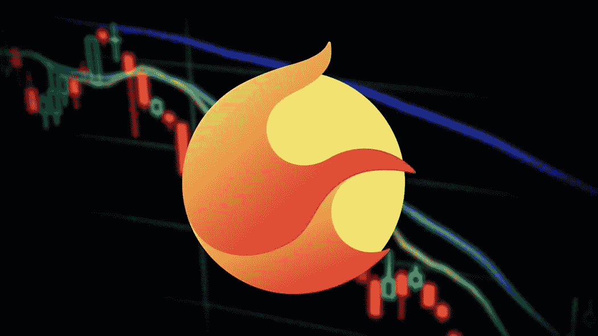

# 购买 Terra 2.0 是明智的决定吗？

> 原文：<https://medium.com/coinmonks/is-good-decision-to-buy-terra-2-0-1bfe7f67516a?source=collection_archive---------27----------------------->

Source photo [terra luna 2.0 — Bing images](https://www.bing.com/images/search?view=detailV2&ccid=0Zh7Xc9g&id=71BB7F80AABA6247A044B12696B2B02A6696678A&thid=OIF.dMw7WQmT92FD1z9KfzcUTA&mediaurl=https%3a%2f%2fwww.kriptoarena.com%2fwp-content%2fuploads%2f2022%2f06%2fterra-luna-cover.jpg&cdnurl=https%3a%2f%2fth.bing.com%2fth%2fid%2fR.d1987b5dcf60f3feb6864ea1bcbc34c9%3frik%3d%26pid%3dImgRaw%26r%3d0&exph=590&expw=1050&q=terra+luna++2.0&simid=6959857645612&FORM=IRPRST&ck=74CC3B590993F76143D73F4A7F37144C&selectedIndex=80&ajaxhist=0&ajaxserp=0)

## 那么，什么是 Terra 2.0 呢？

为了生态系统，TerraForm Labs 的首席执行官 Do Kwon 提出了 Terra Luna hard fork。结果，区块链大地将被一分为二。只要这两条链存在，它们就能够相互独立地发挥作用。

Terraform 实验室的首席执行官道权提出了一个名为 Terra 2.0 的新区块链，并且…