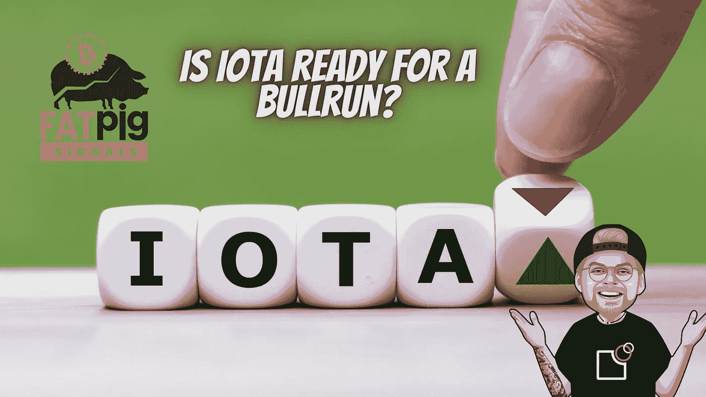

# IOTA 会成为网络之王吗？

> 原文：<https://medium.com/coinmonks/is-iota-becoming-the-king-of-the-web3-97c443c2bfe7?source=collection_archive---------1----------------------->

# IOTA 让区块链过时了吗？

Holger Kö ther 不是一个公正的观察者，而是 IOTA 基金会的高级雇员，逻辑上是 IOTA 背后的驱动力。我们应该避免使用区块链这个术语，因为 IOTA 强调的是，它恰恰不是一个区块链，而是一个纠结。