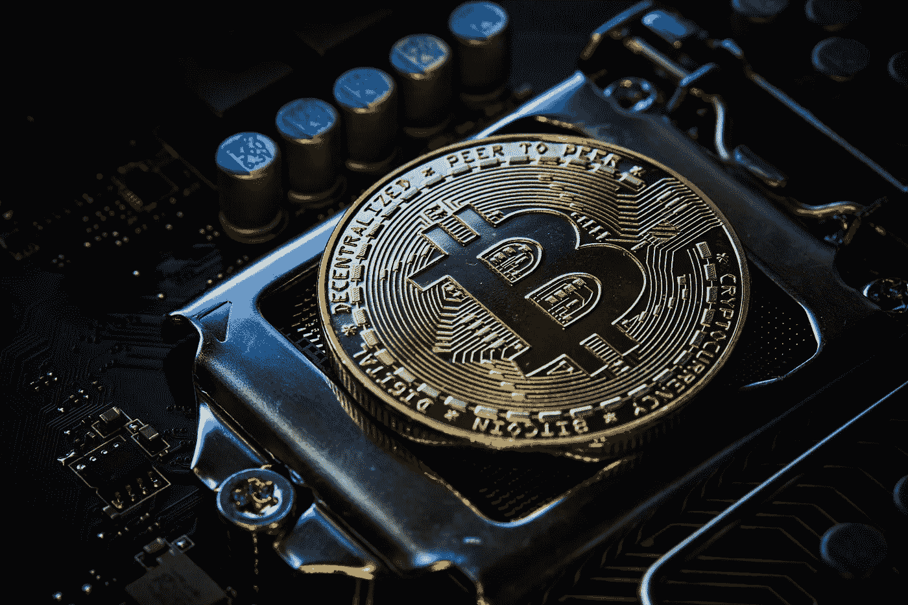

# 投资比特币暴跌是个好主意吗？

> 原文：<https://medium.com/coinmonks/is-it-a-good-idea-to-invest-in-the-bitcoin-dip-d20b23f55c32?source=collection_archive---------50----------------------->

Source photo Unsplash.com

一些分析师认为，比特币将很快挑战 19700 美元大关。只要有需求，价格可能会在几天内涨到 13700 美元。

据专家称，比特币的 200 毫安(移动平均线)已被突破，此后该令牌一直在稳步下滑。考虑到这些因素，18k 美元大关是一个强有力的支撑位。它也可能…