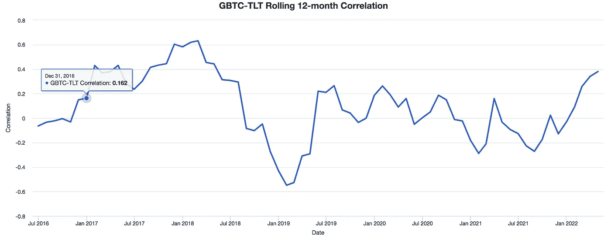
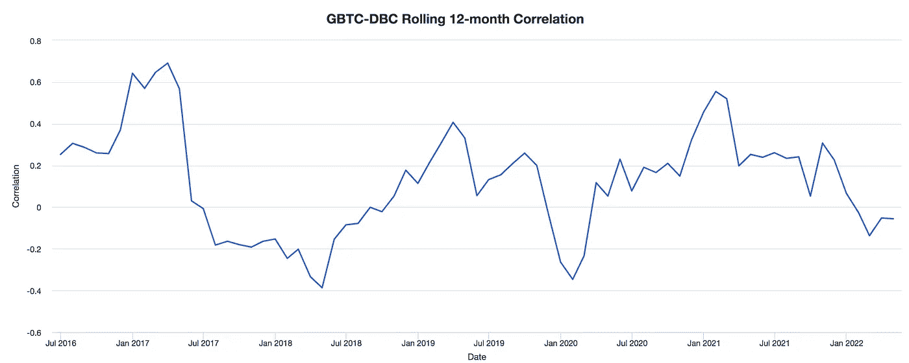
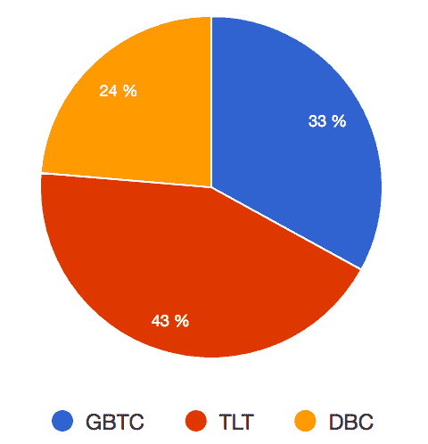
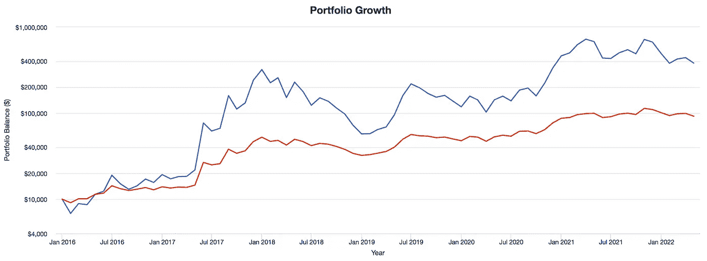
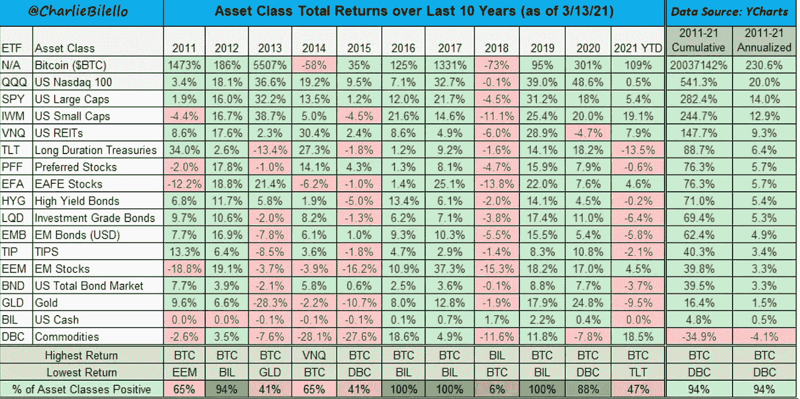

# 加密货币投资是可计算的风险吗？

> 原文：<https://medium.com/coinmonks/is-it-cryptocurrency-investment-ever-be-a-calculated-risk-fb16640e42ee?source=collection_archive---------20----------------------->

假设你可能想降低投资比特币的风险(我们将把它作为整个加密领域的参考)，除了其他更复杂的方法之外，基本上有两种方法可以让你这样做:

# **投资组合多样化**

将比特币与其他资产结合起来以分散风险是减少风险、同时获得大部分收益的最常用方法之一。您需要增加哪种资产来降低风险？根据现代投资组合理论，你需要找到与比特币负相关的资产。

有没有这样的资产符合要求？不管你选择什么样的时间框架，很少有资产是负相关的，然而也有一些资产是弱相关的。

不过，在特定情况下，比如 2018 年至 2019 年的崩盘和当前的比特币熊市，你可以通过增加投资组合中的资产来对冲比特币风险，比如与大宗商品挂钩的 ETF DBC，或者美国长期国债 TLT。

以下是比特币(GBTC 灰色比特币信托基金)和 TLT/DBC 之间的滚动相关性。

按照下面的饼图组成投资组合:

将导致以下投资组合绩效:

正如你所看到的，如果你投资多元化账户(*红线*)，你会有一个比只投资比特币(*蓝线*)多得多的计算风险。

与此同时，你将拥有相当于 100，000 加元的投资组合，而只有比特币的投资组合只有 400，000 加元；我们可以通过降低比特币风险的第二种方式来减轻失去良好表现的风险:

# **更长的投资期限**

这种降低比特币风险的方法比前一种简单得多，同时也能让你获得与全额比特币敞口相同的收益。从技术上讲，事实上你并没有降低风险本身，而是改变了你对 it 的看法。

众所周知，比特币是目前最不稳定的资产之一，因此也是风险最大的资产之一，但在过去 11 年中，它有 9 年是表现最好的资产，有 82%的时间是这样！！！请看下面:

*奖金:看看 2011 年至 2011 年期间的年化回报率，令人震惊。*

那么，我们如何降低比特币的风险呢？答案是:缩小。无需过多解释，这里有一个图表可以说明一切:

如果你看比特币的年度回报，而不是每日回报，你会发现它是不稳定的，但在上升！如果你缩小范围，决定每年或每个季度买入或卖出，你会意识到，感知风险比你看更短的时间范围(如每天)要低得多。

这也符合比特币是一种全新技术的概念，它仍处于早期阶段，需要时间来完全成熟，所以没有必要担心明天的价格！

现在，这是否意味着比特币注定会上涨，因为它从一开始就一直在上涨？当然不是，过去的表现并不能保证未来的表现，股票也是如此。(事实上，这绝不是财务建议)

总之，有可能采取一种计算风险的方法来投资加密，以上只是两种方法。

> 加入 Coinmonks [电报频道](https://t.me/coincodecap)和 [Youtube 频道](https://www.youtube.com/c/coinmonks/videos)了解加密交易和投资

# 另外，阅读

*   [用于 Huobi 的加密交易信号](https://coincodecap.com/huobi-crypto-trading-signals) | [Swapzone 审查](/coinmonks/swapzone-review-crypto-exchange-data-aggregator-e0ad78e55ed7)
*   最佳[密码交易机器人](https://coincodecap.com/best-crypto-trading-bots) | [购买索拉纳](https://coincodecap.com/buy-solana) | [矩阵导出评论](https://coincodecap.com/matrixport-review)
*   [Coldcard 评论](https://coincodecap.com/coldcard-review) | [BOXtradEX 评论](https://coincodecap.com/boxtradex-review)|[uni swap 指南](https://coincodecap.com/uniswap)
*   [比特币基地评论](/coinmonks/coinbase-review-6ef4e0f56064) | [德里比特评论](/coinmonks/deribit-review-options-fees-apis-and-testnet-2ca16c4bbdb2) | [FTX 评论](/coinmonks/ftx-crypto-exchange-review-53664ac1198f)
*   [Coinmetro 评论](https://coincodecap.com/coinmetro-review) | [VirgoCX 评论](https://coincodecap.com/virgocx-review)
*   [法国 4 大最佳加密副本交易平台](https://coincodecap.com/copy-trading-platforms-france)