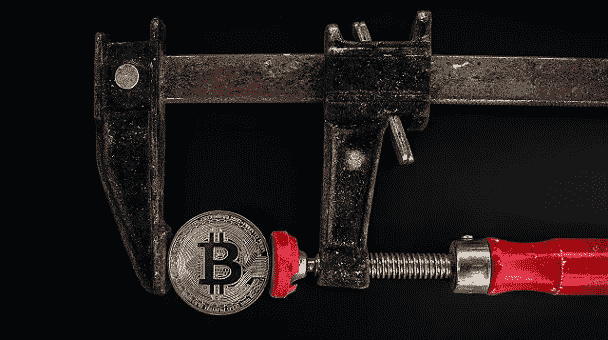

# 创建自己的加密货币成本高吗？

> 原文：<https://medium.com/coinmonks/is-it-expensive-to-create-your-own-cryptocurrency-270ab504c3a5?source=collection_archive---------8----------------------->

你想创造你自己的硬币？你需要多少钱？这取决于你想创建什么样的加密。创造一个加密令牌是一回事，创造一个成熟的加密硬币是完全不同的另一回事。

Photo by [Worldspectrum](https://www.pexels.com/photo/black-and-red-caliper-on-gold-colored-bitcoin-1099339/) via Pexels

虽然加密令牌和加密硬币这两个术语经常互换使用，但它们并不是生来平等的，也不被赋予相同的权利。

**代币**

为了创建令牌，您需要访问一些预先存在的支持智能合约的区块链，然后简单地创建您需要的令牌。令牌主要是为特定项目而创建的。它们可以用作奖励或支付项目中的特定服务或交易。成千上万的 ERC-20 代币已经在区块链以太坊发行。

*   代币是一类依赖于其他加密货币的加密货币
*   代币在另一种加密货币的公共数据库中注册。
*   任何真实世界的资产，有形的或无形的，都可以注册为令牌。
*   它们可能是也可能不是讨价还价的筹码。
*   他们有各种各样的潜在功能，从独家折扣，进入系统，或投票权。
*   因此，例如，代表一定数量的实物黄金的代币可以在其用户之间自由交易，而没有公司或政府干预的可能性。

区块链平台为您提供了创建令牌的选项。这个过程不需要太多的努力，而且相对便宜。您可以在几分钟内创建一个令牌。

费用通常从 30 美元到 300 美元不等，取决于区块链的条件和区块链的受欢迎程度。比如像以太坊这样的网络，由于应用广泛，价格更贵。

**加密硬币**

为了创造一个成熟的加密硬币，你需要开发一个区块链。所以，如果你想创造你自己的加密硬币，像你自己的比特币或以太坊，那么你的加密硬币将需要它的原生区块链。

您需要:

-了解区块链和编程
-几乎从零开始开发区块链技术
-配置和实施区块链网络
-验证和运行区块链运营的节点
-有足够的资本投资所有阶段
-这可能需要很长时间

当然，你不需要什么都亲力亲为，你可以雇佣已经精通上述事情的人，或者你可以与一群聪明人合作开发你的区块链项目，推出你自己的加密硬币。

我们已经可以看到，创造代币比开发一种新的加密硬币的区块链要容易和便宜得多。

根据科技公司 CIS 的数据，一个简单的区块链应用程序的价格从 15000 美元到 40000 美元不等。而如果你打算创造一个中等复杂程度的区块链，价值最高可以达到 9 万美元。

但如果你的项目要求极度复杂，价值可以达到 15 万美元以上。

**值得吗？**

让我这么说吧，如果你的加密硬币会成功，那么它就非常值得。如果你的硬币在所有其他密码中徘徊，那么它将转化为大量的时间和金钱损失。

所以，如果你想开始一次加密硬币之旅，你最好提前计划。专注于你将如何推广你的新硬币，你将如何让你的硬币为人所知和交易。这将最终决定你的加密硬币的成败。如果你只是创造了一个区块链，发行了一种新硬币，这对你有好处，但如果你让人们接受并交易你的硬币，你可能会成为百万富翁…甚至亿万富翁。

给你一个建议:不要创造你的硬币，然后等着别人来。相反，找到一个社区，为他们开发一种货币。

快乐密码！

*注:本文仅供参考。本文中的陈述代表我自己的观点和评估。在创建或投资加密货币之前，我建议你联系法律和金融专家，以便尽可能多地收集相关信息。*

> *加入 Coinmonks* [*电报频道*](https://t.me/coincodecap) *和* [*Youtube 频道*](https://www.youtube.com/c/coinmonks/videos) *了解加密交易和投资*

# 另外，阅读

*   [有哪些交易信号？](https://coincodecap.com/trading-signal) | [Bitstamp vs 比特币基地](https://coincodecap.com/bitstamp-coinbase) | [买索拉纳](https://coincodecap.com/buy-solana)
*   [ProfitFarmers 回顾](https://coincodecap.com/profitfarmers-review) | [如何使用 Cornix Trading Bot](https://coincodecap.com/cornix-trading-bot)
*   [十大最佳加密货币博客](https://coincodecap.com/best-cryptocurrency-blogs) | [YouHodler 评论](https://coincodecap.com/youhodler-review)
*   [my constant Review](https://coincodecap.com/myconstant-review)|[8 款最佳摇摆交易机器人](https://coincodecap.com/best-swing-trading-bots)
*   [MXC 交易所评论](/coinmonks/mxc-exchange-review-3af0ec1cba8c) | [Pionex vs 币安](https://coincodecap.com/pionex-vs-binance) | [Pionex 套利机器人](https://coincodecap.com/pionex-arbitrage-bot)