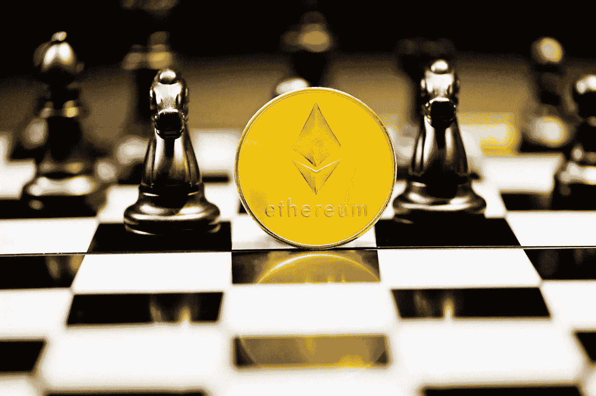

# 以太坊还在跌的时候买好不好？

> 原文：<https://medium.com/coinmonks/is-it-good-to-buy-ethereum-while-its-still-down-a58f41f2ddba?source=collection_archive---------30----------------------->

以太坊的价格最近一直在上涨，最近达到了每枚 4800 美元左右的创纪录高位——在过去的 12 个月里上涨了 900%以上。

虽然无法确切知道以太坊未来的表现如何，但在不久的将来，它有可能超过每枚 5000 美元。这是否意味着现在是投资的时候了？以下是你需要知道的。

Photo Souce on Google

# **以太坊是一个好的投资吗？**

总的来说，加密货币可能是一种高风险的投资。在这一点上，这是高度投机性的，意味着没有人确切知道它是否会长期成功。加密货币仅仅存在了 10 年多一点，现在判断它有多大的持久力还为时过早。

也就是说，以太坊确实有很大的潜力，它是目前加密领域最强的玩家之一。

以太坊区块链是最受欢迎的分散应用(dApps)区块链之一，如不可替代令牌(NFT)和分散金融。这些 dApps 需要使用以太坊的本地令牌 Ether。这意味着，如果这些 dApps 中的任何一种被广泛采用，乙醚的使用将会增加——其价格可能会飙升。

以太坊也正在从工作证明(PoW)挖掘协议更新为利益证明(PoS)协议。PoW 协议非常耗能，因为它涉及高性能计算机解决复杂的难题，以验证区块链上的交易。这种类型的协议也比 PoS 慢，导致每秒的交易更少。

以太坊 2.0 预计将于明年某个时候全面推出，一旦实现，它不仅需要的能源减少约 99%，而且处理交易的速度也将大大加快。这使得它比比特币等仍在使用 PoW 协议的竞争对手更具优势。

# **要考虑的潜在不利因素**

以太坊可能是一项强有力的投资，但它并不完美。在你投资之前，重要的是要了解潜在的不利因素，以确保你知道你将进入什么。

首先，新的加密货币正在快速发展，以太坊可能会面临激烈的竞争。已经有一些所谓的“以太坊杀手”加密货币，如 Cardano，旨在利用以太坊的弱点。

例如，Cardano 已经使用了 PoS 挖掘协议，并且它还能够在其区块链上托管 dApps。为了保持竞争优势，以太坊需要不断创新。

此外，加密货币可能是一种风险投资，因为它的投机性很强。与股票不同，加密货币没有长期的增长记录。虽然以太坊可能有很大的潜力，但不能保证它(或一般的加密货币)在十年或二十年后仍然存在。

# 结果

那么，在你投资之前，考虑一下你愿意承受多大的风险。如果你是一个规避风险的投资者，加密可能不适合你。如果你选择投资，只投资你实际上能承受损失的钱。

没有人知道以太坊将走向何方，但如果你准备投资加密货币，这可能是一个强有力的选择。只是要确保你知道这项投资的利弊，以确定它是否是你的正确选择。

> 加入 Coinmonks [电报频道](https://t.me/coincodecap)和 [Youtube 频道](https://www.youtube.com/c/coinmonks/videos)了解加密交易和投资

# 另外，阅读

*   [无聊猿游艇俱乐部(BAYC)回顾](https://coincodecap.com/bored-ape-yacht-club-bayc-review) | [拜比特 vs 比特币基地](https://coincodecap.com/bybit-vs-coinbase)
*   [5 款最佳加密交易终端](https://coincodecap.com/crypto-trading-terminals) | [最佳 DeFi 应用](https://coincodecap.com/best-defi-apps)
*   [比特币基地 vs 瓦济克斯](https://coincodecap.com/coinbase-vs-wazirx) | [比特鲁点评](https://coincodecap.com/bitrue-review) | [波洛涅克斯 vs 比特鲁](https://coincodecap.com/poloniex-vs-bittrex)
*   [德国最佳加密交易所](https://coincodecap.com/crypto-exchanges-in-germany) | [Arbitrum:第二层解决方案](https://coincodecap.com/arbitrum)
*   [币安交易机器人](/coinmonks/binance-trading-bots-d0d57bb62c4c) | [OKEx 评论](/coinmonks/okex-review-6b369304110f) | [阿塔尼评论](https://coincodecap.com/atani-review)
*   [最佳加密交易信号电报](/coinmonks/best-crypto-signals-telegram-5785cdbc4b2b) | [MoonXBT 评论](/coinmonks/moonxbt-review-6e4ab26d037)