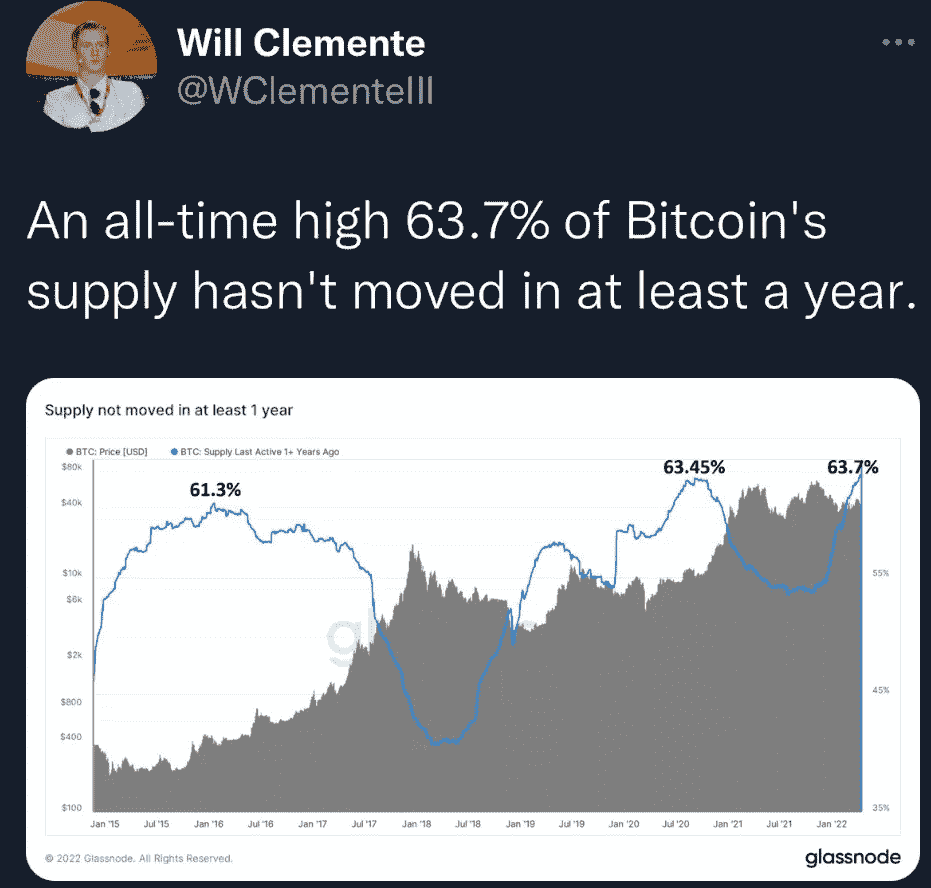
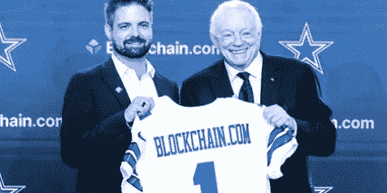

# #4:是如果/那么还是什么时候/那么？XRP 对证券交易委员会的诉讼

> 原文：<https://medium.com/coinmonks/is-it-if-then-or-when-then-xrp-vs-sec-lawsuit-4c9400e16f6f?source=collection_archive---------38----------------------->

# 数字资产不会消失

我们现在身处 2022 财年的 Q2，对于我接触过的大多数人来说，一个共同的主题贯穿了所有的谈话——时间过得真快。自“后 2020”时代以来，我们世界的许多方面都在继续快速变化和发展。

然而，当我考虑数字资产和加密货币环境的情绪时，自从我 3 月 15 日的上一次更新以来，没有发生任何变化。以下是一些需要考虑的事项:

去年(2021 年 4 月 12 日-2022 年 4 月 11 日)，比特币总供应量的 63.7%没有“移动”(即使是从钱包到钱包)，打破了此前在 2020 年创下的 63.45%的历史最高纪录。这显示了从上到下的投资者信心，包括“鲸鱼”增持。 ***(见下图 1，@WClementeIII)***

Figure 1: Bitcoin supply movement as a % of total supply

对冲基金和大型机构继续探索托管服务、metaverses、资产负债表考虑因素以及该领域的其他参与形式。BlockFi 的大卫·奥尔森(David Olson)表示，“全球排名前 50 的对冲基金中，有 80%都在开始某种形式的秘密之旅。”-那剩下的 20%呢？

散户投资者已经很有弹性了，现在，绝大多数人都“免费”持有 crypto，如果他们已经持有 3-4 年或更长时间，就会获利。他们没有动力提早出售，并把亚马逊(Amazon)和微软(Microsoft)这样的企业作为耐心和信心的例子。话虽如此，其中一些投资者正抱着这种信念去抛售柴犬 SHIB，但这是一条完全不同的路。

所有这些好消息都渗透到了市场中，为什么零售领域仍然有如此多的恐惧、不确定性和怀疑？通过随意交谈或只是偷听进行一项简短的调查，让我相信，全球绝大多数人对数字资产仍然很少甚至没有信心或了解，更不知道它们在未来将扮演什么角色。

可以说，今天最流行的投机性对话是围绕 XRP 的对话，这是一种全球公用事业令牌，被 SEC 起诉，原因是它符合证券的定义，因此它的一些创始人和执行领导层在资产开始时进行的一些活动和交易无效。这场官司让很多投资者哭诉 ***“如果这个，那那个！”*** 相对于结果——“XRP 军”认为，与美国证券交易委员会(SEC)的法律诉讼达成和解或取得积极成果，将是推动他们的投资实现价值的催化剂。

因为它关系到 XRP 的诉讼，以及总体数字资产空间的时间，在我看来，这些都不重要。结论就简单多了， ***“当此，则彼！”并且*** 做出理性的决定，能够为其利益相关者和投资者提供效率、成本节约和规模价值的优质数字资产将最终胜出。在 CoinMarketCap 上列出的 18，000 种加密货币中，我认为只有 25 种或更少的加密货币拥有被归类为相对于同行“优越”的凭证、合作关系和产品。正如前文所述，相对于互联网服务提供商和其他声称自己的股份是互联网“最佳来源”的人的数量，dot.com 繁荣时期的投资者筛选和整理当时的所有废话肯定同样困难。

心理角度也值得考虑——大多数高级交易者都会同意市场是非理性的，并倾向于远离散户。然而现在，我们正处于这样一个独特的位置，特别是考虑到上面列出的几个要点。为了跟进本文开头关于对冲基金和 20%未参与的声明，富达去年进行的一项研究显示，70%的受访金融机构计划在未来一年投资 crypto，而 90%的受访金融机构表示他们计划在未来五年内这样做。这就剩下 10%的资金在未来 5 年内不会去开拓一个全新的资产类别。自 1694 年英格兰银行开始发行债券以来，我们还没有过这样的新资产类别——在这个世界正在急剧转变为完全数字化的企业的时代，这确实是一个多代人的机会。

“富达去年进行的一项研究显示，70%的受调查金融机构计划在未来一年投资加密技术，而 90%的机构表示他们计划在未来五年内这样做。”

所以，让我们带着一些更倾向于 ***当/然后侧面*** 的想法，重温一下 XRP 的情况:

比方说，XRP 被美国证券交易委员会视为一种证券，这会导致价格暴跌吗？这无疑意味着绝大多数剩余的加密货币也将被归类为证券。全球数字资产空间会因为美国一个监管机构的决定而下降吗？

如果 XRP 不被认为是安全的呢？价格会暴涨吗？这对投资者来说是可持续的吗？市场上的其他公司会效仿吗？

这只是一种观点——但总的来说，我不认为这场官司有什么大不了。当然，它是否惹恼了许多散户投资者，尤其是全球的 XRP 投资者？当然可以。但这正是他们想要的。他们想让你吓得发抖，忽视你的家人，晚上躺在床上，在脑子里想象各种场景。他们会发布任何头条新闻，让你在价格上涨前卖掉你的包。它可能会先倒下，但 XRP 与全球前 100 家银行中的一半以上都有合作关系，并有着良好的合作记录，包括在董事会内部。

如果价格继续走低，我真的看不出有多少零售行业会受到冲击。当然，如果你在一年左右的时间里刚刚开始投资数字资产，那么你的投资很有可能会缩水，如果我们看到进一步的投降，你可能会开始动摇。然而，对于我们大多数人——长期散户投资者和贪婪的银行和机构——来说，更低的价格意味着以更低的价格购买更多的东西。你可以问问自己，为什么市场会给散户投资者这么好的机会？再说一遍，大部分散户投资者现在都在买房。如果你给他们提供 6-15k 之间的比特币，或者 0.20-30 之间的 XRP，我可以向你保证*卖*不会是他们选择的答案。他们会积累更多！

除了以上所述，这里还有一些我在过去一个月左右时间里发现的有趣的其他更新:

体育:在全球范围内，主要的运动队继续与主流加密交易所合作，铸造他们自己的 NFT 和其他收藏品，等等。在美国，洛杉矶湖人队、金州勇士队、迈阿密热火队、费城 76 人队、达拉斯牛仔队是在美国和全球铺平道路的众多球队中的一小部分。

Peter Smith, CEO of Blockchain.com & Jerry Jones, Owner and President of the Dallas Cowboys

广受欢迎的元宇宙初创公司 *The Sandbox* 以 40 亿美元的估值再次融资 4 亿美元。

印度加密交易所 CoinDCX 以 215 亿美元的估值融资 1.35 亿美元。

万事达卡表示，他们“认识到数字资产正在彻底改变金融格局。”

苹果公司宣布，他们正在寻求聘请一名资深法律顾问，该顾问应具有为#区块链和#加密货币提供咨询的经验。(我觉得这个很有趣——就像大学毕业，申请一份入门级的工作，但也需要 5 年的经验)。

因此，我没有参加 FUD，担心接下来会发生什么，而是在我的脑海中用一堆杂乱的 ***If/Then*** *，*来玩净值情景，我开始将数字资产格局的演变作为一个全面的 ***When/Then*** 情景——我不确定这是否重要 *When* 它甚至何时发生。

似乎不管我们喜不喜欢，它都在发生。

> 加入 Coinmonks [电报频道](https://t.me/coincodecap)和 [Youtube 频道](https://www.youtube.com/c/coinmonks/videos)了解加密交易和投资

# 另外，阅读

*   [Bookmap 点评](https://coincodecap.com/bookmap-review-2021-best-trading-software) | [美国 5 大最佳加密交易所](https://coincodecap.com/crypto-exchange-usa)
*   最佳加密[硬件钱包](/coinmonks/hardware-wallets-dfa1211730c6) | [Bitbns 评论](/coinmonks/bitbns-review-38256a07e161)
*   [新加坡十大最佳加密交易所](https://coincodecap.com/crypto-exchange-in-singapore) | [购买 AXS](https://coincodecap.com/buy-axs-token)
*   [红狗赌场评论](https://coincodecap.com/red-dog-casino-review) | [Swyftx 评论](https://coincodecap.com/swyftx-review) | [CoinGate 评论](https://coincodecap.com/coingate-review)
*   [投资印度的最佳密码](https://coincodecap.com/best-crypto-to-invest-in-india-in-2021)|[WazirX P2P](https://coincodecap.com/wazirx-p2p)|[Hi Dollar Review](https://coincodecap.com/hi-dollar-review)