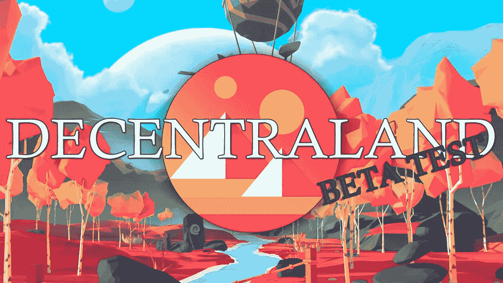

# 投资分散土地值得吗？

> 原文：<https://medium.com/coinmonks/is-it-worth-investing-in-decentraland-65c21f7022d0?source=collection_archive---------6----------------------->

Source photo [descentreland — Bing images](https://www.bing.com/images/search?view=detailV2&ccid=hjYCqQMp&id=863837F50CB870FF725B1091801B4EE8592E5B9C&thid=OIP.hjYCqQMpE1i0vtBnxUjmUAHaEL&mediaurl=https%3a%2f%2fcrypto-economy.com%2fwp-content%2fuploads%2f2020%2f01%2fdecentraland-beta-test.jpg&cdnurl=https%3a%2f%2fth.bing.com%2fth%2fid%2fR.863602a903291358b4bed067c548e650%3frik%3dnFsuWehOG4CREA%26pid%3dImgRaw%26r%3d0&exph=676&expw=1200&q=descentreland&simid=608012467060750970&FORM=IRPRST&ck=E481F55F2D875A5089A15DE84EE8C925&selectedIndex=4&ajaxhist=0&ajaxserp=0)

像 Roblox 这样的数字平台的成功激发了区块链商业中类似想法的发展。

分散土地是虚拟现实领域的最新来者之一，它使虚拟财产所有权成为可能。

简而言之,“去中心化”是区块链的一个创新理念，它提供了一个虚拟现实环境，用户可以在其中将内容货币化……