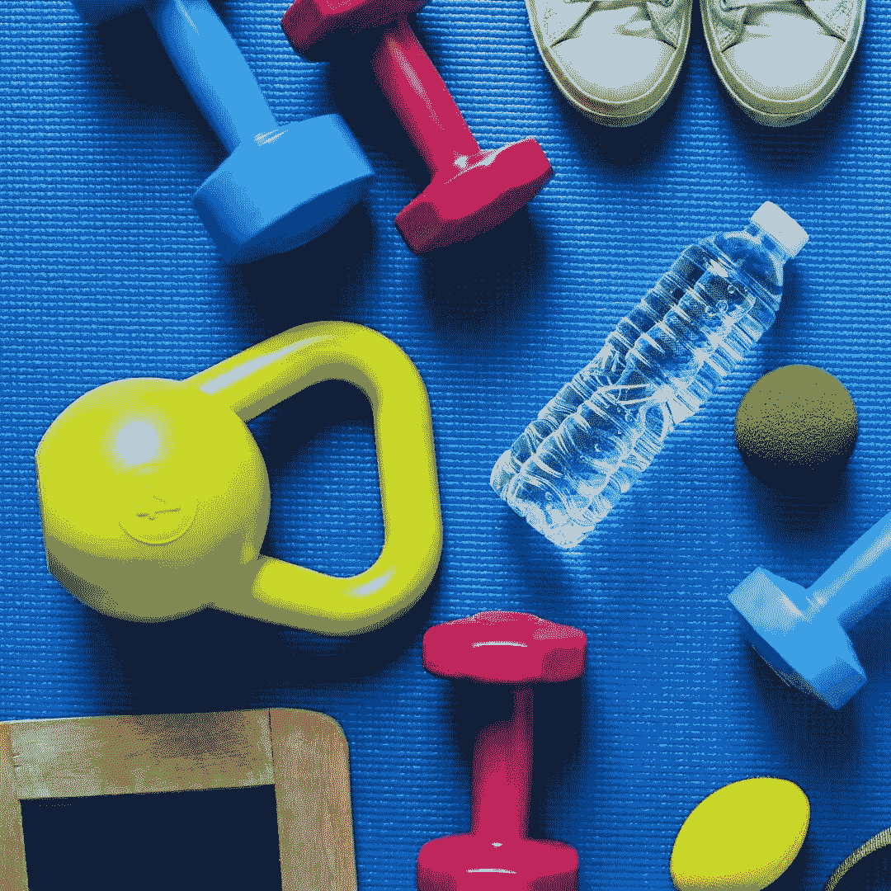

# 值得使用发行令牌的移动应用程序吗-2

> 原文：<https://medium.com/coinmonks/is-it-worth-using-mobile-apps-that-issue-tokens-2-fca661daefff?source=collection_archive---------34----------------------->

在这篇文章中，我将继续研究令牌、健身和踏步之间的关系，我在我的 [**上一篇文章**](https://bit.ly/3KCqFxQ) 和移动应用中试图解释这一点。在本文中，我还将包括 Sweatcoins、Fitlich 和 STEPN，这三个应用程序是我在上一篇文章中评论过的。当然，这一次我会更加挑剔。

我们的身体已经准备好了，我们想要锻炼或散步和跑步。我们现在只需要一个手机应用程序来保存我们的数据。但这个移动应用首先必须是一个用户友好的应用。锻炼应该提供支持，甚至赚钱。还是我把这个 app 吹的不成比例了？

我将集中讨论相当多的应用程序的积极和消极方面。

## 一. Fitlich 应用程序

首先，我想仔细看看 Fitlich 应用程序，并告诉你有关它的信息。

当你下载 Fitlich 应用程序时，你必须首先用一个短信代码或会员身份(如谷歌/脸书)注册该应用程序。

应用程序中引起我注意的第一个特性是多语言支持。另一个功能，挑战你的朋友或家人的能力，是它与许多应用程序的区别。另一方面，对于那些不知道自己想做什么的人来说，应用程序提供的现成挑战是非常合理的。

安装 Fitlich 后，我开始邀请我的朋友。然后我比较了免费会员和高级会员。每接受一次邀请，我就能获得 50 个 FBute 代币，而我的朋友获得的代币的百分之五也会进入我的钱包。钱包功能仅适用于高级用户。像许多其他应用程序一样，当用户是高级用户时，广告不会出现。在免费会员中，正如我在以前的文章中提到的，你每天有机会赢得 5 个 Fbute 令牌，而在高级会员中，这一数字高达 10 个 FBute 令牌。当然，这个币数是做 app 里的练习题可以赚到的上限。否则，您在使用 Google Fit 或 Health Kit integration 行走和跑步时燃烧的卡路里会变成加密货币。

高级用户在转移他们钱包中的 FBute 令牌时会面临转让费。这是生意的本质。由于 Fitlich 是一个用户友好的应用程序，所以向用户出售转让信用是一个很好的功能，可以避免这笔额外的费用。对于免费用户，所有锻炼都可以免费查看。

## 二。查看其他应用程序

**1。步骤**

在我看来，STEPN 的应用程序界面非常简单。也有可能赚到 STEPN 的钱。另一方面，每个用户必须购买一双运动鞋才能使用该应用赚钱。这需要大约 1000 美元的开支。总之，你先花钱，那么 STEPN 就愿意给你钱！

然而，登录 STEPN 也不容易。对我来说有点太难了。激活码指引你到 discord 或 telegram 后，你只能用 STEPN 给你的链接登录应用。在 STEPN 上花 1000 美元赚钱没有太大意义，而在 Fitlich 可以通过燃烧卡路里赚钱。

**2。汗币**

Sweatcoin 是一个靠走路给你挣钱的 app。然而，坦白地说，应用程序中的语言支持对我来说还不够。这部分应该改进。除此之外，在这个应用中还有可能挣钱。但是，你只能在应用程序提供给用户的商店里购买商品，才能花掉你赚到的钱。因为 Sweatcoins 无法为用户提供加密货币基础设施。所以，无论你的账户里积累了多少钱，都不可能变成现金。另一个缺点是，正如我上面提到的，该应用程序只依赖于锻炼。与向免费用户提供 200 多项锻炼的 Fitlich 相比，Sweatcoin 有所欠缺。

**3。卡乐伦**

卡乐伦也有类似菲特里奇的挑战基础设施。但是，为了参与这些挑战，你需要先付费，比如 Sweatcoin。总之又一个不买不给的应用。

**4。步骤现金**

和 Sweatcoin 一样，这个应用的开发也只是为了迈出一步。我在这个应用程序中看不到加密货币和运动基础设施。

**5。虚拟**

这个应用第一眼看上去很不错。但是，下载应用后，当我输入手机号码登录时，激活码没有来。我还在等代码呢！你也可以在这个应用中挑战。

**结论**

在移动应用领域，健身和健康应用非常流行。然而，为用户选择最有用和最有利可图的应用程序并不总是容易的。我写这篇文章的主要动机是帮助做健身的用户，努力保持健康。我在 Fitlich 之外评论过的其他一些应用程序为了赚钱会先向用户要钱。同样，应用程序的内容和他们给用户的主题是非常有限的。另一方面，Fitlich 似乎为用户提供了一个全新的世界。与你的朋友一起挑战的机会。200 多种健康运动等等。与谷歌和苹果的整合。多语言支持。选择赚钱的同时燃烧卡路里。我不认为有任何其他应用程序可以将它们都包含在内。

> 加入 Coinmonks [电报频道](https://t.me/coincodecap)和 [Youtube 频道](https://www.youtube.com/c/coinmonks/videos)了解加密交易和投资

# 另外，阅读

*   [AscendEx 保证金交易](https://coincodecap.com/ascendex-margin-trading) | [Bitfinex 赌注](https://coincodecap.com/bitfinex-staking) | [bitFlyer 点评](https://coincodecap.com/bitflyer-review)
*   [Bitget 回顾](https://coincodecap.com/bitget-review)|[Gemini vs block fi](https://coincodecap.com/gemini-vs-blockfi)cmd |[OKEx 期货交易](https://coincodecap.com/okex-futures-trading)
*   [AscendEx Staking](https://coincodecap.com/ascendex-staking)|[Bot Ocean Review](https://coincodecap.com/bot-ocean-review)|[最佳比特币钱包](https://coincodecap.com/bitcoin-wallets-india)
*   [霍比评论](https://coincodecap.com/huobi-review) | [OKEx 保证金交易](https://coincodecap.com/okex-margin-trading) | [期货交易](https://coincodecap.com/futures-trading)
*   [网格交易机器人](https://coincodecap.com/grid-trading) | [Cryptohopper 审查](/coinmonks/cryptohopper-review-a388ff5bae88) | [Bexplus 审查](https://coincodecap.com/bexplus-review)