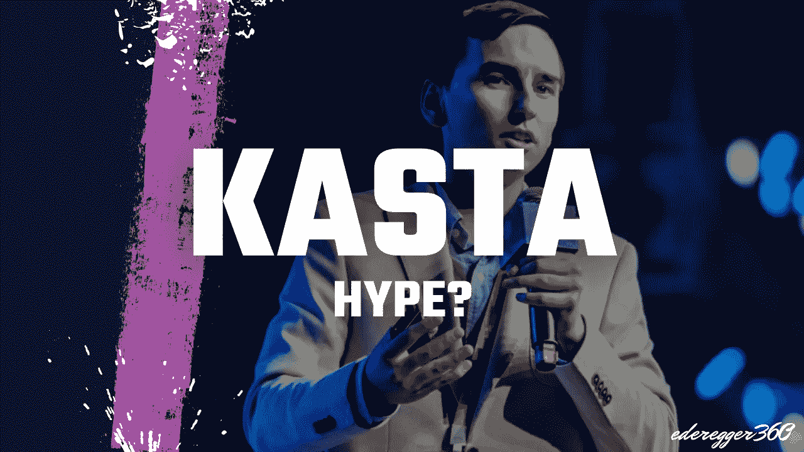

# KASTA 真的值得大规模炒作吗？

> 原文：<https://medium.com/coinmonks/is-kasta-really-worth-the-massive-hype-8766908dc9f?source=collection_archive---------2----------------------->

## 它是由像月亮卡尔这样的秘密影响者大力推广和共同创立的。

Thumbnail made by [Günter Ederegger](https://medium.com/u/4f0c50d16421?source=post_page-----8766908dc9f--------------------------------)

# 卡斯塔是什么？

Kasta 是区块链的一项技术，作为移动货币支付方法的替代方案，使用加密货币来促进商品和服务的数字支付，而无需使用金融中介，如…