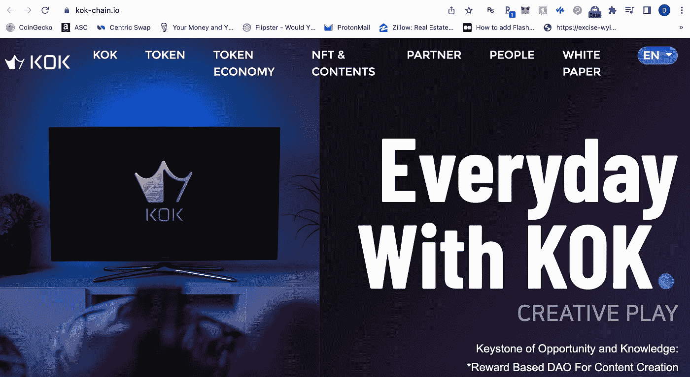

# 机会与知识的基石(KOK)是庞氏骗局吗？

> 原文：<https://medium.com/coinmonks/is-keystone-of-opportunity-and-knowledge-kok-a-ponzi-scam-77abaaf00402?source=collection_archive---------6----------------------->

(*以下表达的任何观点均为作者个人观点，不应构成投资决策的依据，也不应被解释为从事投资交易的建议或意见。*)

我在公园看到的一个朋友在谈论道权露娜的崩溃，我们都笑了。我告诉他我是如何写文章的，以及他是否希望我写一篇与加密货币相关的文章。所以他让我检查一下这个叫做[角](https://www.coingecko.com/en/coins/kok)的代币，看看它是不是一个庞氏骗局。

TL；我不会深究 KOK 令牌，因为 90-95%的加密货币硬币都失败了，只有 5%是有用和重要的。在我看来，KOK token 及其应用无法实现他们的目标和抱负。

# 首字母缩略词 KOK 代表“机会和知识的基石”所以这并不完全像听起来那样，但我想他们背后有一个聪明的术语。

当我看他们的网站时，我首先注意到的是，我们不知道谁在管理这家公司。除了列出的顾问之外，他们也没有提到任何名字，这显然不是一件好事，对吗？这是第一个主要的危险信号。

[Only People Listed “Advisor”](https://kok-chain.io/people/?lang=en) — KOK chain

该公司和 KOK play 应用程序背后的想法是创建一个应用程序，其中所有内容都在一个程序中，应用程序本身对于最终用户访问分散的网络是完全必要的。该应用程序有自己的采矿功能和游戏中的货币是角令牌。这个应用程序包括在线游戏、在线购物中心、电视广播等等。我没有机会使用或查看该应用程序，因为我在使用时有一部 iPhone 7，而且它似乎主要在 Android 上可用。关于 KOK play app 的信息来自[这里](https://www.youtube.com/watch?v=0S1K0FdGTjA)。

他们计划增加大量功能，包括像 Yandex 和 google 这样的搜索引擎、youtube、社交媒体、地图、信使等。理论上，KOK chain 公司正在寻求与苹果商店和谷歌安卓商店竞争。

# **目前，KOK 不提供除 KOK play 之外的任何产品或服务**

目前，你所能做的就是通过成为他们的会员来提升他们的会员资格。当我们看他们的补偿计划时，起作用的是他们的分支机构将投资至少 100 美元在 K0K 代币上，之后他们将代币与 KOK play 放在一起，并向你承诺每月回报。例如，你可以投资 100 至 1500 美元购买 KOK tokens(我的朋友或他的家人就是这样做的)，并获得 3 个月每月 3%的投资回报率，或者你可以投资 1500 至 10000 美元，每月获得 5%的投资回报率。

当你招募新人时，他们会付给你报酬，但请记住，他们会用 KOK 代币付给你，你只能通过他们的应用程序交换来提取。女士们先生们，请记住这一点。他们也有这些联盟排名，根据招募的人数，他们会有九个排名。

# 价格

[KOK Price Chart](https://www.coingecko.com/en/coins/kok) — [Coin Gecko](https://www.coingecko.com/)

从记录时间开始，KOK 的交易价格为 0.84 美元，在 24 小时内下跌了 12.3%。2 月 26 日，也就是我生日的前一天，金价创下了 6.83 美元的历史新高。因此，目前它从历史高点下跌了 87.5%，这还不错**但**据我了解，KOK 是一家相当新的韩国公司，它成立了区块链，希望并期待出售这个**大创意**。成千上万的人买了，起初它开始工作。但是一旦新的资金随着典型的金字塔计划的失败而开始枯竭，这也没有什么不同。'

**结论**

这似乎是一个典型的 MLM 加密骗局。如果我们看一下 KOK 代币，它是区块链以太坊上的 ERC 20 代币。这些代币可以在几分钟内设置好，而且几乎不需要任何费用。因此，创造一个新的 ERC 20 代币并不困难。

但是这里有个问题:因为他们是 MLM 人，所以他们有办公室。

*我不会对 KOK token 看得太深，因为 90–95%的加密货币硬币都会失败，只有 5%会有用和重要。在我看来，KOK token 及其应用程序无法实现他们的目标和抱负。*

如果你喜欢这篇文章，请继续关注我提供的每日加密货币新闻和见解[https://medium.com/@doyinsule](/@doyinsule)

> 加入 Coinmonks [电报频道](https://t.me/coincodecap)和 [Youtube 频道](https://www.youtube.com/c/coinmonks/videos)了解加密交易和投资

# 另外，阅读

*   [分散交易所](https://coincodecap.com/what-are-decentralized-exchanges) | [比特 FIP](https://coincodecap.com/bitbns-fip) | [宾邦评论](https://coincodecap.com/bingbon-review)
*   [用信用卡购买密码的 10 个最佳地点](https://coincodecap.com/buy-crypto-with-credit-card)
*   [加拿大最佳加密交易机器人](https://coincodecap.com/5-best-crypto-trading-bots-in-canada) | [Bybit vs 币安](https://coincodecap.com/bybit-binance-moonxbt)
*   [阿联酋 5 大最佳加密交易所](https://coincodecap.com/best-crypto-exchanges-in-uae) | [SimpleSwap 点评](https://coincodecap.com/simpleswap-review)
*   购买 Dogecoin 的 7 种最佳方式
*   [最佳期货交易信号](https://coincodecap.com/futures-trading-signals) | [流动性交易所评论](https://coincodecap.com/liquid-exchange-review)