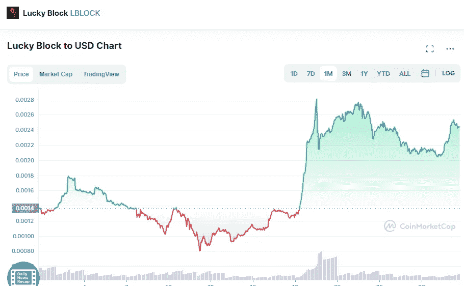

# 在五月的最后一天，幸运块(LBLOCK)是一个好的投资吗？

> 原文：<https://medium.com/coinmonks/is-lucky-block-lblock-a-good-investment-in-the-last-day-of-may-3376d5f08376?source=collection_archive---------43----------------------->

Source photo [Lucky Block price today, LBLOCK to USD live, marketcap and chart | CoinMarketCap](https://coinmarketcap.com/currencies/lucky-block/)

Lucky Block 的 LBLOCK 币是我们最喜欢的长期投资加密货币

Lucky Block 成立于 2012 年，旨在改变在线游戏的面貌。因此，用户很容易参与平台的治理，并看到他们的投资随着时间的推移而增长。