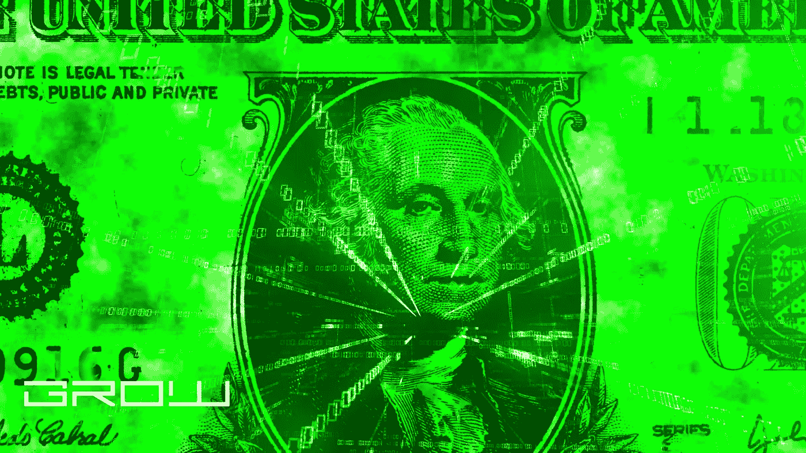

# 万事达卡是要自己创造加密货币吗？

> 原文：<https://medium.com/coinmonks/is-mastercard-going-to-create-its-own-cryptocurrency-b32b3382b828?source=collection_archive---------28----------------------->

cryptocurrency

在一份声明中，万事达卡表示，它将在初创公司“Scalex Technologies”的帮助下创建“万事达卡区块链”。这将是一个闭环钱包，让你储存你的货币，并用它来购买商品和服务。

这对万事达卡来说是一个巨大的举动，因为他们正在与首批进入加密货币的区块链初创公司合作。正如《福布斯》的报道所言，“万事达卡旨在为消费者提供一种快速、便捷、安全的‘汇款和收款’方式”。交易员对这一消息感到兴奋，他们认为这是万事达卡股价飙升的机会。

万事达卡首席执行官 Ajay Banga 在推特上表示，这种加密货币将“对所有人开放”，以更具包容性。虽然这是万事达卡首次发布关于其加密货币开发的任何消息，但它以前曾涉足区块链技术。这是 Ripple (XRP)背后的公司。在接受 CNN Money 采访时，Ripple 公司战略副总裁告诉记者，“万事达是一家大公司。他们了解风险和控制，这正是我们的业务所需要的。”

Ajay Banga 还表示，这种加密货币系统将远比比特币(BTC)等其他数字货币更有效。他说过“在我们奔跑之前，我们必须学会如何行走。”许多交易员认为，万事达卡的公告将为万事达卡股价带来立竿见影的利好消息。[文章结尾]

声明本身是中立的，我不太关心什么卡公司在研究什么加密技术。然而，这并不是读者第一次遇到与加密相关的新闻事件，看到无论是哪家公司/集团煽动了这一事件，股价都会出现快速但不可持续的飙升。在我的方法上，我会比某些人更像外科医生。

你将不得不挖得很深，远远超出表面，在这里找到任何关于万事达卡的公告的实质内容。他们谈论区块链技术已经快一年了，这让你觉得如果这一切都是基于炒作，为什么现在突然宣布呢？

此外，你还需要考虑关于万事达卡财务状况的最新消息，以及在这份声明发布之前它们的表现。该信用卡公司于 2018 年 2 月 27 日发布了第四财季报告，该报告列出了过去几个季度不断下降的增长率。

万事达卡的股价约为 130 美元(截至 2018 年 2 月 22 日)，由于增长放缓，最近跌至 121 美元。因此，我们现在看到的是一家增长放缓、股价下跌的大公司。并不需要一个 MBA 学位就能开始思考如何让公司重新获得正面形象，对吧？

即使万事达卡宣布了这样的事情，你为什么会相信这足以阻止他们的下降趋势呢？你只是在听一个在预测或计划方面被证明不可靠的管理团队的话。

你看，这类事情导致了市场的大规模恐慌，并推动市场上涨。这是一种从众心理，因为其他人都在谈论它，所以控制了局面，制造了泡沫。这是一个典型的例子，我们称之为“恐慌”。

万事达卡的股价将被推高到一个不可持续的水平，随后将再次暴跌。如果你允许自己在这一点上兴奋或投入，你只是在火上浇油。

我现在唯一会建议购买万事达卡股票的人是那些已经持有大量头寸、需要现金用于其他目的的人。如果你是投资新手，至少要等到市场有机会复苏并平静下来。

当万事达卡股价不可避免地下跌时，它会再次反弹，然后再次暴跌，因为人们总是在追逐快速收益。在没有证据的情况下，你不能相信管理层在这一点上说的或做的。

如果你想买公司股票，找一家在过去几年中表现优于市场的公司，比如创纪录的利润，裁员后没有失业等等。(这被称为“巴菲特方法”)

最后，不要忘记小型股。它们比大盘股波动性小，因为它们没有数千亿美元的销售额和利润可以损失。小盘股的好处在于，你不用花一大笔钱就可以买一大堆。你可以轻而易举地购买一系列小公司的股票，并通过将获得的股息进行再投资，让你的股票逐年增值。

> 加入 Coinmonks [电报频道](https://t.me/coincodecap)和 [Youtube 频道](https://www.youtube.com/c/coinmonks/videos)了解加密交易和投资

# 另外，阅读

*   [币安 vs FTX](https://coincodecap.com/binance-vs-ftx) | [最佳(SOL)索拉纳钱包](https://coincodecap.com/solana-wallets)
*   [比诺莫评论](https://coincodecap.com/binomo-review) | [斯多葛派 vs 3Commas vs TradeSanta](https://coincodecap.com/stoic-vs-3commas-vs-tradesanta)
*   [Capital.com 审查](https://coincodecap.com/capital-com-review) | [港加密借贷平台](https://coincodecap.com/crypto-lending-hong-kong)
*   [如何在 Uniswap 上交换加密？](https://coincodecap.com/swap-crypto-on-uniswap) | [A-Ads 审核](https://coincodecap.com/a-ads-review)
*   [WazirX vs coin dcx vs bit bns](/coinmonks/wazirx-vs-coindcx-vs-bitbns-149f4f19a2f1)|[block fi vs coin loan vs Nexo](/coinmonks/blockfi-vs-coinloan-vs-nexo-cb624635230d)
*   [本地比特币审核](/coinmonks/localbitcoins-review-6cc001c6ed56) | [加密货币储蓄账户](https://coincodecap.com/cryptocurrency-savings-accounts)