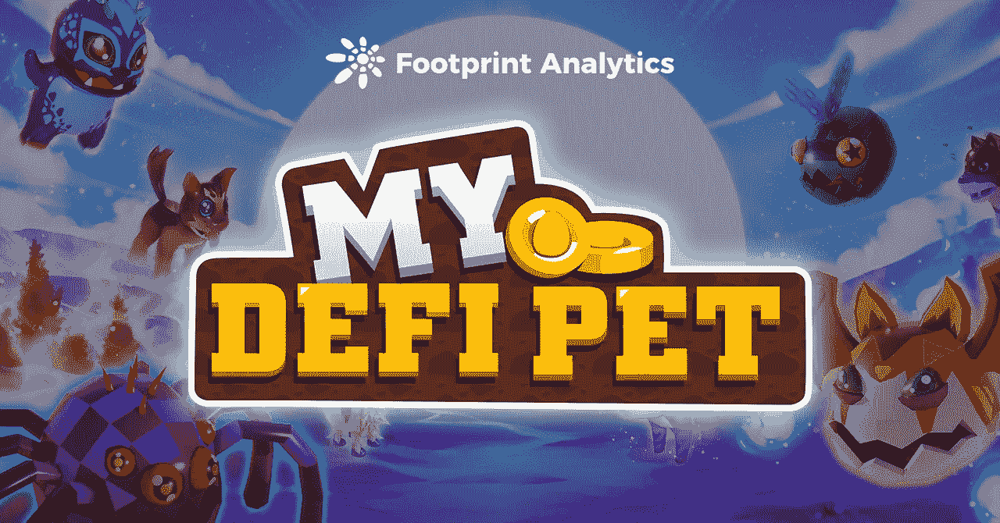

# 我的 DeFi Pet 是骗局还是管理不善？

> 原文：<https://medium.com/coinmonks/is-my-defi-pet-a-scam-or-just-badly-managed-5e0d62eaa20c?source=collection_archive---------75----------------------->

我的 DeFi 宠物团队犯了许多错误，导致其用户群直线下降。BSC 第二大头衔还有希望吗？

2022 年 4 月

数据来源:足迹分析— [我的 DeFi Pet 仪表板](https://www.footprint.network/guest/dashboard/My-DeFi-Pet-Dashboard-fp-12d48be9-a10a-4b69-9189-46f8eef41de2?chain=BSC&gamefi_name=my-defi-pet&channel=EN-238#secret=D3684498C3A98BA0F0ECCA9AA4C63C88)

自从推出近一年以来，人们大多已经不再谈论[我的 DeFi 宠物](https://www.footprint.network/guest/dashboard/My-DeFi-Pet-Dashboard-fp-12d48be9-a10a-4b69-9189-46f8eef41de2?chain=BSC&gamefi_name=my-defi-pet&channel=EN-238#secret=D3684498C3A98BA0F0ECCA9AA4C63C88)，这是一款饲养宠物的区块链游戏，去年 7 月曾有近 10 万名每日**用户。然而，我的 DeFi 宠物，目前在用户数量上排名第二的 BSC 连锁游戏，由于不太理想的原因又开始出现了。**

自 7 月份达到峰值以来，用户数量持续下降，平均每天只有 2000 人或更少。

由于游戏更新进度缓慢和几个严重的 bug，许多用户现在怀疑该游戏是一个骗局。

然而，这仅仅是一个开发团队不知所措的情况，还是一个泵和转储？

# 我的定义是什么？

My DeFi Pet 是一款由 KardiaChain 孵化，越南游戏开发商 TopeBox 开发的个性化 DeFi 宠物饲养游戏。它得到了多个投资者的支持，包括 Kardia Ventures、Axia8 Ventures 和 Megala。

玩家可以在游戏中繁殖、购买和交易怪物，建立自己的部落并与其他玩家一起战斗以获得奖励，并培养 NFT 宠物在 NFT 市场上出售。其实我的 DeFi 宠物和其他开发游戏没有太大区别，像 [Axie Infinity](https://www.footprint.network/@Lesley234365/Axie-Infinity-Dashboard?channel=EN-238) 。

*Screenshot Source — My DeFi Pet Website*

然而，与其他流行的 BSC 游戏不同，我的 DeFi 宠物玩家可以在 BSC 和 KAI 链上玩。

*   理科学士

优势:BSC 流动性高，用户参与度在所有区块链中最高。在 Pankeswap 这样的交易所购买游戏代币$DPET 也很容易。

缺点:像[多边形](https://cryptoslate.com/will-matics-burning-mechanism-help-polygon-stay-on-top-footprint-analytics/)燃气费比区块链高。

*   卡伊

优点:气费低。

缺点:流动性低于 BSC，需要从凯兑换成$DPET。玩家数量也少。

# 数据性能

*Footprint Analytics — Users Stats Overview*

**用户总数**

用户数量是游戏项目健康运营的关键。足迹分析数据显示，2021 年 7 月加入 PvP 功能后，我的 DeFi 宠物用户数量开始爆发式增长，日均达到 9.9 万用户。但只维持了一个月的增速，随后活跃用户数直线下降。

*Footprint Analytics — Daily Users*

当该平台在 8 月份大力宣传 Boss Fight 功能时，玩家们体验了一下，发现这是一个令人沮丧的版本。尽管支付了汽油费，玩家还是无法加入。在 Boss Fight 期间，玩家进行了超过 900，000 次交易，团队当时没有意识到其中超过 90%的交易失败。

9 月 15 日，该项目遭遇 DDoS 攻击，用户无法登录游戏。平台临时安排对服务器进行维护和更新，维护完成后会向用户发出登录游戏的通知。这一系列事件让玩家抛出了骗子的指责。

平台临时安排对服务器进行维护和更新，维护完成后会向用户发出登录游戏的通知。这一系列事件让玩家不得不怀疑这是一场骗局。

截至 2022 年 4 月，即使平台在尝试更新游戏项目功能，活跃用户数和新用户数仍未能增长。

**令牌:$DPET**

$DPET 是我的 DeFi 宠物的治理和游戏内货币令牌，其价格在 4 月 14 日为 0.33 美元。与 Axie Infinity 的代币$AXS 相比，$DPET 是一个低限额代币，其价格上涨是基于游戏的 NFTs 产生的兴趣。

*Footprint Analytics — Token Market Cap Per Active User vs Token Price*

**保留率**

我的 DeFi Pet 的月留存率在逐渐下降。这是因为缓慢的游戏更新和各种游戏中的问题没有得到解决。

*Footprint Analytics — Monthly Retention Analysis*

# 我的 DeFi Pet 是骗局吗？

对于游戏是否是骗局，不同的分析师有不同的看法。

*   在 DDoS 攻击和 Boss Fight 功能中的一个错误之后，他们试图修复这种情况，这表明他们正在努力维护游戏。
*   然而，令人难以置信的缓慢的功能更新和游戏进展让许多人认为开发商没有足够的能力为玩家打造一款好的产品，而是专注于推高$DPET 的价格。

这篇文章由[足迹分析](https://www.footprint.network/)社区贡献。

Footprint 社区是一个世界各地的数据和加密爱好者相互帮助了解和获得关于 Web3、元宇宙、DeFi、GameFi 或区块链新兴世界任何其他领域的见解的地方。在这里，你会发现活跃的、不同的声音相互支持，推动着社区向前发展。