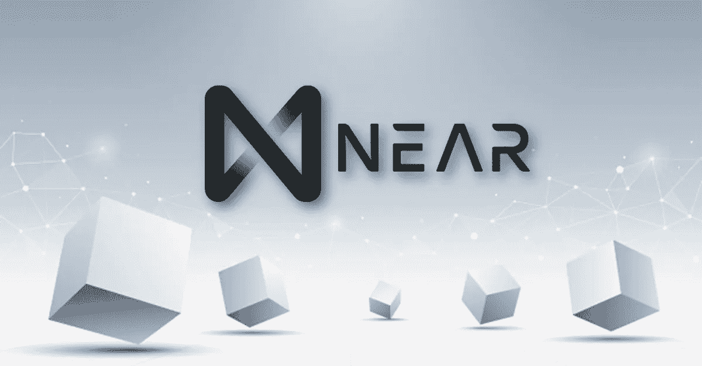

# NEAR PROTOCOL(近)5 月投资好吗？

> 原文：<https://medium.com/coinmonks/is-near-protocol-near-a-good-investment-in-may-2457475d8083?source=collection_archive---------29----------------------->

Source photo [NEAR PROTOCOL — Bing images](https://www.bing.com/images/search?view=detailV2&ccid=p7v21rAo&id=DD809AC7B64F161C882021143A91915CC576284A&thid=OIP.p7v21rAocRLBz5DvFy3HBgHaD3&mediaurl=https%3a%2f%2fbitcoinaddict.org%2fwp-content%2fuploads%2f2021%2f01%2fnear-protocol-la-gi.png&cdnurl=https%3a%2f%2fth.bing.com%2fth%2fid%2fR.a7bbf6d6b0287112c1cf90ef172dc706%3frik%3dSih2xVyRkToUIQ%26pid%3dImgRaw%26r%3d0&exph=627&expw=1200&q=NEAR+PROTOCOL&simid=607995055350483485&FORM=IRPRST&ck=8F8434F9127D7D250DE7CE688BFDFF65&selectedIndex=3&ajaxhist=0&ajaxserp=0)

据信，NEAR 正在建立一个生态系统，其中已经包括许多分散的交易所，包括 Ref Finance、Parasand Mintbase 等 NFT 平台以及名为 Burrow 的贷款协议。

除此之外，Jump Crypto、Tiger Global 和 Three Arrows Capital 等大型加密风险投资公司也为该平台提供了大量支持。此外…