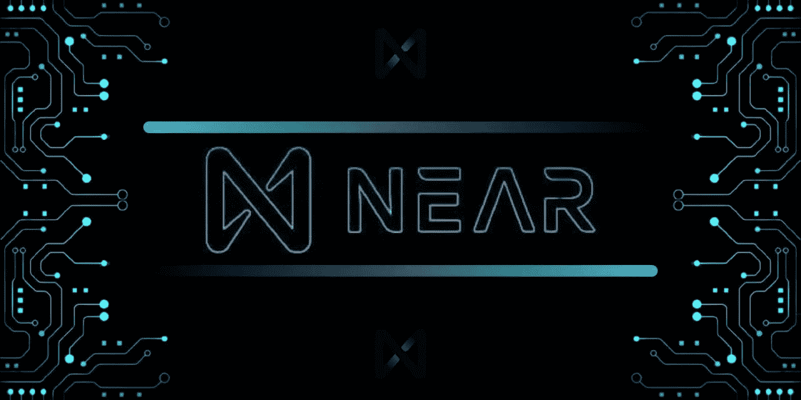

# 接近协议值得大肆宣传吗？

> 原文：<https://medium.com/coinmonks/is-near-protocol-worth-the-hype-85afada34997?source=collection_archive---------25----------------------->

事实上，今天每一个使用互联网的人，不管他是否是区块链人，都一定遇到过 Near Protocol 这个词。由于与一些浏览应用程序的近似协议协作，这一点变得更加确定。但是这个项目背后的历史是什么？为什么会有很多关于 Near Protocol 的讨论、ama、会议和意识？让我们来了解一下名字背后的区块链。

**一点背景信息**

2017 年，Near 创始人 Alexander Skidanov 和 Illia Polosukhin 首先创建了 Near 项目，作为一个可以学习区块链概念和事实的机器学习平台。随着他们在这一领域的进一步发展，他们对知识和更好的区块链表现的需求加深了，他们不断寻求满足这些需求。在学习和研究各种区块链术语和技术的过程中，他们认为探索该领域的各种项目和平台是合适的。结果，他们逐渐意识到:

由于区块链上的活动持续增加，需要一个易于使用且具有良好可扩展性的平台，以便开发人员可以创建强大的分散式应用程序(Dapps)。

尽管各种区块链平台试图体现这种需求，但它们还没有完全做好。

由于这一发现，他们决定自己创建这样一个区块链平台，从而导致了 Near Protocol 的诞生。这就是所谓的纯粹的独创性。

**近距离协议的特点**

作为第 1 层区块链，Near 协议充当高性能 Dapps 构建的基础或底层平台，易于开发者和用户操作。

凭借其 POS(Stake 的证明)机制，Near 允许验证者和令牌持有者对其令牌进行标记，以便能够形成节点。为了减少验证者的权力，Near 使用拍卖系统每 12 小时选择一次验证者。通过这种技术，Near 极大地减少了验证者的不当行为，并确保网络上有更多的参与者，最终增加了区块链的稀缺性。

Near Protocol 利用智能合约，消除了运行 Dapps 和交易的缓慢、拥挤和昂贵的过程，从而确保了技术的最佳利用。它能够通过被称为茄影的切割技术做到这一点。

简单来说，碎片就是整体的一部分。因此，通过扩展，分片技术的使用意味着节点可以被分解或分割成跨各种验证器节点的更小的单元或分片，给予每个节点一小部分网络事务以在近协议区块链中处理和存储。通过这种方式，Near 协议能够在不影响输出的情况下进行高容量交易，从而提高交易量、可扩展性、速度和整体性能。

Near Protocol 还使用了一种被称为末日阻塞(doomslug)的机制，通过这种机制，验证者在区块链中轮流产生和广播块，以提高效率。Near Protocol 展示了一个用户友好的界面，引入了可读的帐户名来代替通常使用的加密钱包地址。

Near 协议还有一个名为 NEAR 的令牌，它有多种用途:

作为交易费的一种手段。交易费用的一部分支付给创建智能合同的开发人员，而其余部分则被烧掉以增加令牌的稀缺性。

它也可以用作在区块链上存储数据的抵押品。

为了确保 Near 生态系统的稳步改善，每年可用 Near 令牌总量的 0.5%将被注入生态系统平台用于开发。

验证者通过标记他们的令牌来确保区块链的安全性，从而得到近令牌奖励。

**协议设置成功的接近程度**

Near Protocol 拥有一个爆炸性的开发者社区，并被视为区块链发展最快的生态系统之一。这是由某些因素造成的。

Aurora 平台是一个 EVM，是基于 Near 协议的智能合约。有了它，开发者可以享受到以太坊兼容的服务、高吞吐量、最优的可扩展性、更少的交易费用、平台的安全性和安全性。这也使得开发人员可以轻松地将他们的应用程序迁移到 Near 平台。随着 Aurora 平台的使用，开发人员可以享受到两个世界的好处，以太坊应用程序在 Near 平台上的效率。

用于跨链服务的彩虹桥允许以无信任、无许可的方式将资产从其他生态系统迁移到附近的平台。

此外，值得注意的是他们为改进协议提供的各种项目资金，以及在近生态系统中已经实现和正在进行的合作。像 Mintbase，Paras，NPunks，OPGames，Tenk，DAO Records，Satori，Near Misfits，RAIZ 等一系列项目的建设肯定会为 Near 用户带来兴奋和功能。

有没有想过要多久才能在法定货币和加密货币之间架起一座简单的桥梁？协议上说从昨天开始！通过实体和移动应用形式的 NearPay，用户可以用 Near 或任何加密货币进行交易。它简单、快速，最重要的是安全。

Near Protocol 正致力于减少(如果不是完全消除的话)其在世界上的碳足迹。通过使用近协议分片技术、Nigtshade 及其 POS 活动，在这方面已经取得了一些成功。由于其努力以更绿色的项目取代其碳足迹，2021 年，Near Protocol 获得了南极气候中性产品标签。

另一种接近协议的方式是通过与 Sweatcoin 合作来鼓励更健康的生活生态系统，SWEAT coin 是一家以通过健康创造新的财富经济为使命的公司，通过激励人们更多地推出汗水代币。Sweatcoin 应用程序的用户无论何时移动都可以获得这个令牌。

**结论**

随着每个项目的开展，Near Protocol 不断确保其为社区和区块链带来创造性、简单性、可扩展性和赋权的愿景得以实现。对于这个高性能的区块链来说，最好的还在后头。

**创建近距离账户访问:**

【https://wallet.near.org/create 

了解关于 Near 协议的第一手信息:

推特

[https://twitter.com/near_blockchain](https://twitter.com/near_blockchain)

[https://twitter.com/NEARProtocol](https://twitter.com/NEARProtocol)

电报

[https://t.me/cryptonear](https://t.me/cryptonear)

不调和

 [## 加入近不和谐服务器！

### 查看 Discord 上的附近社区-与 50，743 名其他成员一起闲逛，享受免费语音和文本聊天。

discord.com](https://discord.com/invite/Hx8gYxxC5n) 

> 加入 Coinmonks [电报频道](https://t.me/coincodecap)和 [Youtube 频道](https://www.youtube.com/c/coinmonks/videos)了解加密交易和投资

# 另外，阅读

*   [如何购买 Monero](https://coincodecap.com/buy-monero) | [IDEX 评论](https://coincodecap.com/idex-review) | [BitKan 交易机器人](https://coincodecap.com/bitkan-trading-bot)
*   [尤霍德勒 vs 考尼洛 vs 霍德诺特](/coinmonks/youhodler-vs-coinloan-vs-hodlnaut-b1050acde55a) | [Cryptohopper vs 哈斯博特](https://coincodecap.com/cryptohopper-vs-haasbot)
*   [顶级付费加密货币和区块链课程](https://coincodecap.com/blockchain-courses)
*   [MXC 交易所评论](/coinmonks/mxc-exchange-review-3af0ec1cba8c) | [Pionex vs 币安](https://coincodecap.com/pionex-vs-binance) | [Pionex 套利机器人](https://coincodecap.com/pionex-arbitrage-bot)
*   [如何在印度购买比特币？](/coinmonks/buy-bitcoin-in-india-feb50ddfef94) | [瓦济克斯评论](/coinmonks/wazirx-review-5c811b074f5b)
*   [Unocoin 评论](https://coincodecap.com/unocoin-review) | [最佳加密赌注硬币](https://coincodecap.com/best-crypto-staking-coins)