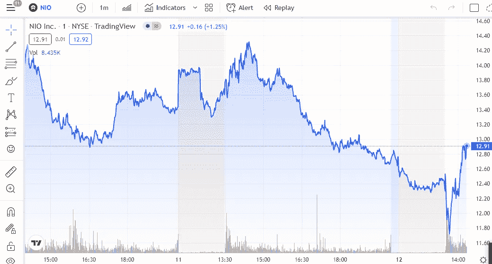

# NIO Inc . 2022 年 5 月投资好吗？

> 原文：<https://medium.com/coinmonks/is-nio-inc-a-good-investment-in-may-2022-b0c0537350d6?source=collection_archive---------45----------------------->

Source photo [NIO 12.88 ▲ +1.34% (tradingview.com)](https://www.tradingview.com/chart/?symbol=NYSE%3ANIO)

Nio 是一家设计和制造智能环保电动汽车的中国公司。该公司还生产五人、六人或七人座的电动 SUV，以及智能电动汽车。截至 2021 年 12 月 31 日，30 只对冲基金持有价值 8.1367 亿美元的 NIO Inc .(纽约证券交易所代码:NIO)。