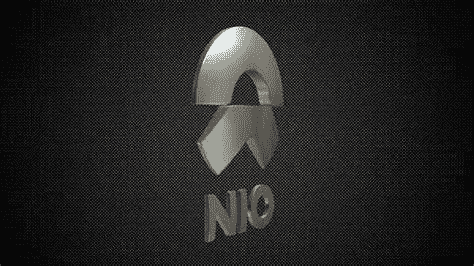

# NIO 股票是好的投资吗？

> 原文：<https://medium.com/coinmonks/is-nio-stock-a-good-investment-3fa7f2c3c983?source=collection_archive---------50----------------------->

Source photo [nio logo — Bing images](https://www.bing.com/images/search?view=detailV2&ccid=LQJqStPd&id=44B0B7C883EEF29B6E8C503E1A35032A6EFBDD09&thid=OIP.LQJqStPdbhb8a4o-e8W9sQHaEK&mediaurl=https%3a%2f%2fnetrinoimages.s3.eu-west-2.amazonaws.com%2f2016%2f12%2f18%2f431639%2f176125%2fnio_logo_3d_model_c4d_max_obj_fbx_ma_lwo_3ds_3dm_stl_1901471_o.jpg&cdnurl=https%3a%2f%2fth.bing.com%2fth%2fid%2fR.2d026a4ad3dd6e16fc6b8a3e7bc5bdb1%3frik%3dCd37bioDNRo%252bUA%26pid%3dImgRaw%26r%3d0&exph=844&expw=1500&q=nio+logo&simid=607998195002255591&FORM=IRPRST&ck=3CB23897B960B3CF74A364BEC43A25B5&selectedIndex=6&ajaxhist=0&ajaxserp=0)

这家中国电动汽车(EV)制造商的股价在 2021 年飙升，当时投资者对所有与 EV 相关的东西都只看到了金钱迹象。现在，没那么糟了。该公司的股价去年下跌了 53%。

俗话说，你倒下了，但没有出局。忽视 Nio 在电动汽车行业的潜力将是一个严重的错误。在中国，世界上最大的汽车…