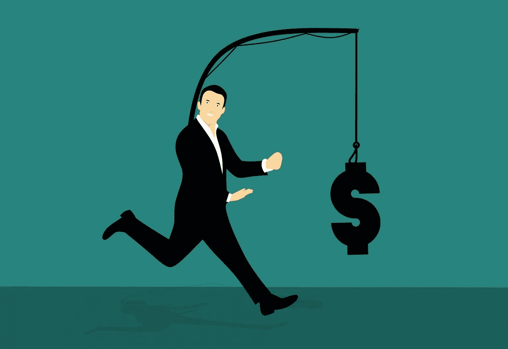
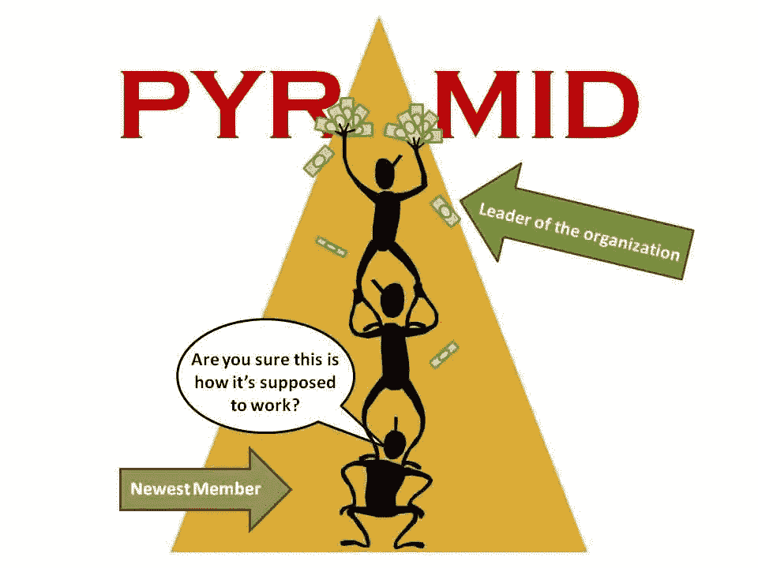
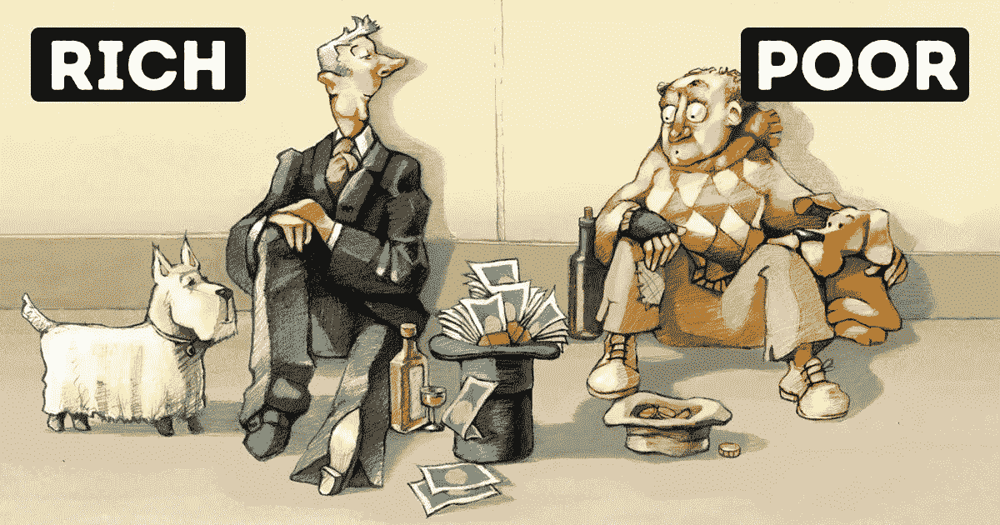

# 有了密码，被动收入可能吗？

> 原文：<https://medium.com/coinmonks/is-passive-income-possible-with-crypto-ae630ae969da?source=collection_archive---------28----------------------->

被动收入。这到底是什么？我们可以找到许多关于如何从投资中获得惊人回报的文章、网站或视频。无论投资是什么，都可能是金钱、时间、私人数据，甚至是我们的联系人。

让我们不要照章办事。被动收入有一个定义，比如 [Investopedia](https://www.investopedia.com/terms/p/passiveincome.asp) 提供了一个。我在这句话下面想象的是，用最少的努力，几乎不用努力，就能给你带来回报，但这可能需要一些初始投资。它可能是你在构建 web 服务、应用程序上的时间投资，或者是一些产生收益的金融投资。

Chasing extra income. [Source](https://pxhere.com/en/photo/1453161)

我猜你已经看到许多文章承诺难以置信的收入。按照这些步骤，每月(或每周，甚至每小时)得到 1000 美元和类似的东西。是的，我说了狗屎。为什么？因为这些东西大多建立在贪婪和希望的假设上。就像上一篇 [**淘金**](/coinmonks/crypto-rush-51cba8a90932)**的想法是一样的。**

**这个想法并不新鲜，我在人生的每个阶段都经历过。让我们想象一下:**

> **在幼儿园，当你想玩另一个孩子的玩具时，你必须付钱给那个穿着小熊软糖的孩子来借玩具。这是他/她的玩具，孩子可以从中获利。**
> 
> **在学校，有电子游戏。如果你想得到这个游戏，你必须付你的零花钱来买这个副本。**
> 
> **在高中，一些人从兼职工作开始，并被 scammy 财务咨询公司录用。他们向朋友和亲戚出售劣质金融产品。如果他们建立了金字塔计划(从他们的朋友那里)，有来自佣金的被动收入。**
> 
> **在大学，你分享你的家庭作业或学期工作成果，你可以靠它赚钱，当然，如果他们不检查抄袭的话。**
> 
> **自己回答几个问题。有多少人在尝试的时候真的获利了？所有人？因为这很容易？还是只有几个？**

**互联网上充满了保证被动收入的想法，这些想法大多以骗局和金钱损失告终。类似于我提到的金融产品的传销，你可以找到广告点击，联盟营销，验证码解决方案，在社交媒体上销售喜欢，甚至是虚假评论和应用程序下载等优惠。**

**如果你建立了一个强大的追随者群体，你可以从他们的工作中获得一些丰厚的佣金。道德吗？由大家来决定。但让我们面对事实，大多数参与这些活动的人最终都会亏本，因为通常需要一些初始投资。可能你不想听到这些，对吗？**

****

**This is not how it should work. [Source](https://www.techzim.co.zw/2016/08/pyramid-schemes-doomed-fail-mathematical-proof/)**

**许多 YouTubers 或博客作者分享他们的想法并展示他们的成功。想象一下，如果其他人会分享他们的失败。但是没人想看或读那个。我们热爱希望。我们愿意相信梦想会成真。**

**但是 crypto 能改变它吗？加密有哪些选项？让我们把明显的骗局放在一边，检查我注意到的选项。**

# **1)采矿**

**你可以投资采矿设备。但是让我们面对现实吧。[作为一个单独的采矿者，采矿很可能没有太多利润](https://www.coindesk.com/learn/can-you-still-mine-bitcoin-and-other-crypto-from-home/)(包括初始投资、当前能源价格、加密波动性、不断增加的散列率&淘汰采矿设备)。最近，有一些来自较小的个体矿工的幸运镜头，但依靠这一点就像赌博。**

** [## 这样的小矿工是如何解决比特币区块的？

### 不是一个，也不是两个，而是三个小型比特币矿工能够找到有效的块哈希，并向比特币添加新的块…

bitcoinmagazine.com](https://bitcoinmagazine.com/business/how-small-solo-miners-solve-bitcoin-blocks) 

如果你不打算投入大量资金，你可以加入采矿池。如果你消耗的能量少于你将产生的价值，这给了你思考的空间。

你也可以通过像 [Nicehash](https://www.nicehash.com/) 这样的市场购买或租赁你的 hash power。并根据市场需求和你目前的能源价格(最近大幅上涨)来评估你的盈利能力。

此外，你应该做好准备，你的采矿设备可能会很快变得过时，它可以停止盈利采矿。同样，你可以投机价格，但一旦你将不得不支付账单。

此外，关注网络的安全性也很重要。这意味着矿权是如何分配的(没有多数人占多数的池)，以及一个大矿商劫持网络的可能性。一些攻击成本的概述带来了 [Crypto51.info](https://www.crypto51.app/) 。

 [## 不同加密货币遭受 51%攻击的成本| Crypto51

### 这是一个硬币的集合，也是每个网络 51%攻击的理论成本。

www.crypto51.app](https://www.crypto51.app/) 

如果你决定试一试，[去挖掘什么](https://whattomine.com/)是一个很好的检查工具，在你跳进去之前。有趣的是，他们也为开发者提供开放的免费 API。

 [## 与以太坊相比，加密硬币采矿利润计算器

### 计算与以太坊或比特币相比，开采所选替代币的利润有多少

whattomine.com](https://whattomine.com/) 

赞成的意见

*   挖掘装置可以用来挖掘不同的硬币
*   参与池的选项
*   选择在市场上购买/出售您的计算能力

骗局

*   采矿设备可能会过时
*   能源价格会导致采矿业无利可图
*   51%的攻击针对薄弱的工作链证明

# 2)打桩

打桩是保护区块链的另一种技术。一些人仍然不相信它的安全性，采矿-打桩争论仍然是一件事。主要是以太人和比特币人之间。但是这超出了本文的范围。

简单来说，你需要投资硬币/代币，而不是采矿设备。这些硬币在保护网络(或保护 DAapps)的游戏中用作您的赌注。根据你赌注的重量，你会得到奖励。类似于采矿。

采矿的好处是你可以将你的采矿设备切换到另一个网络，如果你当前采矿的网络出现问题，你可以继续采矿。因此，你应该真正确定你投资的项目。因为如果出了问题，你的全部投资可能会损失。[赌注奖励服务](https://www.stakingrewards.com/)提供了一个有趣的概述。

 [## 通过加密|赌注奖励赚取被动收入

### 赌注回报是赌注和加密增长工具的领先数据提供商。我们目前正在跟踪和 263…

www.stakingrewards.com](https://www.stakingrewards.com/) 

赞成的意见

*   不需要采矿设备
*   通常易于设置
*   低能耗

骗局

*   投资于不稳定资产
*   大股东可能攻击网络的比例与 51%相似

# 3)主节点

主节点是验证新块的特殊节点。他们要求有一些初始抵押品，这应该是为了防止网络中的不良行为者，如果他们被抓住，就有失去抵押品的风险。如果他们是诚实的，他们会因为保护网络而得到回报。

masternode 硬币的大繁荣发生在 2017 年底。这些项目中的大多数都是廉价的抄袭品，背负着巨大的技术债务。在接下来的几个月里，一切都崩溃了。

然而，少数项目在熊市的血洗中幸存下来，现在仍然活跃。多少有些成功。可以在 [masternodes.online](https://masternodes.online/) 上找到 masternode 硬币的概览。

 [## 主节点。在线的

### 表格行注:初始硬币发行(ICO)。分层主节点。十进制硬币。不准确统计。区块链是…

主节点. online](https://masternodes.online/) 

赞成的意见

*   不需要采矿设备
*   议定书的管理

骗局

*   主要是对不稳定资产高风险投资
*   较高的初始投资要求(抵押品)
*   节点的设置可能很复杂

# 4)高产农业

随着分散金融(DeFi)的诞生，我们获得了一个新的机会，如何以分散的方式(kinda)在我们的闲置资产上赚取收益率。最大的繁荣始于贷款市场和合成品抵押。加上 AMM 分散化的交易所，我们打开了潘多拉的盒子。

“金钱乐高”这个词说明了一切。起初，你可以从平台上产生的费用中赚取一部分，用于提供你的流动资金。后来，它通过流动性挖掘变得更高，这种可能性可以通过贡献和使用协议获得治理令牌的额外奖励。

它导致了疯狂的投资策略和自动化的投资金库，利用杠杆、符号化的流动性头寸，同时在许多项目中收获收益。Total gamechanger 推出了[快速贷款](https://www.youtube.com/watch?v=mCJUhnXQ76s)，这是一种抵押不足的贷款，可以在同一个街区偿还。

有几个收益率比较工具，但我不知道有什么好的聚合工具可以涵盖所有类型。举几个例子， [LoanScan](https://loanscan.io/) 提供借贷市场概况， [Liquidityfolio](https://www.liquidityfolio.com/) 跟踪 AMMs 的收益率。

 [## LoanScan:比较高息账户

### LoanScan 帮助您发现和访问高息账户。利用我们的工具让您的资金增值。

loanscan.io](https://loanscan.io/) 

赞成的意见

*   每个人都能获得各种金融工具
*   选择通过使用复杂的策略来增加产量
*   自动化投资金库和复利
*   抵押不足的贷款(快速贷款)和套利交易

骗局

*   多重风险([智能合同漏洞利用](https://blaize.tech/article-type/9-most-common-smart-contract-vulnerabilities-found-by-blaize/)、[快速贷款漏洞利用](https://coinmarketcap.com/alexandria/article/what-are-flash-loan-attacks)、[非永久性损失](https://academy.binance.com/en/articles/impermanent-loss-explained))
*   对新人来说很复杂，无法完全理解风险
*   有时没有完全分散
*   不得不依赖区块链的安全(51%的攻击，[双倍花费](https://www.investopedia.com/terms/d/doublespending.asp)

# 6) NFT

翻转 NFTs(意思是低买高卖)成为社交媒体上的一个话题。我们都看到了少数人带来的难以置信的收益。这多半是赌博，每一次成功都掩盖了别人的许多失败。翻转本身是主动交易，因此我不会把它算作被动收入。

被认为是被动收入的是版税。版税是对 NFT 发行者的奖励，是来自未来交易的百分比奖励。这意味着未来的每一笔交易都会给原始发行者带来回报。如果 NFT 是一个成功的、经常交易的资产，它可以成为原作者真正的财富。

NFTs 得到了很大的关注，尤其是在以太坊区块链。如今最常用的市场之一是 [OpenSea](https://opensea.io/) 。

 [## 探索收藏| OpenSea

### 多边形上的无气市场。在多边形区块链上创建、购买、出售和拍卖 NFT，而无需…

opensea.io](https://opensea.io/explore-collections) 

赞成的意见

*   每个人都能接触到
*   如何将数字财产货币化的简单方法

骗局

*   高风险投资
*   可疑的分权
*   不得不依赖区块链的安全(51%攻击，[双花](https://www.investopedia.com/terms/d/doublespending.asp))

# 7)空投

多个加密项目决定转换，或者至少他们假装转换成分散的自治组织= DAO。为了能够治理项目的未来步骤，您需要拥有治理投票。但是如何让社区参与进来呢？空投，主要是追溯到项目的用户。最初，这是一个不错的主意。

使用该项目的用户有机会决定其未来。但当时它被空投猎人利用了。一些空投甚至更像是对投资者的回报。但是，这仍然是一个有趣的想法，获得一次性收入，只使用你最喜欢的产品。

一个有趣的服务是 [AirDrops.io](https://airdrops.io/) ，用于跟踪跨多个链和项目的空投。

 [## 加密空投清单 2022 年 3 月“寻找免费空投和奖金！

### lll➤寻找免费加密空投？试试 airdrops.io！我们汇总了 3 月份的最新加密货币空投…

airdrops.io](https://airdrops.io/) 

赞成的意见

*   使用项目的报酬
*   治理中的投票权

骗局

*   可以被鲸鱼捕食
*   鲸鱼可能接管投票权
*   假空投经常被用于网络钓鱼

# 8)安全令牌

我想提到的最后一类是令牌化证券。它可以是象征性的股权、债务，甚至是象征性的房地产所有权。这意味着这些代币可能会及时升值，并支付股息，就像传统证券一样。但是像所有事情一样，它也可以下降。

证券代币受到监管，因此对投资者来说应该更安全。但它带来了与之相关的所有必要条件，如反洗钱、KYC，甚至成为合格投资者等要求。

提供现有安全令牌的服务之一是 STOmarket.com。

 [## 所有 STO 交易代币|证券代币市场|交易价格|代币价格

### 🚨爆炸性新闻🚨我们在修饰自己！已经有 1024 人认捐了 620 万美元！保留你的位置投资于…

stomarket.com](https://stomarket.com/market) 

赞成的意见

*   受监管的投资应该更安全吗

骗局

*   受管制，可能被查封，冻结
*   不能完全分散

# 结论

所以，到底怎么了？我应该把我的钱放在哪里以获得一份不错的被动收入？如果有一个工作模式，我们都会很富有。你在网上看到的所有承诺都具有很强的欺骗性。肯定会有输家为赢家创造利润。

When there are winners, there are losers. [Source](https://oluwasegunonimisi.com/17-difference-between-rich-and-poor/)

找到你是谁需要时间。了解投资风险和你决定投资的产品是至关重要的。如果你有这方面的知识，它会降低风险，并可能提高你的回报，或帮助你防止损失。

回答最初的问题:**有可能，但也有风险**。我试着强调了几个选项，你可以更深入地探索并决定哪一个最适合你。如果你错过了什么，请在评论中告诉我。祝你一路平安，好运。

> 加入 Coinmonks [电报频道](https://t.me/coincodecap)和 [Youtube 频道](https://www.youtube.com/c/coinmonks/videos)了解加密交易和投资

# 另外，阅读

*   [用信用卡购买密码的 10 个最佳地点](https://coincodecap.com/buy-crypto-with-credit-card)
*   [最好的卡达诺钱包](https://coincodecap.com/best-cardano-wallets) | [Bingbon 副本交易](https://coincodecap.com/bingbon-copy-trading)
*   [印度最佳 P2P 加密交易所](https://coincodecap.com/p2p-crypto-exchanges-in-india) | [柴犬钱包](https://coincodecap.com/baby-shiba-inu-wallets)
*   [8 大加密附属计划](https://coincodecap.com/crypto-affiliate-programs) | [eToro vs 比特币基地](https://coincodecap.com/etoro-vs-coinbase)
*   [最佳以太坊钱包](https://coincodecap.com/best-ethereum-wallets) | [电报上的加密货币机器人](https://coincodecap.com/telegram-crypto-bots)**