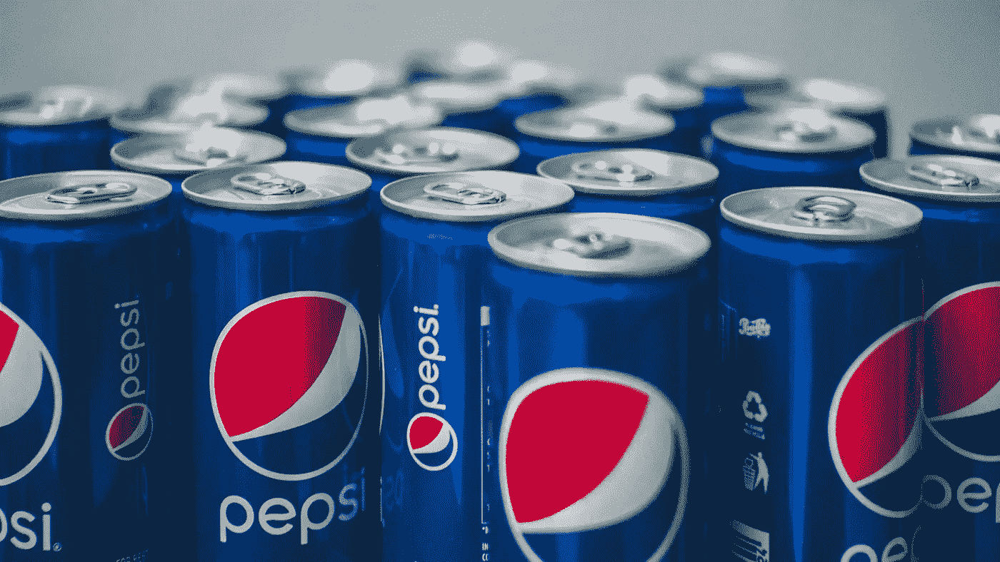

# 百事公司的股票是一个好买卖吗？

> 原文：<https://medium.com/coinmonks/is-pepsico-stock-a-good-buy-66ed78b3e74f?source=collection_archive---------35----------------------->

Source photo Unsplash.com

这是一种在经济景气和不景气时都表现良好的股票:百事可乐(NASDAQ:PEP)。

这家总部位于纽约哈里森的公司的股价今年迄今仅下跌 10%，相比之下，其交易所在的纳斯达克指数下跌了 29%。PEP 的股票目前以每股 160 美元的价格出售，较其 52 周高点每股 177.62 美元折价 12%。