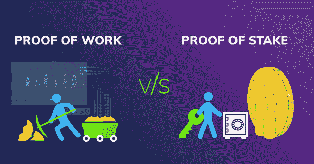

# 股权证明真的像现在的菲亚特系统吗？

> 原文：<https://medium.com/coinmonks/is-proof-of-stake-really-like-the-current-fiat-system-a259e3bcc36d?source=collection_archive---------9----------------------->

你可能已经听到了比特币中更极端的声音，声称 PoS 与当前的菲亚特系统完全一样，因此当并排比较这两个系统时，工作证明是明显的赢家。让我们进一步分析一下，看看是不是真的。

美元是如何印制的，由谁来决定？
美国联邦储备系统是有权通过改变利率来制定货币政策的实体，并且能够印刷美元。普通美国公民没有能力合法印刷美元，他们在货币政策的总体治理中没有发言权，也不能从确保美元存在的货币体系中获得利息。

**什么是利益证明？**
赌注证明(PoS)是一种共识机制，投票的权重由用户持有的硬币(赌注)数量决定。因此，正如比特币矿工的 hashrate 决定了他们每次可以生产多少区块一样，PoS 验证机的赌注数量也是如此。在以太坊，成为验证者的要求是 32 ETH，然而也有智能合约(例如:火箭池，利多等。)使得用户能够将他们 ETH 集中在一起，允许任何人能够下注任何数量的 ETH。任何用户都可以下注任意数量的 ETH，并获得约 5%的年回报率，同时参与共识并维护以太坊的安全性。利率由协议本身通过算法确定，在 hardfork 之外不受影响。这类似于比特币，发行不能改变，除非有硬分叉。因此，在这两个协议中，我们可以说没有人控制发行，而是协议通过算法确定发行。

标准 1:
与美联储不同，没有人特别控制 ETH 的发行。如果有人试图改变它(就像比特币一样)，市场将决定支持哪个分支。

标准 2:
与美联储不同，任何 ETH 持有者都可以从其 ETH 中获得利息，并可以参与共识。每个 ETH 持有者都有机会受益于必要的通货膨胀，以支付安全预算。(还值得注意的是，在 PoS 环境中的 EIP-1559 ETH 是净通缩的，因此在发放批量补贴时不会产生净通胀。)一般的美元持有者不会从美元的印刷中受益。

从这两个标准来看，美联储和美联储都不相似。

**什么是工作证明？**
工作证明(PoW)是一种共识机制，矿工可以使用他们的计算机生成哈希，以保护网络安全，同时还可以因此获得报酬。

对于普通用户来说，PoW 和 PoS 的主要区别在于合理参与的能力。要想盈利，开采比特币需要大量基础设施投资，由于规模经济，竞争非常激烈。这意味着，如果采矿者 A 在采矿基础设施方面的投资为 100 亿美元，采矿者 B 的投资为 100 万美元，采矿者 A 的单位时间投资收益率将*显著*高于采矿者 A。这是一种集中力量，使较大的采矿作业能够战胜较小的作业，从而增加其市场份额，慢慢淘汰较小的采矿者，并激励较大的采矿者合并。gigaminer 将能够在能源合同和其他一切具有批发价值的东西上做出更好的交易，包括智力(工程、财务规划、储备销售机会的技术分析等)。有了 PoS，无论你押 100 美元还是 10 亿美元，每个人都有相同的收益。因此，集中效应**明显小于比特币挖矿效应**。PoS 具有低得多的进入门槛，并且它没有能量消耗，这意味着协议可以发布**小得多的**膨胀来激励验证者保持在线。这意味着安全的价格比战俘的价格低得多。

标准 1:
与美联储不同，没有人特别控制 BTC 的发行。如果有人试图改变它(就像以太坊一样)，市场将决定支持哪个分支。

标准 2:
与美联储类似，普通比特币持有者不能从协议中获得收益，也不能参与共识。与美联储类似，只有富裕的人群(矿工)才能从通货膨胀中分得一杯羹。财富的数量越大，积累的%收益就越高，从而成为每天淘汰更多小矿工的集中力量。

PoW 类似于标准 2 上的 FED。

PoW 更接近于当前的菲亚特系统，因为进入的门槛很高，大型矿业机构可以通过赚取比特币获得巨大利益，而普通用户没有能力通过加入网络来增加他们的比特币。

我最后会说，PoS 是菲亚特系统的直接对立面。当有人试图将两者混为一谈时，这只能通过有缺陷的逻辑来实现，以支持 PoS 远不如 PoW 的观点。

我确实认为 PoS > PoW，但我不会说 PoS 是有史以来最好的发明，也不会说 power 真的会烧开海洋。这种情况的反面是 BTC·马克斯试图通过使用错误的逻辑和极端主义来推销的东西。不过不要搞错，我认为它们都是很好共识机制，如果我们不得不永远使用权力，这是可行的，尽管并不理想。不过，总的来说，认为 PoS 与当前的菲亚特系统相似是一个有缺陷的论点。

> 加入 Coinmonks [电报频道](https://t.me/coincodecap)和 [Youtube 频道](https://www.youtube.com/c/coinmonks/videos)获取每日[加密新闻](http://coincodecap.com/)

# 另外，阅读

*   [币安 vs FTX](https://coincodecap.com/binance-vs-ftx) | [最佳(SOL)索拉纳钱包](https://coincodecap.com/solana-wallets)
*   [比诺莫评论](https://coincodecap.com/binomo-review) | [斯多葛派 vs 3Commas vs TradeSanta](https://coincodecap.com/stoic-vs-3commas-vs-tradesanta)
*   [Capital.com 评论](https://coincodecap.com/capital-com-review) | [香港的加密借贷平台](https://coincodecap.com/crypto-lending-hong-kong)
*   [如何在 Uniswap 上交换加密？](https://coincodecap.com/swap-crypto-on-uniswap) | [A-Ads 评论](https://coincodecap.com/a-ads-review)
*   [WazirX vs CoinDCX vs bit bns](/coinmonks/wazirx-vs-coindcx-vs-bitbns-149f4f19a2f1)|[block fi vs coin loan vs Nexo](/coinmonks/blockfi-vs-coinloan-vs-nexo-cb624635230d)
*   [本地比特币评论](/coinmonks/localbitcoins-review-6cc001c6ed56) | [加密货币储蓄账户](https://coincodecap.com/cryptocurrency-savings-accounts)