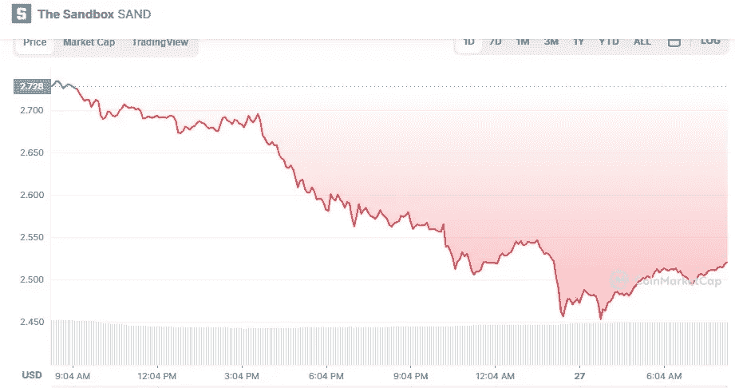

# 2022 年 5 月沙盒投资好吗？

> 原文：<https://medium.com/coinmonks/is-sandbox-a-good-investment-in-may-2022-d52839eebe38?source=collection_archive---------15----------------------->

Source photo [The Sandbox price today, SAND to USD live, marketcap and chart | CoinMarketCap](https://coinmarketcap.com/currencies/the-sandbox/)

沙盒也被列入我们今天最受欢迎的加密货币名单。最受欢迎的元宇宙硬币之一，沙盒(沙子)目前售价为 2.52 美元，下降了 7.57%。

在元宇宙，沙盒是在以太坊区块链上运行的硬币。自诞生以来，沙盒已经成为元宇宙最受欢迎的加密货币之一…