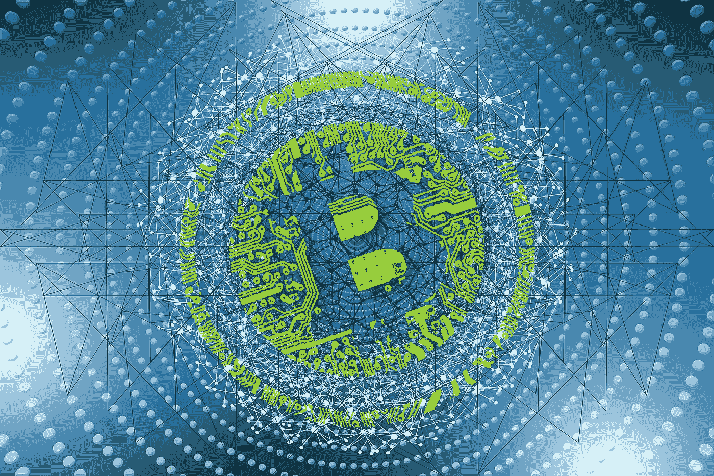

# 以 100 美元出售比特币现金明智吗&谁在购买？

> 原文：<https://medium.com/coinmonks/is-selling-bch-at-100-wise-who-is-buying-6947f937daaf?source=collection_archive---------9----------------------->

*Image by “ gerart “, on Pixabay (modified)*

比特币现金(BCH)是在 100 美元卖出，还是投机者在增加筹码的同时将价格维持在历史低点？

我昨天创造了这个简单的迷因，警告不要把 BCH 卖给菲亚特或 BTC。卖出意味着失去希望。当然，这与交易无关，因为交易者并不真正关心项目的长期可行性。