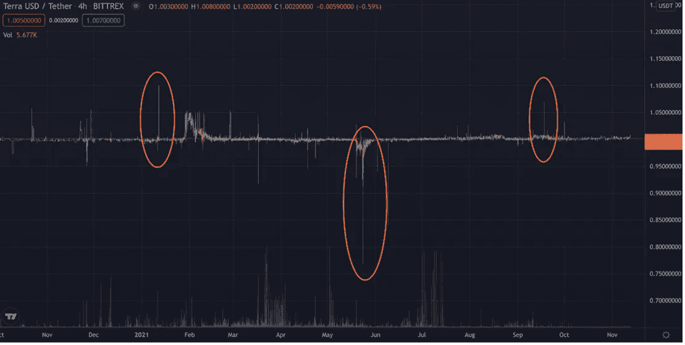
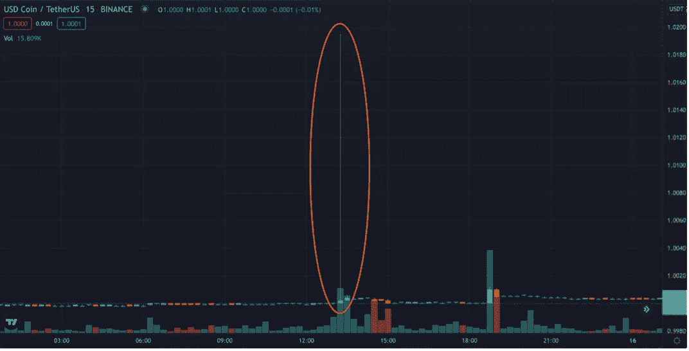
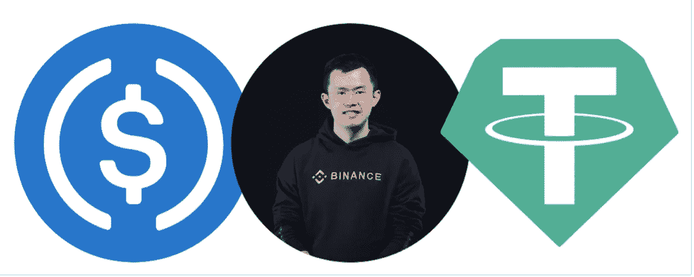
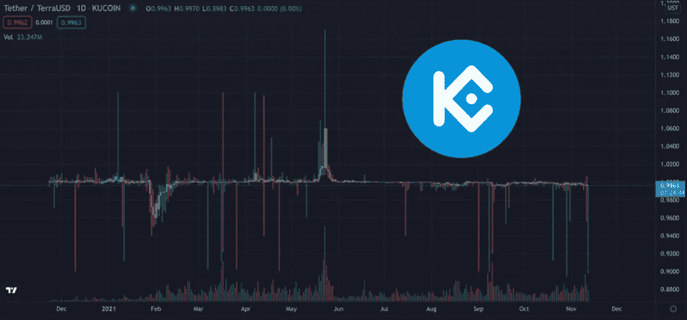
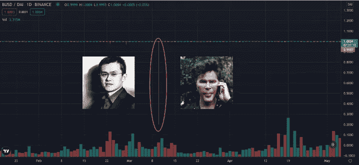

# 均线上的滑点是无风险的交易策略吗？

> 原文：<https://medium.com/coinmonks/is-slippage-on-stablecoins-a-risk-free-trading-strategy-225a0848a3e4?source=collection_archive---------9----------------------->

在这篇文章中，我将分析集中和分散交易中出现的稳定资本下滑。我将调查它发生的原因，它的后果以及我们可以利用密码市场的这些“空白”的方法。

什么是滑点？

当您的订单执行价格与请求价格不一致时，就会出现滑点。这是当市场对你的交易不利时，在你的经纪人处理订单的时间里，原始价格不再可用。与传统加密货币不同，稳定货币的主要特点是必须始终与美元挂钩。价格的任何长期变动都会导致不稳定，因此它们将不再“稳定”。主要原因是与该对货币的交易量相比，市场订单交易量较大。发生这种情况时，有两种明确定义的情况:

-低交易量的交易所/对。

-所选货币对的交易量高的大型交易所。

我将集中讨论第一种情况。这种情况往往发生在交易量较低的交易所，在那里稳定的债券以相对较低的日交易量进行交易。目前在 Bittrex 上交易的 UST/USDT 组合可能就是这种情况。根据 Coinmarketcap 的数据，其日交易量不到 2 万美元，与比特币基地每日逾 350 万美元的 USD 美元交易量相比微不足道。这意味着什么？很简单，在 Bittrex 上出现的最轻微的大批量市场订单，订单簿将无法处理如此大的数量，价格将在几秒钟内发生剧烈变化。

UST/USDT Slippage

我现在将转向滑点可能发生的第二种情况，这是本文的重点，因为这是一种随着时间的推移有可能定期盈利的方式。在每天交易巨额资金的交易所中，个人或机构希望立即卖出/买入其全部头寸的情况并不罕见。

这种直接性只能通过市场订单来实现。在下图中，你可以看到一个清晰的例子，它发生在 2021 年 10 月 15 日 13:15 (UTC 时间)币安的 USDC/USDT 对。与之前交易量几乎微不足道的情况相比，当滑点发生在顶级交易所时(有巨大的[交易](https://slothtrading.com)量)，可以从滑点中获利。

USDC/USDT Slippage

如此剧烈的市场波动意味着什么？根据 Coinmarketcap 的数据，我们可以看到一对日交易量超过 1.36 亿美元的货币在价格稳定性方面的脆弱性。一个略高于 500 万美元的市场订单肯定会导致一种本应保持“稳定”的货币出现近 2%的价格变动。现在你可能在想…这些情况会给散户带来什么后果，不是吗？继续读下去，你会发现的。

**滑点…如何从中获利？**

集合计价和自动买卖资产的算法是交易所主要使用的机制，以保持与美元挂钩的稳定货币价格。但我们已经发现，这些机制并不完善，在出现大量市场订单时，它们暂时无法保持价格均衡。

如果我在币安持有 10，000 股 USDC，在 1.015 点对 USDC/USDT 发出限价单，会发生什么？那么，在 2021 年 10 月 15 日，我的订单将被执行，我将有 10.150 USDT 在我的账户上。我会在几秒钟内无风险地获得 1.5%的投资回报(不包括交易费)。即使这不是一个多汁的产量，如果它是复合的，并随着时间的推移，它可能会导致一个相当不错的 ROI(投资回报)。

**历史滑点变动**

现在我们到了有趣的部分。我将揭露发生在主要交易所的主要滑点案例，以及在市场失衡的情况下，一个决定执行基于买卖稳定债券的交易策略的人的净盈利是多少。

首先，重要的是要提到我将在下面展示的回报，假设交易者在每个稳定的 coins 中有一半的资本，并分别下了买入和卖出订单[。](https://slothtrading.com)这意味着，如果一个交易者有 20，000 美元的 Huobi，并打算交易 USDT/HUSD 货币对，他将有一个 10，000 的 USDT 卖限价单和一个 10，000 的 HUSD 买限价单。

首先，一个明显的例子是库科恩的 USDT/UST 组合。它的日交易量超过 3000 万美元，如果自 2021 年初以来我们遵循上述策略，买入和卖出订单在美元上下浮动 4%，产生复利，我们现在的累计回报率将高达 67.3%。

然而，就规模而言，整个 stablecoins 历史上最明显的例子可能是 2021 年 3 月 10 日发生在的和戴组合，其日交易量超过 500 万美元。BUSD 的价格在某个时候值 0.2 戴，这意味着有人能够以原价的五分之一购买 BUSD，并将他们的钱乘以五。

**结论**

从这份报告中可以吸取什么教训？也许最大的收获是，稳定的收入在一天结束时并不那么“稳定”。另一件要记住的事情是，有可能通过滑点获得 10-15%的年回报率，而没有太大的风险，如果你正在押注或借贷加密货币，请记住这一点。

在下注或借贷的过程中，你放弃了你的硬币，你不受控制，而滑点策略“只”有交易所破产的风险或滑点不发生的可能性。但对于希望在低风险下获得适度回报的投资者来说，研究利弊肯定是一个选择。

市场上有许多稳定的硬币，也有许多可以交易的交易所，找到一对有足够流动性的硬币是一个耐心和决心的问题，你可以考虑将其作为一种风险/回报远远超过借贷/赌注的策略。

记得看看我的[网站](https://slothtrading.com)，在那里使用几个神经网络每小时发布不同资产的价格预测。

请在[推特](https://twitter.com/SlothTradingCom)上关注我。

给我们一笔[捐款](https://ko-fi.com/slothtrading)来继续发展这个项目，我们将不胜感激:)。

> 加入 Coinmonks [电报频道](https://t.me/coincodecap)和 [Youtube 频道](https://www.youtube.com/c/coinmonks/videos)了解加密交易和投资

# 另外，阅读

*   [WazirX vs coin dcx vs bit bns](/coinmonks/wazirx-vs-coindcx-vs-bitbns-149f4f19a2f1)|[block fi vs coin loan vs Nexo](/coinmonks/blockfi-vs-coinloan-vs-nexo-cb624635230d)
*   [BlockFi 信用卡](https://coincodecap.com/blockfi-credit-card) | [如何在币安购买比特币](https://coincodecap.com/buy-bitcoin-binance)
*   [火币交易机器人](https://coincodecap.com/huobi-trading-bot) | [如何收购 ADA](https://coincodecap.com/buy-ada-cardano) | [Geco？一次审查](https://coincodecap.com/geco-one-review)
*   [加密复制交易平台](/coinmonks/top-10-crypto-copy-trading-platforms-for-beginners-d0c37c7d698c) | [五大 BlockFi 替代品](https://coincodecap.com/blockfi-alternatives)
*   【Crypto.com 评论】|[|](/coinmonks/crypto-com-review-f143dca1f74c)|[信用交易](/coinmonks/huobi-margin-trading-b3b06cdc1519)