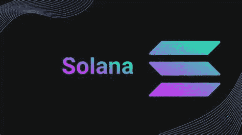

# 索拉纳在今天是一个好的投资吗？

> 原文：<https://medium.com/coinmonks/is-solana-a-good-investment-today-41411685d9c2?source=collection_archive---------4----------------------->

Source photo [solana — Bing images](https://www.bing.com/images/search?view=detailV2&ccid=0bBdC8si&id=B6B1B40FE6AA0356CF7FF336E806411E95A0F0C7&thid=OIP.0bBdC8siAmTD7MgzNj51TgHaEK&mediaurl=https%3a%2f%2fcointopsecret.com%2fwp-content%2fuploads%2f2021%2f08%2fExploring-the-Solana-Ecosystem-Design-1068x601.jpg&cdnurl=https%3a%2f%2fth.bing.com%2fth%2fid%2fR.d1b05d0bcb220264c3ecc833363e754e%3frik%3dx%252fCglR5BBug28w%26pid%3dImgRaw%26r%3d0&exph=601&expw=1068&q=solana&simid=608027856009712050&FORM=IRPRST&ck=D8611AE3814D4E2D6903BEB9F9F19DA5&selectedIndex=0&ajaxhist=0&ajaxserp=0)

## 索拉纳是什么？

为了在保持可扩展性的同时实现快速的事务处理速度，开发了 Solana 分散加密计算平台。Solana 是一个开源、高性能、无权限的项目，任何人都可以使用它来构建加密应用程序并不断发展。