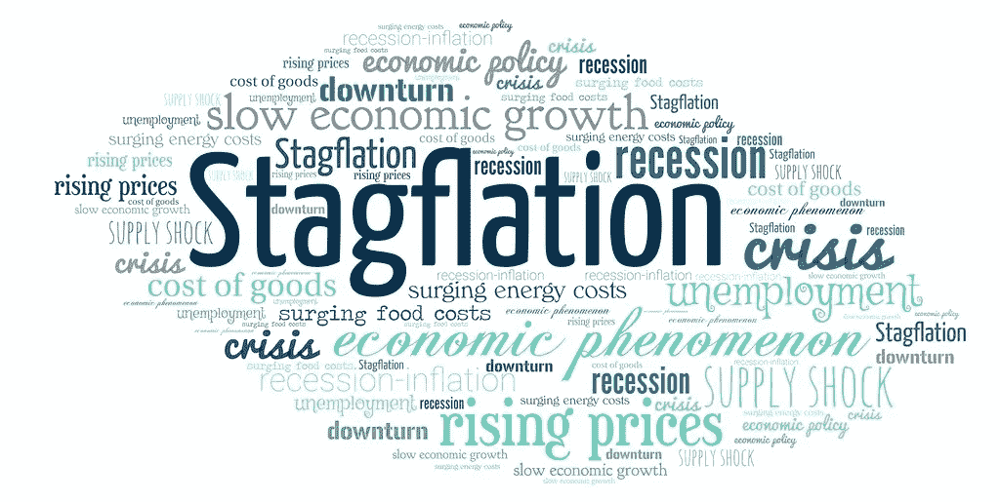
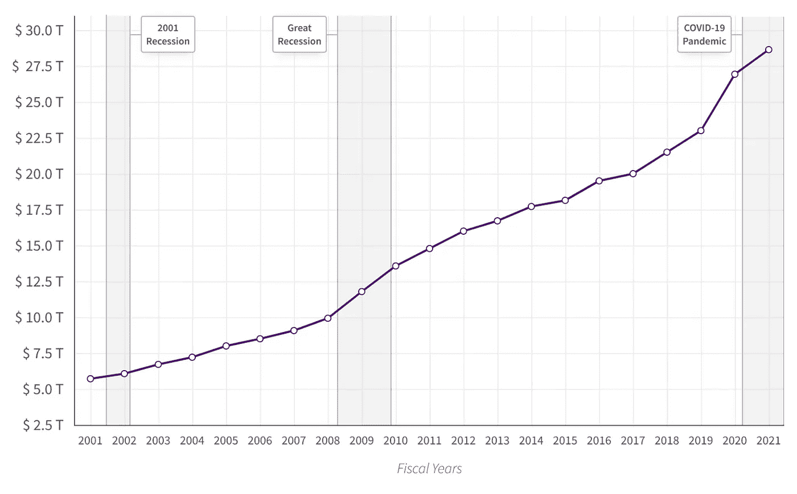
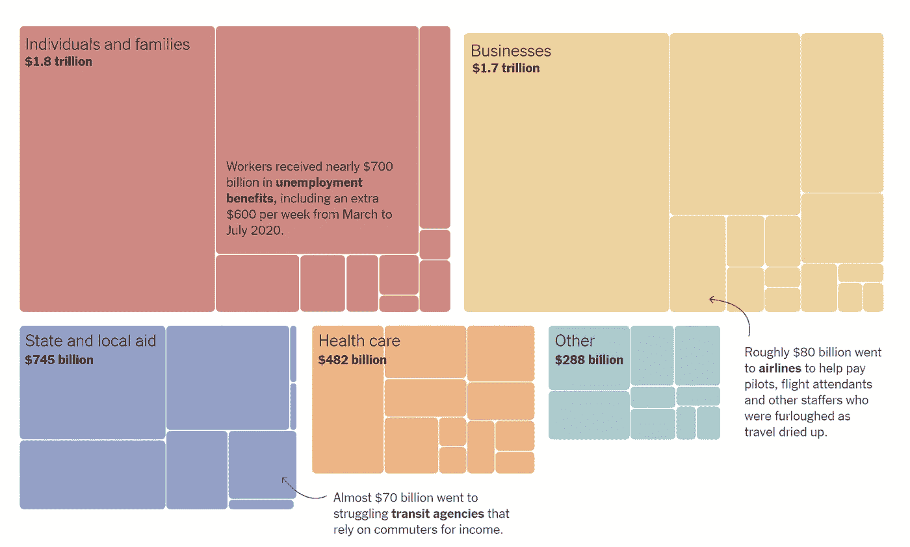
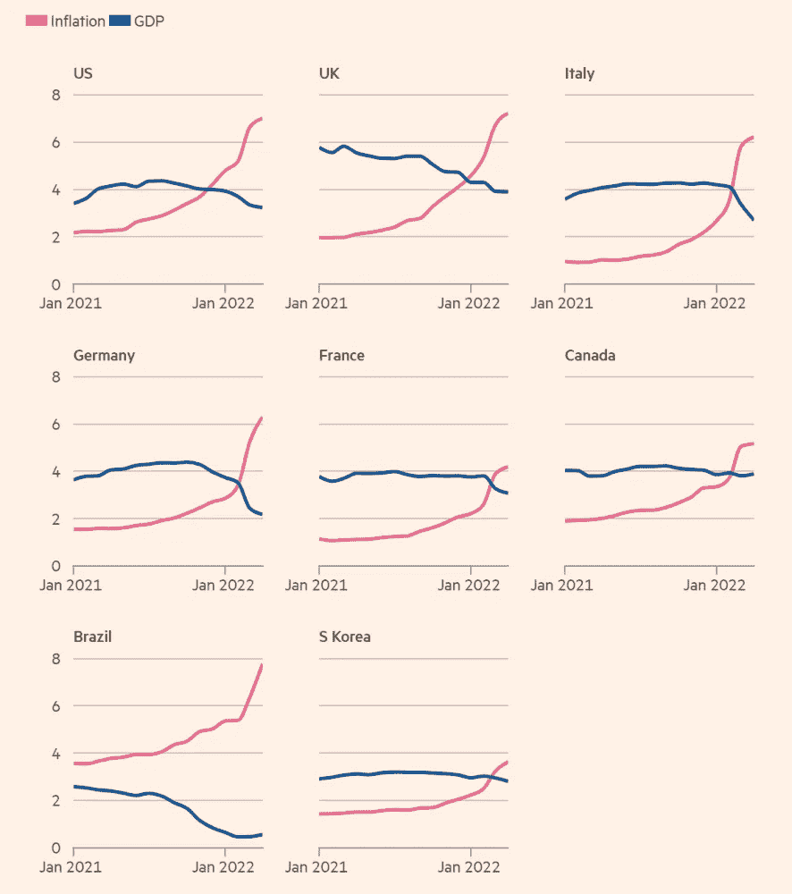
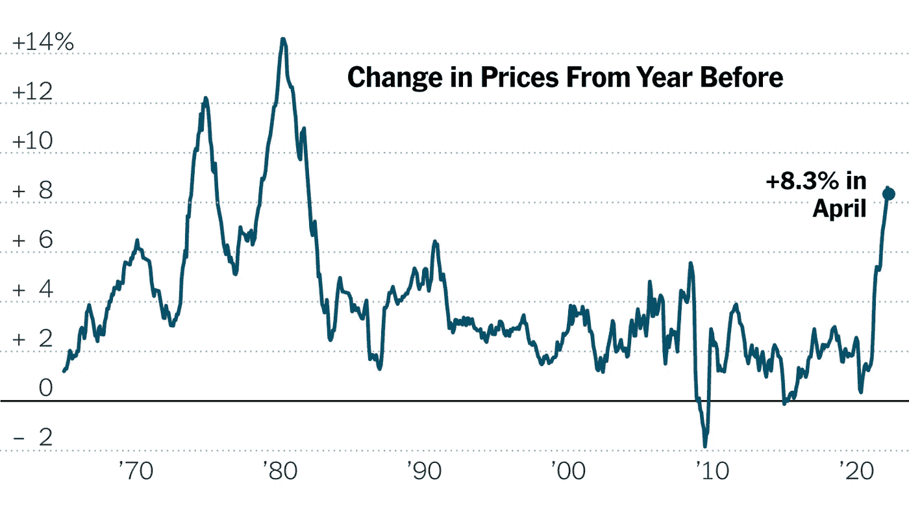
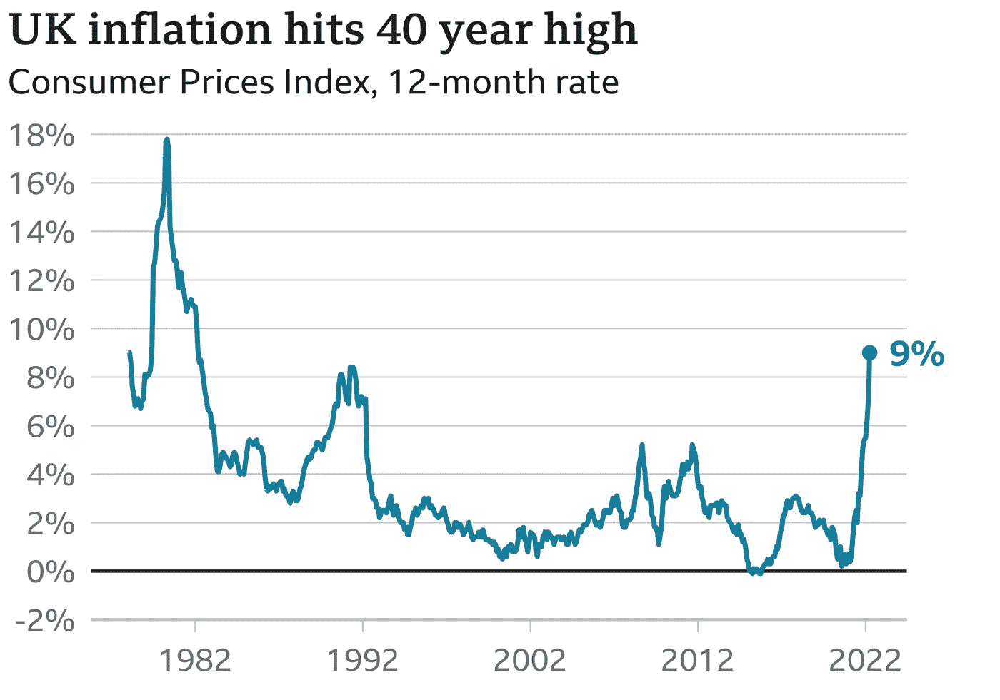
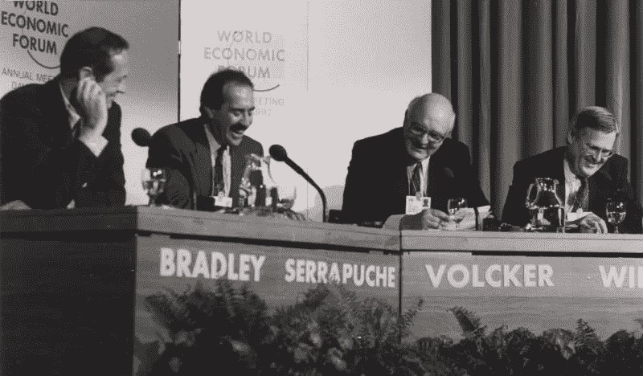
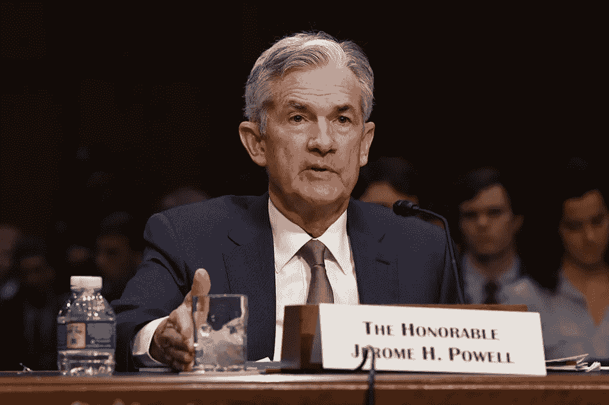

# 滞胀有可能发生吗？

> 原文：<https://medium.com/coinmonks/is-stagflation-on-the-cards-5d87a757b166?source=collection_archive---------38----------------------->

Image: flickr

2022 年本应是经济复苏之年，疫情过后，公司将恢复全面运营，消费者将积累的资金用于所有因病毒而错过的度假和活动。几家媒体声称这将是新的“咆哮的二十年代”，指的是 1918 年至 1921 年流感流行后的消费主义十年。

然而，目前的经济预测似乎描绘了一幅不同的画面。这并不是说我们将试图预测将会发生什么，因为经济预测的唯一功能就是让占星术看起来值得尊敬。俗话说，“经济学家是明天就会知道为什么他昨天预测的事情今天没有发生的专家。”

最好考虑可能会发生什么，为什么。

# 滞胀

滞胀就是这样一种情况。滞胀指的是高失业率和高通货膨胀率并存的经济，本质上是经济停滞和通货膨胀的结合。

20 世纪 70 年代滞胀期间，股票市场一片混乱。在过去的 20 个月里，它下跌了大约 50%，近十年来第一次，很少有人想投资股票。经济发展缓慢，导致失业率不断上升，最终达到两位数。中央银行将利率提高到 20%,使得许多人买不起新车和房子。

这是对 20 世纪 70 年代大通胀的可怕描述，始于 1973 年末，一直持续到 20 世纪 80 年代初。

# 是什么导致了滞胀？

20 世纪 70 年代初的一系列事件加剧了这场危机。

**美国国债**

联邦政府的债务迅速增加。美国在冷战期间花了很多钱与苏联进行军备竞赛，还在越南打了一场代价高昂的战争。这些因素加上约翰逊的伟大社会计划扩大国内和社会倡议，导致了巨额债务。

随着 1973 年滞胀和经济衰退的到来，美国国债占 GDP 的比例达到了 33%。

**重大战争，能源供应冲击&油价**

1973 年，石油输出国组织对加拿大、日本、荷兰、英国和美国实施禁运，以回应这些国家在阿以战争中对以色列的支持。石油输出国组织希望利用其在全球石油供应上的主导地位来推动政策改革。

油价上涨了 400%以上，引发了关于替代能源和在包括汽车在内的各种行业创造更节能方法的争论。

鉴于对燃料的需求和依赖，油价飙升导致美国和国际通货膨胀率上升，导致全球经济衰退。

# 1973 年和 2022 年之间的相似之处

**美国国债**

甚至在“乔维德·疫情”之前，美国就已经积累了大量的国债，大约只有 27.50 万亿美元，是二战结束以来的最高水平。

Image source: datalab.usaspending.gov

为了抗击疫情病毒，美国国会通过了一项刺激和救助计划，向美国经济注入了有史以来最大规模的联邦资金。大约有 5 万亿美元被分配给家庭、小公司、餐馆、航空公司、医院、地方政府、学校和全国其他应对疫情影响的组织。仅刺激计划就为工人提供了大约 7000 亿美元的失业福利。

Image source: nytimes.com

因此，美国国债在 2022 年 2 月 1 日历史上首次超过 30 万亿美元。

**重大战争，能源供应冲击&油价**

俄罗斯入侵乌克兰后，石油和天然气价格飙升。油价一度达到每桶 139 美元，为近 14 年来的最高水平，而次日交货的天然气批发价格上涨了一倍以上。

此外，拜登总统签署了一项行政命令，禁止向美国进口俄罗斯的石油、天然气和煤炭。许多欧洲国家大幅削减了俄罗斯的石油和天然气进口，加剧了能源供应冲击。俄罗斯能源巨头俄罗斯天然气工业股份公司(Gazprom)已经切断了对波兰和保加利亚的天然气输送，原因是这两个国家不愿意用卢布支付天然气供应。

鉴于乌克兰人民的韧性以及普京在乌克兰的战争只能以两种方式结束:种族灭绝或失败，冲突似乎还将持续一段时间。

根据圣路易斯美联储银行的数据，到 2021 年第四季度末，美国国债占 GDP 的比例为 123%。当原油价格在 1973 年至 1975 年间翻了一番时，失业率从 4.6%跃升至 9%。美国目前的失业率为 3.6%。

与上世纪 70 年代类似，随着能源供应冲击加上国债上升，滞胀肯定是有可能发生的。

# 当前指标

各经济体正同时面临经济放缓和价格上涨。甚至在乌克兰爆发战争之前，由于疫情破坏了供应链，包括美国、英国和欧元区在内的许多国家的油价已经升至几十年来的最高水平。战争只是加剧了这些问题。

Image source: ft.com

预测看起来很冷。IMF 下调了今年对 143 个经济体的预测，这些经济体占全球 GDP 的 86%。全球通胀率预计为 6.2%，比 1 月份的预测高出 2.25 个百分点。

前美联储主席本·伯南克(Ben Bernanke)在 2006 年至 2014 年期间执掌美联储，他警告说，美国可能会同时遭遇自 20 世纪 70 年代以来从未见过的失业和通胀水平。

最近，高盛(Goldman Sachs)董事长劳埃德布兰克费恩(Lloyd Blankfein)警告说，美国正在走向衰退，他表示，“如果我在经营一家大公司，我会为此做好准备，”布兰克费恩在哥伦比亚广播公司(CBS)的《面对全国》(Face the Nation)节目中说，“如果我是一名消费者，我会为此做好准备。”

德意志银行(Deutsche Bank)表示，他们的官方观点是美国将在 2023 年底陷入衰退，并表示“如果有什么不同的话，我们认为风险倾向于更严重的衰退，因为通胀证明比普遍预期的更持久。”

官方数据显示，中国的零售额跌至两年来的最低水平，而工厂产出大幅下降，反映了北京零补贴政策带来的令人沮丧的经济影响，城市失业率达到 6.1%，这是自 2020 年 2 月新冠肺炎疫情早期 6.2%的峰值以来的最高水平。

上个月，美国消费者价格指数以 8.3%的年率增长，高于经济学家的预期，并保持在 40 年来的最高水平，突显出美联储方面遏制通胀的紧迫性。

Image source: nytimes.com

然而，美国并不是唯一受影响的国家。在英国，4 月份通胀率达到 9%，为 40 多年来的最高水平，此前飙升的天然气和电费加剧了家庭面临的生活成本危机。

Image source: bbc.co.uk

随着今年第一季度经济活动大幅放缓，英国经济正遭遇自上世纪 70 年代第二次石油危机以来最严重的一轮滞胀、增长疲软和高通胀。英格兰银行表示，预计到 2025 年，通货膨胀率将在秋季进一步上升至 10%以上，失业率将从 3.8%上升至 5.5%。

各国央行目前正在缓慢加息，以提高借贷成本，抑制支出，让供给赶上需求，但紧缩政策本身可能引发全球经济衰退。

# 20 世纪 70 年代滞胀是如何解决的？

保罗·沃尔克

commons.wikimedia.org — WEF

保罗·沃尔克于 1979 年 8 月被任命为美联储主席，很大程度上是因为他的反通胀观点。沃尔克首先调整美联储政策，积极瞄准货币供应而不是利率，但他降低通胀和通胀预期的努力不够。

随后，保罗·沃尔克(Paul Volcker)的美联储推出了将关键短期利率推高至近 20%的政策，并导致失业率在 1981 年飙升至近 11%。1981 年第三季度，美国经济正式进入衰退，因为高利率给制造业和建筑业等依赖借贷的经济部门带来了压力。

随着经济衰退的恶化，沃尔克面临着国会一再要求放松货币政策的呼吁，但他坚持认为，现在不能降低长期通胀预期将导致更长时间内更具灾难性的经济形势。最终，他的坚持得到了回报，到 1982 年 10 月，通货膨胀率降至 5%，利率也开始下降。

**杰罗姆·鲍威尔**

commons.wikimedia.org — FED

对于美联储现任主席杰罗姆·鲍威尔来说，保罗·沃克尔不仅仅是一位前任。他是他的职业英雄之一，由于螺旋式通货膨胀，杰罗姆·鲍威尔可能被迫像沃尔克那样行事。

两位数的利率是一个真正的可能性。

# 摘要

尽管滞胀迫在眉睫，但有很多原因可以解释为什么 2022 年不会像 1973 年那么糟糕。

首先，欧洲经济现在的基础比 20 世纪 70 年代要坚实得多。欧元消除了欧盟成员国参与竞争性贬值的需要，竞争性贬值在上世纪 70 年代动摇了汇率和国民经济。

其次，20 世纪 70 年代全球经济的石油密集度是现在的 3.5 倍。哥伦比亚大学的研究人员称，与 20 世纪 70 年代初相比，现在可以用不到一半的石油生产同样数量的产品和服务。例如，汽车比 20 世纪 70 年代的同类产品能效高得多，耗油量至少少 40%。

随着 2022 年的到来，在令人担忧的高通胀背景下，两大风险日益凸显:美联储政策失误的可能性和欧元区能源供应的重大中断。政策制定者担心他们将如何应对这些风险，以及对经济和市场的影响。

有一件事似乎是肯定的:我们不会毫发无损地走出这场危机。

*免责声明:本文包含的信息仅用于教育目的，并不构成 Wheatstones 的任何形式的建议或推荐，用户在做出(或避免做出)任何投资决定时也不打算依赖这些信息。*

> 加入 Coinmonks [电报频道](https://t.me/coincodecap)和 [Youtube 频道](https://www.youtube.com/c/coinmonks/videos)了解加密交易和投资

# 另外，阅读

*   [如何在印度购买比特币？](/coinmonks/buy-bitcoin-in-india-feb50ddfef94) | [WazirX 评论](/coinmonks/wazirx-review-5c811b074f5b)
*   [CryptoHopper 替代品](/coinmonks/cryptohopper-alternatives-d67287b16d27) | [HitBTC 审查](/coinmonks/hitbtc-review-c5143c5d53c2)
*   [CBET 评论](https://coincodecap.com/cbet-casino-review) | [库科恩 vs 比特币基地](https://coincodecap.com/kucoin-vs-coinbase)
*   [折叠 App 审核](https://coincodecap.com/fold-app-review) | [Kucoin 交易机器人](/coinmonks/kucoin-trading-bot-automate-your-trades-8cf0ca2138e0) | [Probit 审核](https://coincodecap.com/probit-review)
*   [如何匿名购买比特币](https://coincodecap.com/buy-bitcoin-anonymously) | [比特币现金钱包](https://coincodecap.com/bitcoin-cash-wallets)
*   [币安 vs FTX](https://coincodecap.com/binance-vs-ftx) | [最佳(SOL)索拉纳钱包](https://coincodecap.com/solana-wallets)