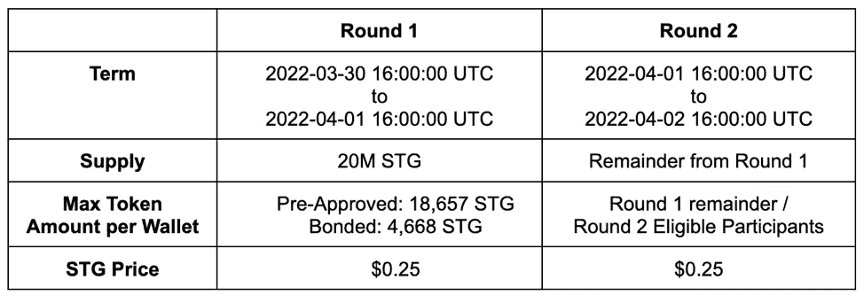
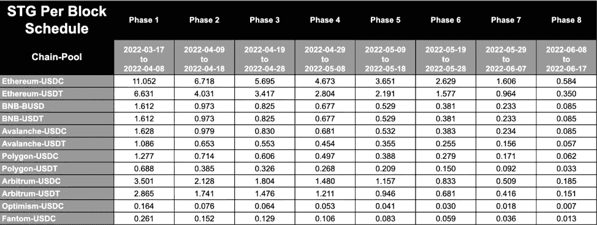
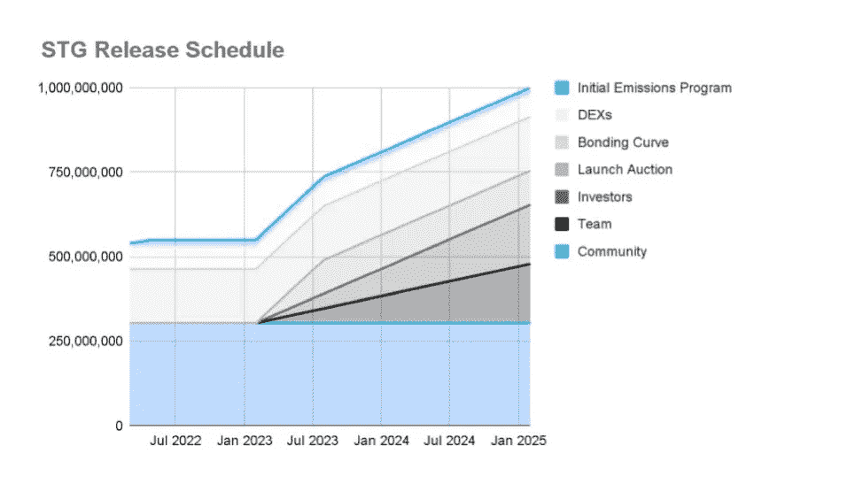

# 星际之门对于鲸鱼来说只是一枚转储币吗？

> 原文：<https://medium.com/coinmonks/is-stargate-stg-a-dump-coin-for-whales-83fbb97a4136?source=collection_archive---------0----------------------->

星际之门发射时发出巨大的嗡嗡声。在两周内上涨近 700%后，价格稳步下降。这一切只是炒作吗？

Image: PixTeller

> 如果普通股价值在短时间内下跌 50%会给你带来严重的痛苦，你就不应该持有它们——沃伦·巴菲特

# 星际之门

在我们开始之前，让我说我是星际之门(STG)的受益持有者。我第一次听说星际之门是在[秘密玩笑](https://www.youtube.com/c/CryptoBanterGroup)上。主持人冉·诺伊纳提到了这项技术，但也表示他暂时没有购买。出于好奇，我查看了该项目，并亲自尝试了一下。

我第一次转账 10 美元后就被星际之门卖了。正如许多批评者指出的那样，支撑 STG 的技术是伟大的。在我了解 STG 的前两天，我一直在用虫洞转移代币到 BSC 上的[星球金融](https://app.planet.finance/)。

虫洞有效，但并不伟大。提醒你，我是在[大型黑客](https://www.theverge.com/2022/2/3/22916111/wormhole-hack-github-error-325-million-theft-ethereum-solana)之后使用虫洞*。这并不能激发信心。更不用说，整个过程像狗屎一样笨重。*

星际之门非常不同。星际之门启动本地连锁资产转移，两分钟后结束。星际之门利用零层协议来完成这个令人印象深刻的壮举。就其本身而言，零层允许使用“超轻节点”进行跨链、通用的消息传递。

不涉及太多细节，第 0 层路由通过一个 [oracle 和一个端点中继](https://layerzero.gitbook.io/docs/faq/ultra-light-node/overview)从源和目的地链发送数据块报头。中继器将交易证明传输到每个相应的区块链，然后对照块报头对交易证明进行验证。

结果是资产的无缝跨链转移。星际之门协议易于使用且直观。您选择一个源链和资产，以及一个目标链和资产，然后进行交换。两分钟后你就完成了。

 [## 8 个最佳免费加密副本交易平台和应用(2022)

### 再来说说果酱。想象一下，你站在杂货店里，盯着放在…

medium.com](/coinmonks/top-10-crypto-copy-trading-platforms-for-beginners-d0c37c7d698c) 

# 购买炒作

在我购买 STG 之前，我花了大约半个小时浏览文档。我以 3.20 美元的价格上车，又以 3.60 美元的价格往包里多加了一些。在这样的价格下，我赌上了继续炒作的机会。在阿拉米达研究公司购买了所有 1 亿枚可用代币后，启动拍卖在 Twitter 上引起了轰动。

流动性拍卖后，接下来是一轮债券发行，在七家连锁店中分配了 1.6 亿英镑。随后是两轮社区拍卖。在这几轮中，又售出了 2000 万枚 STG 代币，每枚售价 0.25 美元。

Image: Stargate Finance

在 DEX 公开发售的头几天，代币价格稳定在 0.50 美元至 0.60 美元之间。我的赌注是炒作列车可能会携带令牌从 DEX 价格的 10 倍，给我一点头皮游戏。有那么一秒钟，它看起来是可能的，但 STG 的最高价约为 4.25 美元。

我仍然看好 STG 的未来。我一直在减肥，在反弹的低点增加脂肪。目前的价格徘徊在 1.55 美元左右，呈明显下降趋势。我的平均买入费刚刚超过 2 美元大关。然而，STG Discord(允许讨论价格)中的情绪出人意料地变得悲观。

实际上，我对熊市情绪的持续抱有希望。我不能让自己鼓励它，即使我认为在最初的 DEX 价格附近找到一个入口是非常史诗般的，如果不是更低的话。我想时间会证明一切。

# STG 排放

在不和谐的价格讨论中，有一些声音对排放率表示不满。从我的角度来看，排放似乎并不特别离谱。

星际之门协议启动了七链交换。这种努力显然需要大量流动性才能发挥作用。那些代币肯定来自某个地方。

Image: Stargate Finance

Discord 集团的叙述是，一些邪恶的内部人士“知道”排放率将非常高，并一直在向零售倾销。这让我很惊讶，因为所有的拍卖和团队代币都被锁定到 2023 年 3 月。

Image: Stargate Finance

当然，如果你在 0.50 美元买入，那么在 4 美元抛售是完全合理的。不过，这算不上邪恶的内部行为。这就是交易的方式。

 [## 2022 年 6 大最佳硬件钱包|顶级加密硬件钱包[更新]

### 最好的加密货币硬件钱包是绝对必要的。我们将在 NGRAVE、Ledger Nano X 和…

medium.com](/coinmonks/the-best-cryptocurrency-hardware-wallets-of-2020-e28b1c124069) 

# STG 定位

STG 分歧中更大的问题似乎是人们意识到，STG 赌注不会带来任何经济回报。似乎许多人都希望赌注奖励能推高市场价格。不要介意，文件很清楚地说，赌注只是为了投票托管治理。

阿拉米达研究公司吞并 1 亿英镑时做的一件很酷的事情是放弃 aSTG 的投票权。我不确定我是否也会这么做，但这是他们善意的表示。对我来说，关于 STG 投票权的有趣的事情是，社区有一张白纸来找出如何让 STG 盈利。

Layer Zero 的业务发展主管 maki(SushiSwap 的联合创始人)在最近的一次社区电话会议上说，Stargate 正在与渴望金融公司谈判，以便在所有 Stargate 池中分配一部分 yUSDC。核心思想是，渴望用户可以使用星际之门进行跨池狩猎。

Maki 还提到了 PancakeSwap 和 TraderJoe 利用星际之门桥接的另一项合作计划。还提到了一个最终目标，即创建稳定资本之外的多种本地资产的流动性池，如以太坊、乐观和 Arbtitrum(等等)。

对于那些没有注意的人，30%的社区分配池是完全解锁的。这为许多有趣的选择打开了大门，包括道国债互换，贿赂 CRV 和 CVX 奖励，直接发展赠款，以及任何其他可能的部署。这些想法都可以通过 STG 令牌的空白治理来实现。

# STG 长期观点

即使你不太相信 STG 持有者的投票智慧，也应该从短期价格行为中退一步。阿拉米达研究公司承诺在三年内不出售他们在 STG 的 2500 万美元股份*。我不认识阿拉米达那边的好人，但我可以猜测他们的意图。*

首先，我很确定他们不会在 0.25 美元的时候跳进去，寻求 10 倍的投资回报。阅读 STG 价格讨论不和谐，似乎许多人认为这是阿拉米达的长期游戏。我敢打赌(事实上，我是在打赌)，阿拉米达预计在这三年内接近 100 倍(或更多)。

阿拉米达当然知道解锁时间表的时钟滴答作响。这告诉我，他们预计明年这个时候价值将流入 STG，否则代币将面临巨大的抛售压力。请记住，这些解锁是线性的，一系列代币将*可能*在一年后上市。

请记住，我们在这里讨论的底层协议是一种本地资产，即多链交换。如果您使用 STG，这种本地资产、多链交换还可以实现*免费*跨链转移。我不是 DeFi 大师或其他什么人，但即使是我的小狒狒大脑也能看到跨链 DeFi 的巨大潜力，仅在这一方面。

如果我的狒狒大脑看到了其中的价值，那么外面的大量超级大脑开发人员肯定也看到了价值。同样，正如 [*Invest Answers*](https://www.youtube.com/c/InvestAnswers/videos) 常说的，“跟着钱走。”阿拉米达研究所的钱买了一卡车的 STG。

就我个人而言，我不需要跟着钱走。我用星际之门，大声说，“神圣的狗屎”就像连续五次。它运行得很好，这在这个领域很重要。很简单。很直观。而且天衣无缝。这就是我买下它的原因，只要这些低价还在，我会继续买下去。

以下是我的长期观点:

1.最坏的情况(也是最不可能的情况)，STG 在明年解锁前归零

2.更有可能的是，我最终不亏不赚，或者在解锁时有一点亏空

3.(也许)很有可能到解锁的时候我至少会快 10 倍

不管怎样，我知道锁什么时候到期。我认为阿拉米达设想到 2023 年 4 月，星际之门*至少拥有*250 亿美元的市值(完全在情理之中)。象征性的价格是 25 美元。这意味着阿拉米达是 100 倍，我的虾包是 10 倍。我为什么不打这个赌？

但是如果到了明年 3 月，STG 还在几块钱左右徘徊，我会放弃。抛开错失的机会成本和所有这些因素，这是一个没有价值的汉堡。问题是，我也认为阿拉米达可能会看到比 100 倍更多的上升空间。

如果这被证明是真的，那么上帝保佑那些古怪的不和谐的人。事实上，上帝已经保佑他们了！自从我开始写这篇文章以来，STG 又下跌了 0.07 美元。我想我最好去沙发垫上找些干粉。

当然，这些只是我的 ***意见*。**我不是财务顾问，这不是财务建议，而且总是 [DYOR](/coinmonks/crypto-investing-how-to-dyor-1e6dabdb1de9) 。遵循这些想法中的任何一个都可能会让你失去所有的钱。我对此 100%认真。我喜欢摆弄这些东西，但我公开表现得像个彻头彻尾的狒狒。相应投资。

直到下一次，安全，聪明，并确保[绑骆驼](https://www.oxfordreference.com/view/10.1093/acref/9780199539536.001.0001/acref-9780199539536-e-2318)。

> 加入 Coinmonks [电报频道](https://t.me/coincodecap)和 [Youtube 频道](https://www.youtube.com/c/coinmonks/videos)了解加密交易和投资

# 另外，阅读

*   [3 商业评论](/coinmonks/3commas-review-an-excellent-crypto-trading-bot-2020-1313a58bec92) | [Pionex 评论](https://coincodecap.com/pionex-review-exchange-with-crypto-trading-bot) | [Coinrule 评论](/coinmonks/coinrule-review-2021-a-beginner-friendly-crypto-trading-bot-daf0504848ba)
*   [莱杰 vs Ngrave](/coinmonks/ledger-vs-ngrave-zero-7e40f0c1d694) | [莱杰 nano s vs x](/coinmonks/ledger-nano-s-vs-x-battery-hardware-price-storage-59a6663fe3b0) | [币安评论](/coinmonks/binance-review-ee10d3bf3b6e)
*   [Bybit Exchange 评论](/coinmonks/bybit-exchange-review-dbd570019b71) | [Bityard 评论](https://coincodecap.com/bityard-reivew) | [Jet-Bot 评论](https://coincodecap.com/jet-bot-review)
*   [3 commas vs crypto hopper](/coinmonks/3commas-vs-pionex-vs-cryptohopper-best-crypto-bot-6a98d2baa203)|[赚取加密利息](/coinmonks/earn-crypto-interest-b10b810fdda3)
*   最好的比特币[硬件钱包](/coinmonks/hardware-wallets-dfa1211730c6) | [BitBox02 回顾](/coinmonks/bitbox02-review-your-swiss-bitcoin-hardware-wallet-c36c88fff29)