# STEPN 是一个好的长期项目吗？

> 原文：<https://medium.com/coinmonks/is-stepn-a-good-long-term-project-f5731b823726?source=collection_archive---------0----------------------->

STEPN——是 App Store 和 Google Play 上提供的一款移动赚钱健康和健身应用程序。STEPN 有一个内置的钱包、令牌交换、市场和租赁系统(正在开发中)，允许用户使用 STEPN，即使是非加密用户也可以简单地做到这一点。配备运动鞋 NFT 的用户可以移动到户外，以赚取代币和 NFT 奖励。

我想你已经知道关于 STEPN 的一切，因为它的大肆宣传，所以我想分享一些你可能不知道的深入分析。我和我的朋友们正在分析加密项目及其令牌组学，以帮助其他项目从错误中吸取教训，使它们成为更具吸引力和可持续性的长期项目。

如果你熟悉 STEPN，你可以跳到深入分析部分，或者从我的角度刷新你已经知道的。

关于其他“移动挣钱”项目，您可以在这里阅读:

 [## 移动到收入项目的完整列表第 1 部分

### 5/32 Move 2 Earn 项目概述。STEPN，XYO，Genopets，Dotmoovs，Step.app

medium.com](/coinmonks/complete-list-of-the-move-to-earn-projects-part-1-bdbeb6af7a65) 

# **概要**

1.  STEPN 概述
2.  STEPN 的标记组学
3.  深入分析
4.  结论

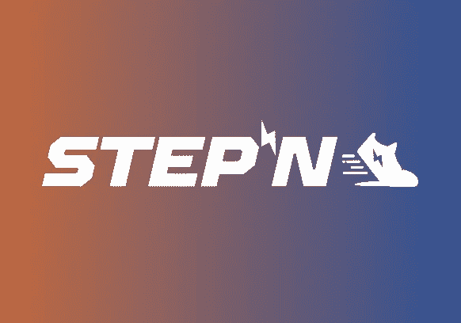

# 1.STEPN 概述

正如我之前提到的，STEPN 是一个移动赚钱的应用程序。它有两个标志:

*   GST(绿色 Satoshi Token)是日常消费的标准代币，如修理运动鞋或整平它们
*   GMT(绿色元宇宙代币)是一种用于特殊活动的更特殊的硬币。

为了更好地理解，我们可以使用任何其他游戏来模拟标准硬币和高级(捐赠)硬币。玩家走路会得到 GST，而 GMT 只能在球鞋 30 级的时候发放，但是要升级到 30 级，无论如何在 5 级，10 级，20 级，29 级和 30 级都需要 GMT。

现在，玩家的唯一动机是赚钱，虽然 STEPN 将提供其他选择中最高的回报，但它将受到欢迎。商品及服务税价格的主要驱动力是购买商品及服务税以更快增加收入的(新)用户的需求。虽然购买商品及服务税的玩家比提取和出售其商品及服务税收入的玩家多，但回报将会增加，越来越多的玩家将加入这个游戏。但有一天，回报可能会停止增长，商品及服务税价格可能会下降，因为更多的供应来自“升级的球员”。

STEPN 将增加后期的社交机制，与品牌的合作将使这款游戏成为许多人使用的必备游戏。这种社会机制和合作可以增加运动鞋和代币的内在价值。激励将从赚钱转向穿更好的运动鞋和获得公众认可。第一次合作已经发生，Asics 与 NFT 的币安联合推出了运动鞋。但是现在的激励机制是什么？

# 2.STEPN 的标记组学

为了简化对任何象征经济学的理解，让我们从供给和需求的角度来分析它。供给和需求之间应该有一个平衡，以支持长期稳定。

## 商品及服务税供应

玩家可以通过外出获得商品及服务税，这是唯一可以发放新商品及服务税的方式(每天 300 个商品及服务税限额，取决于运动鞋的等级)。但这种令牌没有供应限制，越多的新玩家加入游戏，他们对运动鞋的升级就越多——他们将产生并向市场提供越多的令牌。

投入的资金和商品及服务税产生的数量之间有严格的相关性。玩家每消耗一点能量就会获得代币(1 点能量——锻炼 5 分钟，每 6 小时补充 25%的能量)。它们可能会增加两者——能源的总量和利用能源的效率。为了增加能量，玩家需要获得更多的球鞋(如下图所示)或者购买更高质量的球鞋(普通(+0 能量)

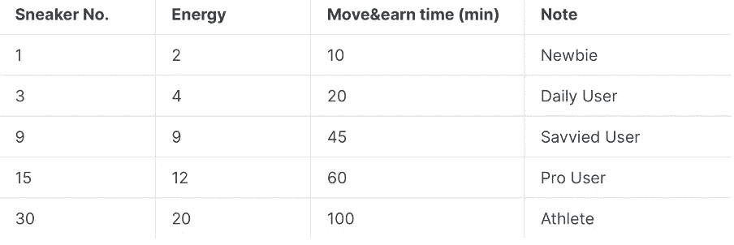

为了提高效率——玩家需要购买基础属性(属性)更好的球鞋，并升级球鞋以选择要增加的属性。级别越高，球鞋升级成本越高。运动鞋的属性只对穿的这双有影响(所以人们可能有购买廉价运动鞋来增加能量的动机)。

早期采用者和投资者可能持有相当一部分代币，因此他们可以为市场提供额外的流动性，并推动价格。2012 年 4 月 19 日，用户中的商品及服务税分配发生了显著变化，当时前 100 名持有人持有 78.8%的商品及服务税，但这一数字在 20 日降至 58.6%。

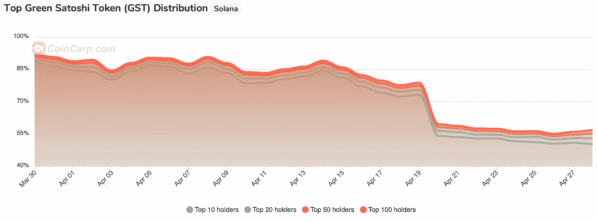

但与此同时，一些顶级持有者甚至增加了仓位。

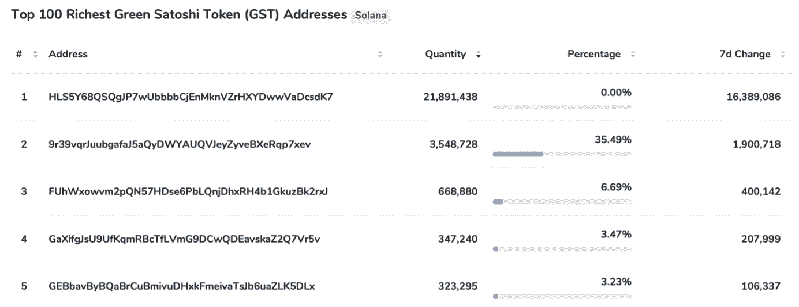

## GMT 供应

GMT 的发行机制和 GST 一样，但是只有穿 30 级 LVL 球鞋的玩家才能生产 GMT。总供应量受到 60 亿代币的限制，只有 30%来自步行。散步的回报会随着时间的推移而减少。此外，一个帐户每天可以发放的代币数量限制为 15 个。下面的饼图代表了 GMT 的未来分布:

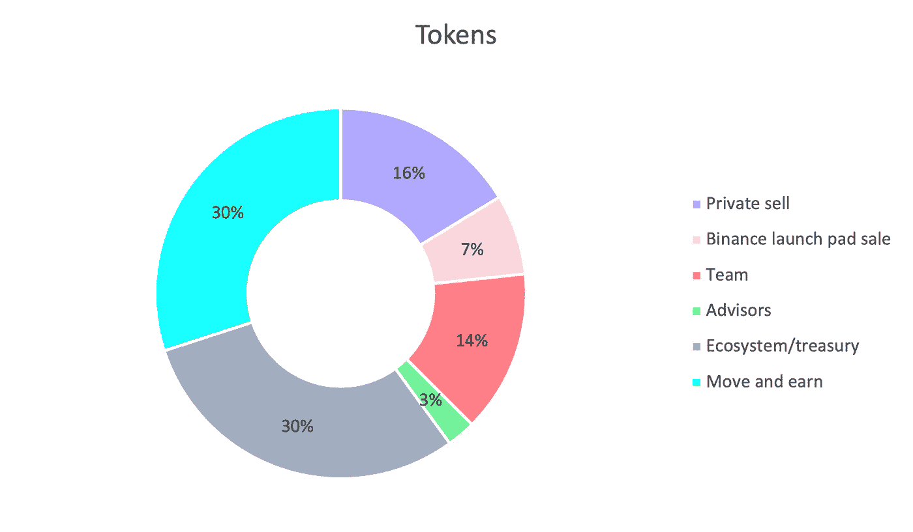

它们将根据以下图表发放和解锁:

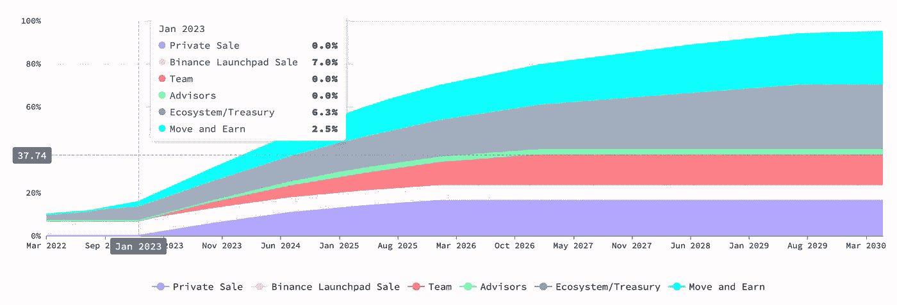

## 需求

游戏中 GST 和 GMT 的使用案例如下:

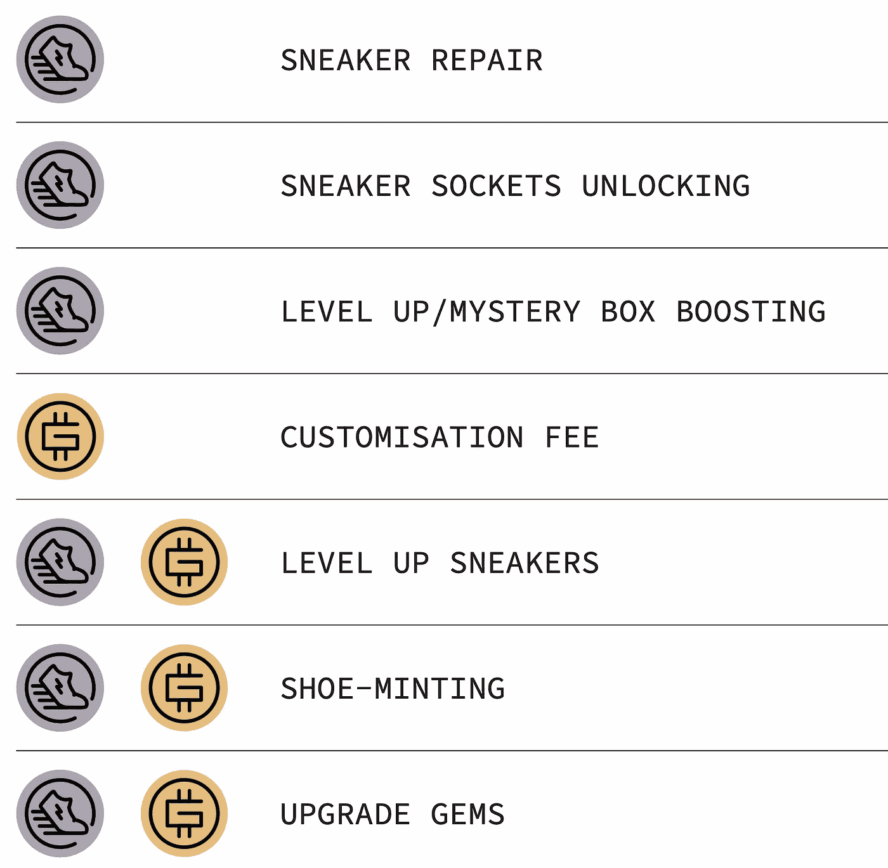

## 对商品及服务税的需求

正如你所看到的，GST 是主要的游戏令牌，几乎在游戏中所有可能的操作中都会用到。但所有这些操作都是为了增加潜在收入。现在不想等，想提高收入的玩家，保证了对这个令牌的需求。

此外，需求直接取决于新球员，他们依赖于进入壁垒——NTF 运动鞋的价格。球鞋价格取决于 GST 和 GMT 价格，因为它们是铸造所需要的，所以 GST 和 GMT 价格越高，新玩家的入门级就越高，这可能会吓到新玩家。目前，运动鞋的底价约为 1.5k 美元。

## 对 GMT 的需求

GMT 用于游戏的一个重要部分，它可能会增加你的收入:

*   永久提高商品及服务税每日收入上限；
*   永久提高所有宝石(提供统计数据)升级的成功率；
*   “永久提高打开鞋盒获得更高质量运动鞋的机会”
*   永久提高从制鞋业获得两只运动鞋的机会；

此外，GMT 将提供额外的功能:

*   赚取一部分协议费作为赌注奖励。2%的市场交易费留给团队维持运营。不低于 5%的交易费用将返还给 STEPN 生态系统。

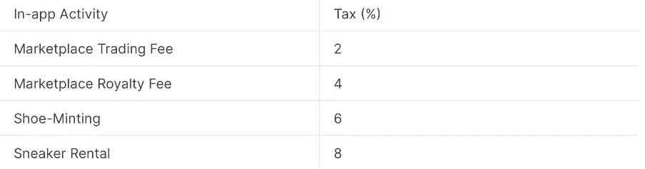

*   股权参与治理，锁定期越长，投票权越高。

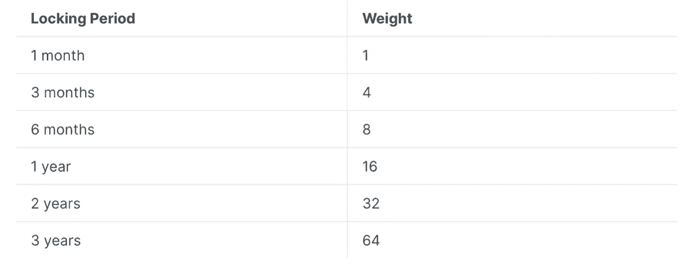

*   GMT 赌注者可以投票决定赌注奖励的分配。

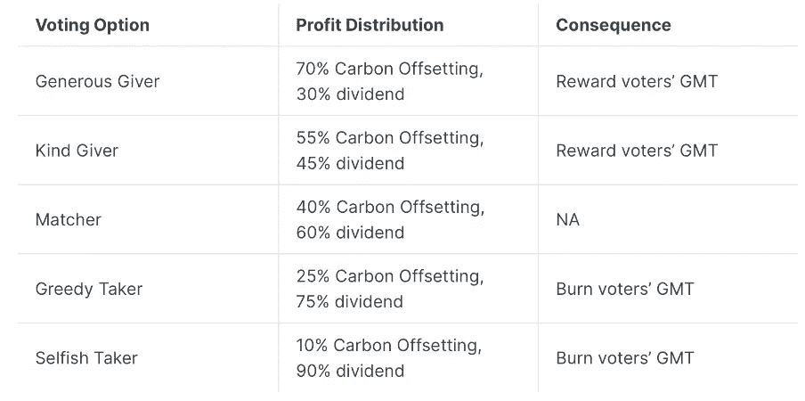

另一个重要的需求来自 STEPN。他们烧掉了 GMT，[看起来](https://coinmarketcap.com/gravity/articles/25747)他们会用他们的收入每季度做一次。

# 3.深入分析

## 代币的供给和需求

总体而言，商品及服务税似乎与供求平衡(绿色——储蓄多于提取，红色反之亦然)。

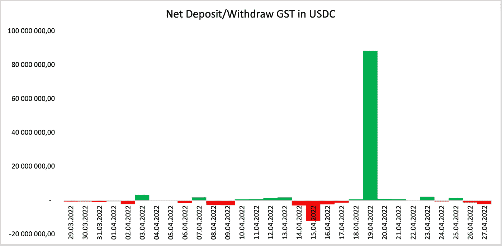

平均存款金额为 1550 万美元，取款金额为 1310 万美元。但是在 2012 年 4 月 19 日有一个巨大的峰值，所以从观察中去除这个日期后，将有 1230 万美元存入和 1290 万美元提取，不是一个非常重要的 GST 流出项目。

这种令牌组学的另一面是 GMT，许多操作都需要 GMT。4 月 18 日，STEPN 实施了一项更新，将 GMT 作为制造和升级运动鞋的费用。不过，看起来在未来，它将是主要的代币，因为只有升级的玩家才能发行它，而商品及服务税就像是一个中间步骤。

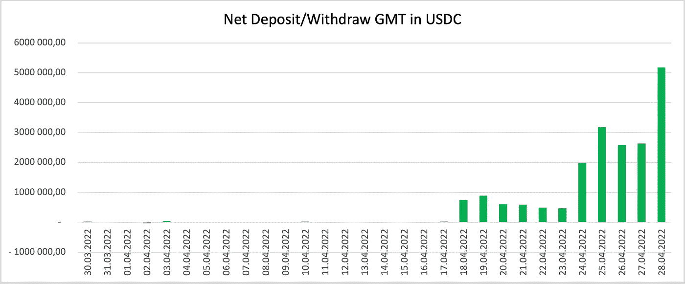

在对每天可能的 GMT 生产和消费的多种情况进行建模后，我意识到至少在一个月内需求将比供应更重要(该建模是在需求增加后使用最少量的数据进行的)。这个模型不包括可能的烧伤，因为很难对未来的烧伤做出假设。不过，它包括模拟新用户和活跃用户的数量，代币价格，将运动鞋升级到 30 拉特，铸造新运动鞋，等等。

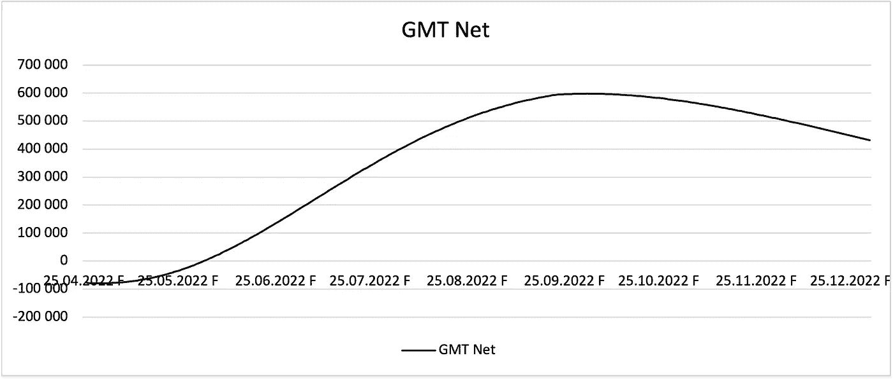

## 用户

用户数量增长非常快，即使有新用户入职步骤的限制。要成为用户，您需要一个邀请代码。它们可以由用户或 STEPN 制作。如果现有用户每隔几天步行一次，他就会收到一个邀请。Stepn 通常每天都会提供一些 invite 代码，但是这个数量是有限的。现有用户甚至开始在网上出售邀请码。新用户的加入速度可能会放缓，因为准入门槛提高了，现在相当于 15000 美元，这对发展中国家来说意义重大。

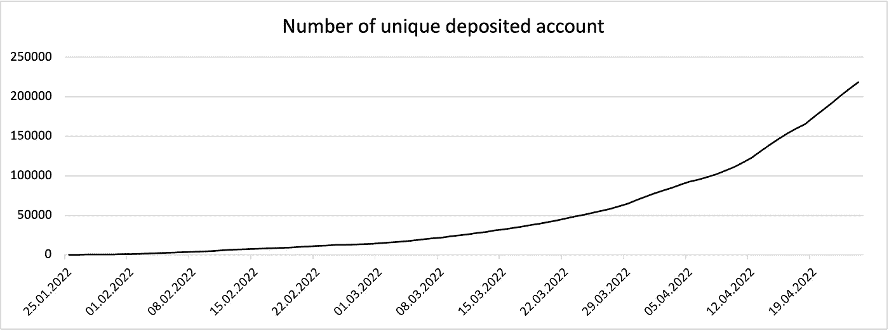

另一方面，每一个新用户都在生产令牌，也许他不会花很多钱买新令牌来更快升级。此外，STEPN 将允许用户从其他人那里借用运动鞋。这些用户将没有动力在应用程序上投入更多的钱，只是为了快速轻松地赚取利润。

# 4.结论

我想了很多关于 STEPN 的可能结果，但我没有最喜欢的一个。我相信管理团队和开发者从 Axie Infinity 的负面经历中学到了很多。此外，我认为将会有更多的社交活动和与品牌的合作，尤其是在夏季，这可能会增加对 STEPN 的兴趣。此外，我相信这可能会成为所有跑步者的共同应用，或者可能会成为富人的封闭俱乐部，他们会有大量的钱买运动鞋。

与此同时，我了解风险，随着越来越多的人将使用这一应用程序，市场上将有更多的供应，对商品及服务税和 GMT 的唯一自然需求来自“捐赠者”或投资者，他们希望现在赚取更多，这可能随时会结束。

这不是财务建议，我分享这些信息只是为了娱乐。

我愿意讨论，请随时通过 LinkedIn 联系我。

并在[推特](https://twitter.com/CryptoMoloKo)上订阅每日新闻。

> *加入 Coinmonks* [*电报频道*](https://t.me/coincodecap) *和* [*Youtube 频道*](https://www.youtube.com/c/coinmonks/videos) *了解加密交易和投资*

# 另外，阅读

*   [Bookmap 评论](https://coincodecap.com/bookmap-review-2021-best-trading-software) | [美国 5 大最佳加密交易所](https://coincodecap.com/crypto-exchange-usa)
*   最佳加密[硬件钱包](/coinmonks/hardware-wallets-dfa1211730c6) | [Bitbns 评论](/coinmonks/bitbns-review-38256a07e161)
*   [新加坡十大最佳加密交易所](https://coincodecap.com/crypto-exchange-in-singapore) | [购买 AXS](https://coincodecap.com/buy-axs-token)
*   [红狗赌场评论](https://coincodecap.com/red-dog-casino-review) | [Swyftx 评论](https://coincodecap.com/swyftx-review) | [造币厂评论](https://coincodecap.com/coingate-review)
*   [投资印度的最佳密码](https://coincodecap.com/best-crypto-to-invest-in-india-in-2021)|[WazirX P2P](https://coincodecap.com/wazirx-p2p)|[Hi Dollar Review](https://coincodecap.com/hi-dollar-review)