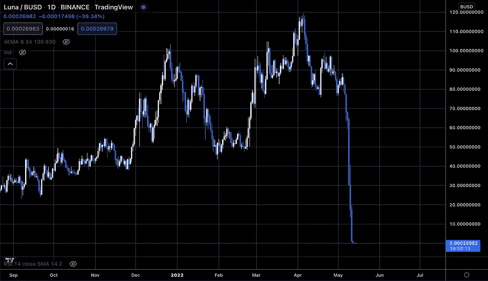

# 加密环境的转折点:Terra 的区块链停止

> 原文：<https://medium.com/coinmonks/is-terras-blockchain-halting-a-turning-point-for-the-crypto-environment-7f1b1fdb97dd?source=collection_archive---------34----------------------->

在对加密投资者来说充满悲剧事件的一周后，Terra 的区块链在 5 月 13 日被停在了 7603700 点的高位。这一决定是由 Terra validators 正式作出的，此前 LUNA 和 UST 被交易平台摘牌，原因是 LUNA 的价格从 60 美元左右暴跌至不到 1 美分，而 UST 的汇率从 1 美元脱钩至 17 美分左右