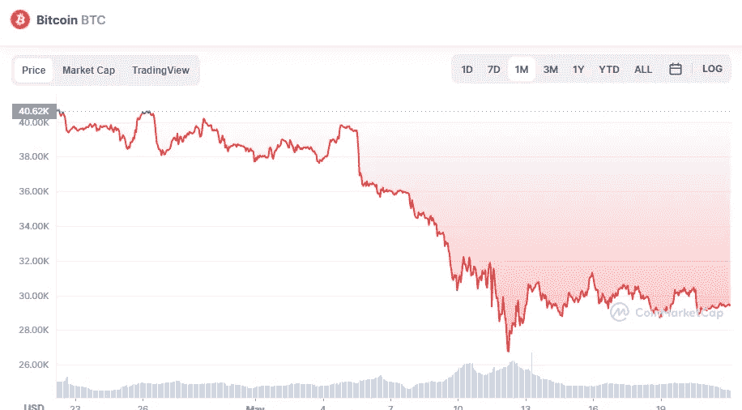

# 比特币的熊市结束了吗？

> 原文：<https://medium.com/coinmonks/is-the-bear-market-for-bitcoin-over-63b9ab75028a?source=collection_archive---------20----------------------->

Source photo [Bitcoin price today, BTC to USD live, marketcap and chart | CoinMarketCap](https://coinmarketcap.com/currencies/bitcoin/)

尽管最近有所下跌，但一些市场人士认为，真正的 BTC 价格底部尚未到达。一些鲸鱼和矿工仍在观望比特币会发生什么。

分析师预测 BTC 的价格可能会涨到 3 万美元，但其他市场参与者不同意。例如，连锁监测资源 Whalemap 声称，比特币目前在世界第一大市场交易