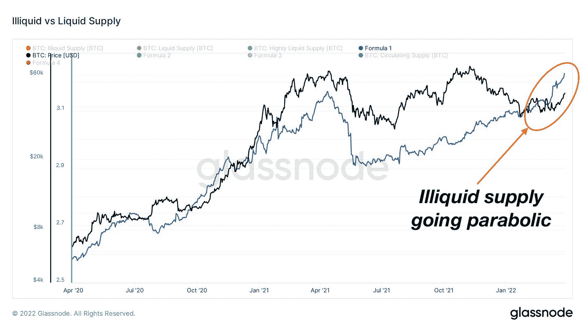
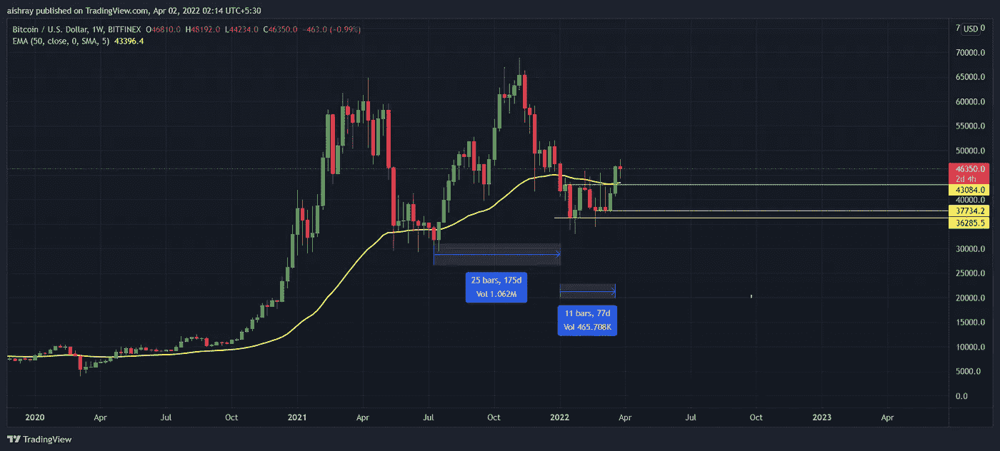
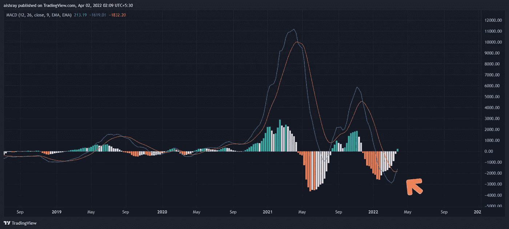
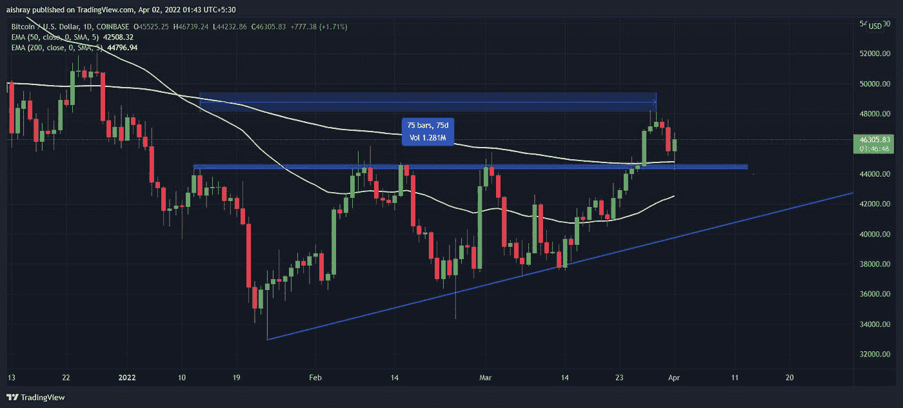

# 比特币牛市在这里吗？

> 原文：<https://medium.com/coinmonks/is-the-bitcoin-bull-run-here-f80e38e0fed1?source=collection_archive---------59----------------------->

让我们从基本面(链上)来谈，然后我们将尝试看看技术方面(图表)

**看大图**

我们看到了 2011 年 4 月至 5 月比特币的大幅上涨，达到 64k 比特币，随后是 5 月 21 日的暴跌。从那以后，BTC 在 50 周均线上方停留了将近 175 天，反弹到 70k 美元附近，然后猛烈下跌，突破了它的支撑位。
所有人同时惊慌失措。称之为牛市的结束和熊市的开始。
同样由于地缘政治的俄乌危机，每个人都开始认为熊市将开始，并将在未来两年统治**！(上一次熊市持续了 3 年)**

****但是，鲸鱼(又名大钱包)是不是很早就开始销售和预订利润了呢？****

**不要。事实上，他们现在正在大量购买！！！**

****

**非流动性供给:简单来说，这些比特币正在流向没有活动的钱包。算是霍德勒的账户吧！**

****技术分析****

**让我带你去看看华尔街、Dalal Street(孟买)的人整天都在做些什么…花式图表！
在达到 70，000 美元的顶部后，比特币崩溃并沉入水下近 75 天……最终在支撑了 6 周之后又跌了回来。**

****

**看 MACD(移动平均线的收敛和发散)。每周来看，比特币非常强劲。随着大规模的交叉，这真的可以在 12 月 22 日结束时启动 10 万美元的反弹**

****

****好吧，我错过了逢低买入。我应该什么时候买呢？****

**首先，没有合适的时间购买比特币，你应该总是美元平均吧！**

**不管怎样，让我带你上船吧！**

**等一下。你是来了解确切的购买价格的吗？
看图表，查原因，买！！**

****

**简单价格动作:
1。200D EMA
2。过去 75 天的抵抗被打破了。
3。重新测试破位阻力使其支撑继续上升趋势。**

**还是搞不清楚现在的买入价？(在 Twitter 上给我发消息，你会学到很多东西！)**

**在推特上关注我:https://twitter.com/AishrayS?t=uWsu9GTOd8mOFD1v3ll3Eg**

> **加入 Coinmonks [电报频道](https://t.me/coincodecap)和 [Youtube 频道](https://www.youtube.com/c/coinmonks/videos)了解加密交易和投资**

# **另外，阅读**

*   **[如何在 FTX 交易所交易期货](https://coincodecap.com/ftx-futures-trading) | [OKEx vs 币安](https://coincodecap.com/okex-vs-binance)**
*   **[OKEx vs KuCoin](https://coincodecap.com/okex-kucoin) | [摄氏替代度](https://coincodecap.com/celsius-alternatives) | [如何购买 VeChain](https://coincodecap.com/buy-vechain)**
*   **[ProfitFarmers 回顾](https://coincodecap.com/profitfarmers-review) | [如何使用 Cornix 交易机器人](https://coincodecap.com/cornix-trading-bot)**
*   **[如何匿名购买比特币](https://coincodecap.com/buy-bitcoin-anonymously) | [比特币现金钱包](https://coincodecap.com/bitcoin-cash-wallets)**
*   **[瓦济里克斯 NFT 评论](https://coincodecap.com/wazirx-nft-review)|[Bitsgap vs Pionex](https://coincodecap.com/bitsgap-vs-pionex)|[Tangem 评论](https://coincodecap.com/tangem-wallet-review)**