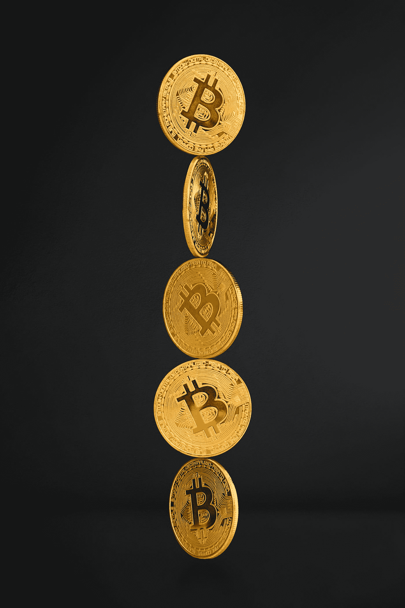

# 秘密熊市结束了吗？

> 原文：<https://medium.com/coinmonks/is-the-crypto-bear-market-over-c45855e129e2?source=collection_archive---------27----------------------->

每个投资者都会有不同的参数来定义熊市。

简单来说，要明白，自从比特币在 11 月达到历史高点以来，在分析蜡烛图时，我们在每周时间框架内经历了一系列更低的高点和更低的低点。

> 在我看来，如果不是从 2021 年 4 月的狂热(从 9 月到 11 月有一个异常的超级周期)开始，至少从那时起，我们就一直处于熊市之中。

Lower lows and lower highs = a bear market

自那以后，比特币的价值已经下跌了 50%以上。一些“专家”说这是一个“纠正阶段”，但我们在两年内经历了四次。由于担心利率上调、估值过高，尤其是俄罗斯入侵乌克兰，市场出现了大量抛售

然而，就在几天前，BTC 股价飙升 18%，有可能使其免于一场大屠杀。但是我们还没有脱离险境。这些都是要看的基本面因素。

## 抵抗

为了确认某样东西是上升趋势(看涨)还是下降趋势(看跌)，资产必须突破阻力。想想锦标赛。一个人必须不断击败更强的对手才能提升自己的排名。

当你看蜡烛图时，你可以通过趋势打破阻力的能力清楚地看到趋势的方向，或者相反，被拒绝进场。自 11 月初以来，BTC 未能突破有意义的抵抗。

直到现在。2 月 27 日，BTC 开始上升趋势，突破了 40，000 美元的关键阻力。现在需要突破 45800 美元。

## 支持

然而，抛售压力已经回归，比特币可能会回撤至支撑位。但这不是恐慌的理由。回溯表明健康的市场结构。

然而，这种支持在哪里才是关键。44，400 美元是理想的，但已经失去了。接下来是$42k，这是保持良好的写作时间。如果失去 42，下一个级别将是我们之前突破的 40k 美元阻力。

如果我们失去了这一点，我们可能会有一个死猫反弹，这是交易者对假出的说法，导致进一步的低点。更低。

## 移动平均线

移动平均线有不同的形式，但是最常用于技术分析的是指数移动平均线，它弥补了移动平均线本质上是滞后指标的事实。

月度时间框架是反对进一步贬值的最后一道支撑，因为它上次失去 EMA20(二十日指数移动平均线)是 2018 年熊市的开始。

自 2 月底以来，比特币高于关键的 EMA 指标，即 EMA20 和 EMA55。它的下一个阻力是 EMA200，这是比特币前进需要摧毁的大坏蛋。

## 相对强度

相对强弱指数(RSI)告诉你某样东西是超卖还是超买。此外，在窄幅波动的市场中，它可以表明看涨或看跌趋势是否会逆转。

比特币目前在 RSI 上位于 50 附近。作为参考，30 分表示超卖(吸引买家)，70 分表示超买(促使获利回吐)。

关注这一指标很重要，因为未来几周我们很可能会在 4 万美元到 4.6 万美元之间波动。RSI 为 50 是准确的中值，因此在这一点上，它没有给出 BTC 可能走向的任何迹象。

## 结果

有迹象表明，比特币的熊市可能已经结束。但在世界如此不确定的情况下，大量抛售 BTC 股票以降低风险总是有可能的。

如果你要在这里呆很长时间，请放心，BTC 只会越来越强。如果你缩小到每月的时间框架，比特币在大范围内有更高的高点和更高的低点。

如果你着眼于短期，要做好颠簸的准备。请记住，最长的熊市只有 411 天。如果我们继续看跌，好消息是，我们已经进入第 100 天了。

Long term, Bitcoin is very bullish

> 加入 Coinmonks [电报频道](https://t.me/coincodecap)和 [Youtube 频道](https://www.youtube.com/c/coinmonks/videos)了解加密交易和投资

# 另外，阅读

*   [OKEx vs KuCoin](https://coincodecap.com/okex-kucoin) | [摄氏替代品](https://coincodecap.com/celsius-alternatives) | [如何购买 VeChain](https://coincodecap.com/buy-vechain)
*   [币安期货交易](https://coincodecap.com/binance-futures-trading)|[3 comas vs Mudrex vs eToro](https://coincodecap.com/mudrex-3commas-etoro)
*   [如何购买 Monero](https://coincodecap.com/buy-monero) | [IDEX 评论](https://coincodecap.com/idex-review) | [BitKan 交易机器人](https://coincodecap.com/bitkan-trading-bot)
*   [CoinDCX 评论](/coinmonks/coindcx-review-8444db3621a2) | [加密保证金交易交易所](https://coincodecap.com/crypto-margin-trading-exchanges)
*   [红狗赌场评论](https://coincodecap.com/red-dog-casino-review) | [Swyftx 评论](https://coincodecap.com/swyftx-review) | [造币厂评论](https://coincodecap.com/coingate-review)
*   [Bookmap 评论](https://coincodecap.com/bookmap-review-2021-best-trading-software) | [美国 5 大最佳加密交易所](https://coincodecap.com/crypto-exchange-usa)
*   [如何在 FTX 交易所交易期货](https://coincodecap.com/ftx-futures-trading) | [OKEx vs 币安](https://coincodecap.com/okex-vs-binance)
*   [CoinLoan 审查](https://coincodecap.com/coinloan-review) | [YouHodler 审查](/coinmonks/youhodler-4-easy-ways-to-make-money-98969b9689f2) | [BlockFi 审查](https://coincodecap.com/blockfi-review)
*   [XT.COM 评论](https://coincodecap.com/profittradingapp-for-binance)币安评论 |
*   [SmithBot 评论](https://coincodecap.com/smithbot-review) | [4 款最佳免费开源交易机器人](https://coincodecap.com/free-open-source-trading-bots)