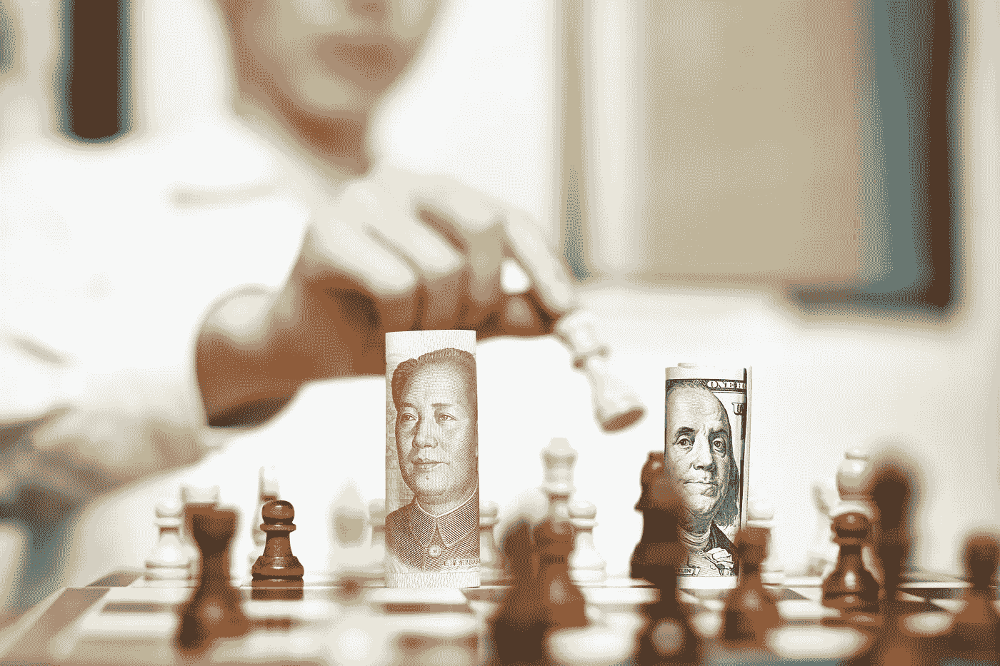
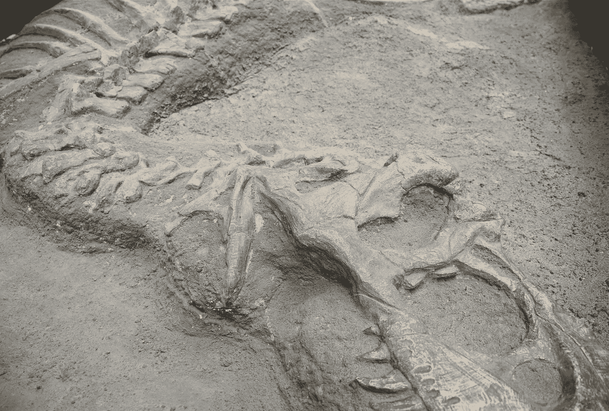
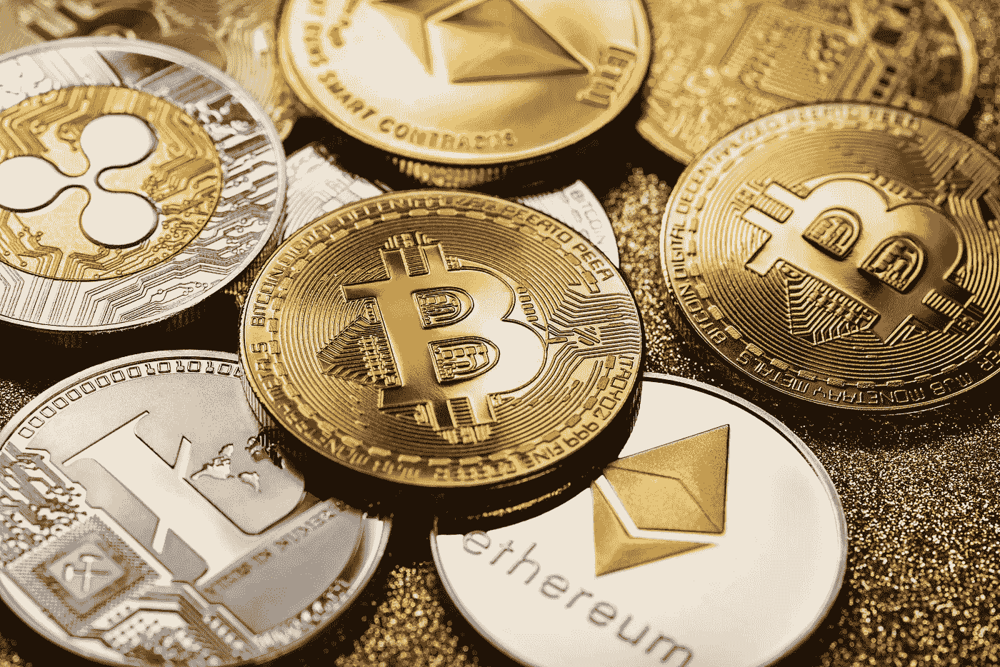
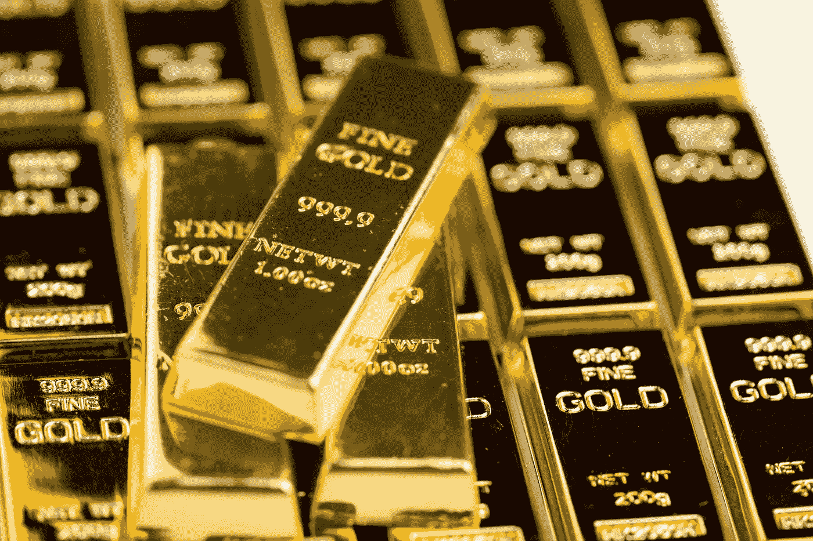

# 加密技术正在取代比特币和美元吗？不可避免的事情来了。

> 原文：<https://medium.com/coinmonks/is-the-crypto-dethroning-bitcoin-and-the-us-dollar-in-the-making-the-inevitable-is-coming-acf851152c47?source=collection_archive---------17----------------------->

女士们，先生们，世界每天都在我们眼前快速地改变。全球经济和全球供应链将永远不会相同，制裁只会适得其反。我们今天只是经历了冰山一角。在 12 到 18 个月内，将会感受到全面的影响和严重的痛苦。乌克兰冲突是全球密码世界将要发生的事情的借口和理由。这篇文章将带你了解自比特币诞生以来，加密世界中不可避免的重大事件。

# 前奏

制裁也创造了替代方案和新举措。2014 年，针对俄罗斯的制裁适得其反。受到制裁的俄罗斯停止从欧洲购买商品，转而开始从南美和亚洲的其他国家购买商品。出口的增加促进了这些国家的经济。供应链改变的根本问题是:一旦改变，就永远改变了，直到下一次中断，没有回头走老路线的可能。我们西方的立法者似乎忘记了这一点。

西方对古老而强大的文化过于傲慢:俄罗斯、波斯、中国、中东和印度。当一个帝国面临挑战时，它会建立联盟以确保战胜挑战。他们帝国繁荣、强大和成功的支柱是贸易，并辅之以使用军队保护、获取新资源的能力。复兴丝绸之路的计划清楚地证明，旧的正在变成新的，意图是让苏伊士运河在贸易地图上处于首屈一指的地位。当有跨国贸易时，使用一种货币有利于商品交换和支付，美元从这种动态中获得了力量。

# 古人

在西方，我们有一个 Instagram 记忆，我们前一分钟看到的东西下一分钟就忘记了。古老的文化不会忘记。美国立法者试图让中国谴责俄罗斯，这是不可能的！中国有外交手腕，但与美国有帐要算。有一句古老的法国谚语说:复仇是一餐你消耗冷。印度人称之为因果报应，在中东真主保佑。西方心态和傲慢的最大缺陷:我们把其他超级大国的善意和外交视为软弱，直到我们把它推得太远。

中国没有忘记 1991 年以美国为首的北约轰炸欧洲。曾经，我们欧洲有个国家叫南斯拉夫。美国飞行员轰炸了中国驻贝尔格莱德大使馆，杀害了中国平民和官员。我们可以称之为附带损害，但中国对它的记忆不同。在制裁和索莱马尼司令遇刺后，伊朗再也不会以同样的方式看待西方了。印度对最近西方造成的创伤有类似的恐惧，中东也是如此。

当我们在西方玩《使命召唤》的时候，世界其他地方都在准备玩一个叫《尊严与荣誉的召唤》的游戏。当我写这篇文章的时候，中国刚刚经历了一场波音坠机的悲剧，美国官员没有发出同情的信息，而是在同一天制裁了中国。对西方官员来说，尊重文化是注定要失败的。

我们也可能正在见证一场盎格鲁-撒克逊的种族压迫:斯拉夫人与俄罗斯人，波斯人与伊朗人，中国人与中国人，印度河流域与印度人，沙特人与沙特阿拉伯人，奥斯曼人与土耳其人。历史上民族冲突从来没有好结果。

为什么是沙特阿拉伯和土耳其？

*   沙特阿拉伯:美国试图将沙特王国卷入 9/11 事件，并试图将穆罕默德·本·萨勒曼王子牵连到 Khashoggi 谋杀案中，这对沙特王国来说是不可接受的。
*   土耳其:埃尔多安总统没有忘记 2016 年在美国煽动的政变。埃尔多安在政变前得到俄罗斯情报部门的警告，并乘坐政变中获救的俄罗斯飞机离开了该国。奥斯曼帝国也有一个严重的问题:博斯普鲁斯海峡是根据蒙特勒公约，土耳其没有发言权使用这部分土耳其不符合奥斯曼精神。一条新的运河正在修建，这条运河将把黑海的入口重新置于土耳其的控制之下，博斯普鲁斯海峡可能因意外或故意而变得不可航行，从而使黑海的入口完全处于土耳其的控制之下。埃尔多安总统似乎今天亲俄罗斯，明天又亲美国，这可能会令人困惑，但这是埃尔多安的方式来声明:奥斯曼帝国没有老板，购买俄罗斯的 S400 支持这一事实。
*   沙特阿拉伯和土耳其也有另一个共同的痛苦:以色列得到了 F35 和其他先进的军事武器，当利雅得和安卡拉要求它保护他们的土地时，他们不得不乞讨，并被我们年迈的西方立法者带去跳舞。给沙特王国和土耳其的信息很明确:“我们不像信任以色列那样信任你们，你们的国家没有以色列重要，默认情况下，以色列在该地区领先，而你们位居第二。”
*   当南美和非洲国家为了从国际货币基金组织和其他西方金融机构获得贷款而被迫接受政治或商业条件时，情况也是如此。

在过去的 20 年里，西方变得非常自由，现在西方文化正严重偏离旧的文化信仰和文化基础。

# 《侏罗纪公园》

我们年迈的立法者，他们中的大多数人出生在软盘之前，脱离了我们人民，他们脱离了现实。自乌克兰冲突开始以来，他们每天都让我们与 WWIII 调情，这无疑是火上浇油。

当谈到加密世界时，他们认为创造一种数字“法定”货币会娱乐大众。即使是数字形式的法定货币仍然是法定货币。他们就是不明白。我们都知道，数字美元和欧元将成为加强政府控制和深入我们个人生活的工具。我们的恐龙似乎认为我们是白痴。

他们认为我们是白痴，因为我们计划向每个家庭发放价值 300 美元的代金券来应对不断上涨的能源价格。你认为钱将从哪里来？你的口袋。

我们的立法者通过他们粗心的制裁向世界表明他们不关心维持全球经济平衡。对于一个以其货币作为储备的国家来说，这是不可接受的。全世界都在关注他们的行动，其他国家看到的并不是一幅美好的画面。我们的美国和欧盟立法者发出的信息是:“如果你们使用我们的基础设施，我们将把它作为武器，如果你们相信我们会持有你们的储备，我们将没收它，如果你们的企业和公民在我们的国家投资和消费，我们将没收他们的业务和资产”。对美国和欧盟的信任正在减弱，但随着乌克兰冲突的爆发，这种信任也消失了。在未来 5 年内，我们将看到世界各国从西方解放出来。人民币越来越受欢迎，但这不是一个可行的长期解决方案。

西方发出的另一个强烈的有毒信息是，正如我们过去在政治上看到的其他参与者一样，延斯·斯托尔滕贝格将从北约首脑的位置上退休，去哪里？担任挪威中央银行行长。显然，金融界需要军事专业知识。

当与其他国家打交道时，我们的西方立法者认为他们是优越的，可以命令和虐待。这能持续多久？压力。拜登警告说，食物短缺“将成为现实”……我们的恐龙正在不计后果地做出将直接影响其公民福祉的决定，并让公民在奢侈吃喝的同时为此付出沉重代价。俄罗斯和乌克兰的冲突是俄罗斯和乌克兰的问题，密西西比州比洛克西的无名氏与此无关，为什么他和他的家人要为此受到惩罚？这是法国大革命规模的反政府暴动的完美引子。为了让拜登连任，下一届美国大选将不得不被操纵到一个疯狂的水平。政治混乱和社会动荡即将到来。

拜登总统一再侮辱普京总统是向外国领导人发出的另一个强烈信息:1)他没有当领导人的任期，只有香蕉共和国的领导人才会口头上大便 2)如果乔·拜登冒昧地侮辱外国领导人，在私下里，他可能也会用侮辱来谈论其他外国领导人。尊重是与古老文化外交的顶点。

欧盟唯一头脑冷静的领导人是匈牙利总理维克托·欧尔班(Victor Orban)，当有人质疑他不参与对俄罗斯的制裁或在冲突中偏袒一方的决定时，他回答说:“匈牙利关心的是匈牙利”。匈牙利总理首先考虑的是他的国家和人民。

# 风景

这一格局在过去几年一直在形成，其边界在几周前对俄罗斯实施制裁时就已明确界定。这种局面显然是由那些没有加入制裁行列的国家塑造的。除了美国、加拿大、一些欧洲国家和澳大利亚，基本上是全世界。

西方实施制裁的方式是另一种实施制裁的邪恶方式，一揽子制裁方式是施虐受虐狂。他们每周都在伤口上捅刀子，试图通过额外的制裁来造成痛苦，不仅对俄罗斯政府，而且对与他们的政府决定毫无关系的俄罗斯公民。全世界都在看着，不仅它不起作用，而且他们看到的也不好看。

当前和新的贸易协定、中国和俄罗斯牵头的倡议也塑造了这一格局。虽然我们的注意力集中在乌克兰冲突上，但除了已经签署并实施的贸易协定(如金砖国家)，东方、中东、非洲和南美国家正在签署强有力的贸易协定。盟军正在联合。

对于第三国来说，制裁是取代西方提供的商品的机会，从而改善其经济，同时夺走西方的市场份额。需要有一种货币来促进和支持跨国贸易协定。

在已经充满挑战的国内经济中，西礁岛玩家将会发现他们没有朋友可以一起玩了。

# 该工具

我们都知道中国、俄罗斯、印度和其他国家一直在快速积累黄金储备。全球主要大国一直在快速放弃美元作为贸易和储备货币的地位。储备货币的价值不仅在于它在全球范围内的交易用途及其与大宗商品的关系，还在于信任和接受。

各国相信美元是一种安全的投资，相信美国会管理它们的外汇储备。这一切都过去了，在伊朗、叙利亚、委内瑞拉和现在的俄罗斯没收或冻结储备，使美元或欧元作为储备货币无效之后，我们年迈的西方立法者摧毁了他们货币有储备的商业理由。如今，美国和欧盟作为另一国资产的监管者，对外国来说风险太大。这个信息是响亮而明确的:除非你的愿望是成为一个附庸国，头上悬着一把斧头，随时准备在你打喷嚏时落下，否则美元和欧元就是你的选择。

这导致我们不可避免地要创建由中国和俄罗斯合作设计和创建的通用黄金支持加密，就像新丝绸之路一样，并支持丝绸之路和其他国际贸易协定。

其中一些主要优势:

*   绕过西方银行系统和 SWIFT
*   与 SWIFT 不同，全天候工作
*   快速，几秒钟内即可完成传输
*   防止西方把它作为武器
*   单一货币支持全球范围内的贸易活动，不需要货币兑换，这是比特币的兴奋剂。比特币一直引领着加密世界，就像我们历史上的某个片段一样，他的儿子将会统治并且更加强大。
*   世界已经准备好放弃全球贸易中的美元，他们需要一个替代品
*   给我一些黄金，我会给你一些密码，而不是更多的法定货币，这就是我们所知的布雷顿森林体系的终结。如今，随着各国随意凭空印制钞票，布雷顿森林体系受到了强烈挑战
*   这不仅是国外的观点，也是国内的观点，我们在西方对我们的货币失去了信任
*   纸质账单正在成为过去，就像数字格式的书已经取代了平装书一样
*   我们可以在列表中添加更多的好处。

西方的 CBDC 倡议正在构建中，这是一种相当复杂和困难的政府发行数字货币的方法，让西方政府可以随意创造数字货币，旨在对抗所谓的“稳定硬币”所带来的风险，这只是一个糟糕的商业案例。任何货币只要被广泛接受和使用，就是好的。如果美元和欧元在全球贸易中被取代，那么任何代表它的数字货币也会被取代。

# 提交

制裁的反弹将是沉重的，双方都将付出代价，但主要是在西方。随着时间的推移，不同的是:东方可以在最近的星巴克没有他们的 foochino 而使用普通咖啡，西方将很难适应生活方式和生活成本的变化，从而引发恐慌袭击、恐惧和仇恨。这将是一个物质和情感层面的打击。西方的年轻一代还没有做好吃苦的准备。

无法以美元和欧元交易将迫使西方屈服，并迫使西方接受通用黄金支持的加密技术，购买该技术进行全球交易，并迫使西方取消或反对其对俄罗斯和中国实施或即将实施的制裁。

我们不确定库克堡和欧洲其他国家有多少黄金，没人知道西方能用他们的黄金作为抵押品购买多少通用黄金支持的密码。

当对一个国家实施严厉制裁时，你也用尽了你最后的弹药。受制裁的国家没有什么可失去的，它被逼到了以毁灭性打击进行报复的地步。下一阶段可能是全球变暖，没有人对此感兴趣，这将是全面的全球毁灭。

一支几乎没有石油来为他们的军事装备提供动力的军事力量，因为没有 GPS(俄罗斯几周前展示了他们可以击落卫星)，食物供应和饥饿的军队，严重的国内问题，崩溃的经济，只有一个唯一的选择:投降。你的军队有多强大并不重要。

西方正试图对俄罗斯实施包围，这一战略的定义是封锁进出敌方地点的所有资源，以削弱敌人并迫使敌人投降，这正是反俄制裁和北约的目标，但有一点小小的误判:西方现在被孤立，并被不参与制裁的国家包围。就像维京人的一集，军队在敌人的堡垒周围实施围攻没有意识到或意识到太晚了，他们被敌人的盟友包围，挤在敌人的堡垒和敌人的盟友之间。历史上反复使用的策略，总是以对攻击者的大屠杀而告终。

# 什么时候

投入使用的机会将在 18 到 24 个月后。为什么？西方似乎在制裁上占了上风，但他们很快意识到反弹的影响，导致他们为他们实施的制裁付出沉重代价，并将在未来以损害他们国家的方式实施制裁。完美风暴正在酝酿:

*   重新构建的全球供应链将绕过目前已建立的架构，为第三国提供更多机会，并从富裕的西方国家手中夺走一些东西，这些国家不再像过去那么富裕了。
*   它甚至还没有开始，制造商正在耗尽制造零件，农业部门的春播季节处于危险之中，这个季节将是艰难的，接下来的季节注定如此。
*   对于一些已经承受了 Covid 冲击的小企业来说，这是致命的一击，他们无法再承受另一次打击
*   失去工作和失业增加
*   对商品的三重有利影响:不仅产品价格上涨，而且柴油价格上涨和短缺增加了将商品运送到最近商店的成本
*   不可避免的是，政府将不得不像往常一样通过增税和指责俄罗斯来应对
*   gig 数字经济的崩溃:“对不起，伙计，我不需要你的关于成为教练的教练的“大师”课程。我需要的是肉和土豆泥！”
*   美联储将不可避免地提高利率
*   当一个国家出现困难时，犯罪率就会上升
*   商品短缺和通货膨胀将在全球一些国家引发局部冲突。
*   影响我们食物供应的禽流感和其他动物疾病已经开始出现，影响将是最严重的
*   恶劣的天气条件:严冬、地震、暴雨和干旱影响农业和国内经济。我们年迈的立法者正在不计后果地打赌，希望大自然会站在他们一边。
*   化肥和谷物的缺乏影响了农业和粮食供应
*   正如已经看到的，禁止谷物和其他商品出口以保护其公民免受国内粮食短缺的国家，将会造成西方的粮食短缺
*   从现在起的一年内，公民将不会因为他们正在经历的导致反政府抗议和骚乱的痛苦而责怪俄罗斯，而是他们的政府。历史上充满了面对贫困和饥饿的群众变得暴力的例子
*   通常的情况会发生，1%的人会微笑。现在是从大众手中低价买入，并通过增加某种形式的马基雅维利工具转售给大众来获利的最佳时机，大众可以用这种工具以溢价购买以大幅折扣从他们那里购买的东西，并且可以负担得起。
*   更多奇怪的事件正在发生，减少了供应，例如最近沙特石油基础设施遭受打击，导致产量减少，而此时美国和欧盟正试图确保石油产量，以取代俄罗斯的石油禁令
*   还有更多…

我每天都在悲伤地阅读新闻，目睹我们年迈的立法者每天都在加剧和加剧一种已经到了不可逆转的地步的局势，并让我们人民来应付损失。制裁反弹势头与日俱增。

迄今为止，西方可以把国内外政策的失败归咎于俄罗斯或中国。只有无能的人才会指责别人而不对自己的行为负责。这种幼稚的小丑表演已经不起作用了，加密的受欢迎程度也是我们西方人不再信任西方制度的一个标志。

# 实施

实施将很容易:

*   中国已经有了数字人民币，技术和基础设施已经过测试和验证
*   中国银联已经存在一段时间了，在一些国家是 Visa 和 Mastercard 的竞争对手
*   俄罗斯只是转向用卢布和黄金与“敌对国家”进行能源和其他全球交易(俄罗斯过去称西方国家为合作伙伴，现在不是了)。俄罗斯国会能源委员会主席帕维尔·扎瓦尼表示，俄罗斯也将接受比特币作为能源支付。这一转变很容易推高卢布的价值。再见，美元和欧元
*   实施的采纳部分是显而易见的，开放的贸易协定，各国在后台观察俄罗斯联邦、叙利亚、委内瑞拉和伊朗的情况，西方冻结储备，扣押俄罗斯公民资产(政府和公民)，结论很简单:我们的国家不能再信任西方。

关于信任的最后一点比听起来更深刻，它关系到一个国家的安全、经济和稳定。正如最近的事件所表明的那样，一个外国依靠西方将处于危险之中。由于风险大于收益，美国和欧洲的外国私人和商业投资将会减少。美元和欧元只是失去了它们的用例以及对它们的信任。

现金(企业和富裕公民)将流向不同的方向，不再是西方，而是阿联酋等中立国家，这增加了对跨国通用数字货币的需求，以促进未来的投资。

# 不可避免的

中国和俄罗斯创建的黄金支持通用密码的可靠用例是存在的，并得到了最近全球事件的支持。这不是是否会实现，而是何时实现。

这种黄金支持的加密技术会让希尔比特币之王下台吗？绝对的！

美元会不会崩盘，失去储备货币的地位？你最好相信！

金背 crypto 会成为 cryptos 的 crypto 吗？没错。

这个国际黄金支持的密码将重塑密码世界吗？是啊！

数字美元或欧元能与之竞争吗？不是！

对于普通公民来说，黄金支持的货币会优先于投资真金吗？是的，我会在另一篇文章中解释原因。

任何其他加密技术能与国际通用的黄金加密技术竞争吗？我不这么认为。即使在大科技支持加密的情况下，在选举后，Covid 和乌克兰战争，大科技认为我们他们可以压制言论自由，关闭你的帐户，因为他们没有正当理由。人们不再信任大型科技公司，它们的加密技术将在东方国家被禁止。

到目前为止，加密技术的采用还处于初级阶段:新手面临着一个混乱的世界太多的硬币，政府控制的媒体机构已经做了很好的工作来吓唬普通人不要投资加密技术，普通人不知道他是否应该在投资前了解区块链技术，等等。许多国家使用的通用黄金支持的加密技术，得到了世界各地政府和金融机构的认可，将会像黄金一样好，增加了普通人的信心水平，并引发了向加密技术的大规模转移。

我会买这个新的密码吗？你打赌，所以我们大多数人！欢迎加入革命！

世界在变，我们也要跟着变！

> 加入 Coinmonks [电报频道](https://t.me/coincodecap)和 [Youtube 频道](https://www.youtube.com/c/coinmonks/videos)了解加密交易和投资

# 另外，阅读

*   [3 商业评论](/coinmonks/3commas-review-an-excellent-crypto-trading-bot-2020-1313a58bec92) | [Pionex 评论](https://coincodecap.com/pionex-review-exchange-with-crypto-trading-bot) | [Coinrule 评论](/coinmonks/coinrule-review-2021-a-beginner-friendly-crypto-trading-bot-daf0504848ba)
*   [莱杰 vs Ngrave](/coinmonks/ledger-vs-ngrave-zero-7e40f0c1d694) | [莱杰 nano s vs x](/coinmonks/ledger-nano-s-vs-x-battery-hardware-price-storage-59a6663fe3b0) | [币安评论](/coinmonks/binance-review-ee10d3bf3b6e)
*   [Bybit Exchange 评论](/coinmonks/bybit-exchange-review-dbd570019b71) | [Bityard 评论](https://coincodecap.com/bityard-reivew) | [Jet-Bot 评论](https://coincodecap.com/jet-bot-review)
*   [3 commas vs crypto hopper](/coinmonks/3commas-vs-pionex-vs-cryptohopper-best-crypto-bot-6a98d2baa203)|[赚取加密利息](/coinmonks/earn-crypto-interest-b10b810fdda3)
*   最好的比特币[硬件钱包](/coinmonks/hardware-wallets-dfa1211730c6) | [BitBox02 回顾](/coinmonks/bitbox02-review-your-swiss-bitcoin-hardware-wallet-c36c88fff29)