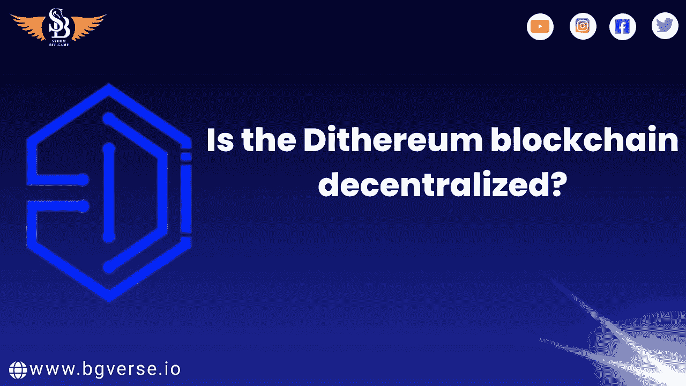

# 区块链是分散的吗？

> 原文：<https://medium.com/coinmonks/is-the-dithereum-blockchain-decentralized-5fe026382525?source=collection_archive---------29----------------------->

双硫仑游戏攻略

[dither eum 平台是一个集合了专业、流量和自然资产的基础平台，将稳步向区块链业务开放](http://sbgame.club/)。它将使分散式应用程序的开发更具生产力和财务头脑，同时，在进步、流量和
资产方面给予深远的加强。Dithereum 平台是 EVM 可行的区块链，它解决了 Dapp 业务中最令人担忧的问题。Dithereum 平台将为世界各地的设计师提供一系列不同的富有想象力的办公室和管理机构。

双硫仑技术特征

[●一个开放的去中心化的组织跟上组织的安全
更何况资源。](https://sbgglobal.io/)
●支持 EVM 的可编程性，精明协议的相似性
减少晋升或重新安置成本。
●元交换工作:气费降低，真正减少
设计师和客户在链条上的费用。
●支持交叉绑定资源移动，提升客户洞察力。

> 加入 Coinmonks [电报频道](https://t.me/coincodecap)和 [Youtube 频道](https://www.youtube.com/c/coinmonks/videos)了解加密交易和投资

# 另外，阅读

*   [交易杠杆代币的最佳交易所](https://coincodecap.com/leveraged-token-exchanges)
*   [最佳加密分析或链上数据](https://coincodecap.com/blockchain-analytics) | [Bexplus 评论](https://coincodecap.com/bexplus-review)
*   [NFT 十大市场造币集锦](https://coincodecap.com/nft-marketplaces)
*   [AscendEx Staking](https://coincodecap.com/ascendex-staking)|[Bot Ocean Review](https://coincodecap.com/bot-ocean-review)|[最佳比特币钱包](https://coincodecap.com/bitcoin-wallets-india)
*   [Bitget 回顾](https://coincodecap.com/bitget-review) | [双子 vs 区块链](https://coincodecap.com/gemini-vs-blockfi) | [OKEx 期货交易](https://coincodecap.com/okex-futures-trading)