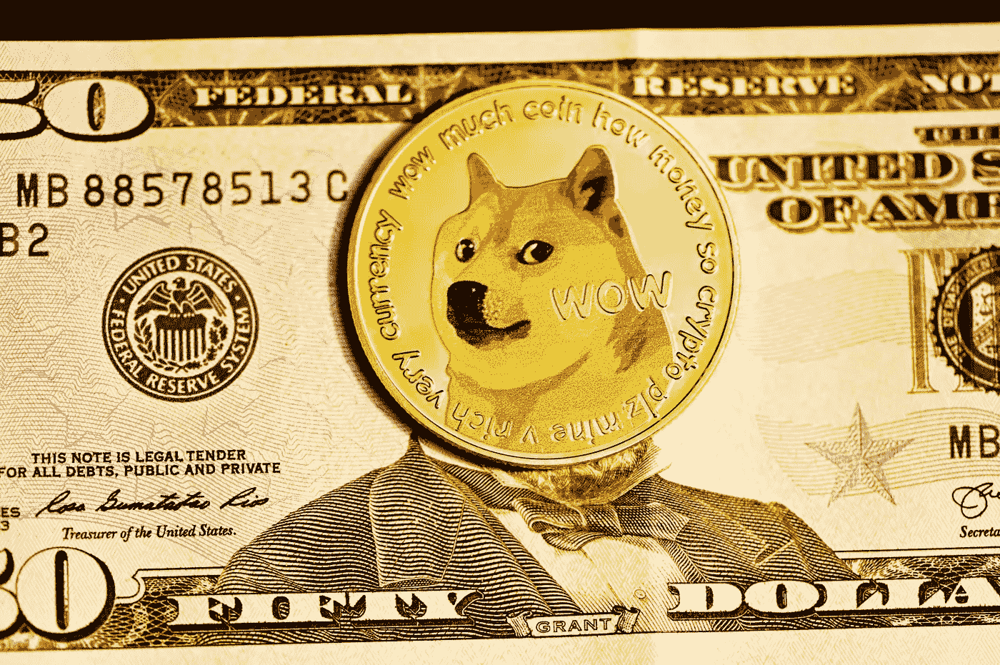

# 随着 Dogecoin 和柴犬的出现，迷因币热潮结束了吗？

> 原文：<https://medium.com/coinmonks/is-the-meme-coin-craze-over-with-dogecoin-and-shiba-inu-c1bb9c062dfb?source=collection_archive---------12----------------------->

2021 年，迷因币热席卷加密市场。Dogecoin (DOGE)击败了所有对手，在飞速增长超过 10，000%后，进入了数字货币的前十名。柴犬也不例外。2021 年，Dogecoin 的主要竞争对手表现优于其竞争对手。事实上，有那么一小段时间，柴犬的市值超过了 Dogecoin 的整体价值。