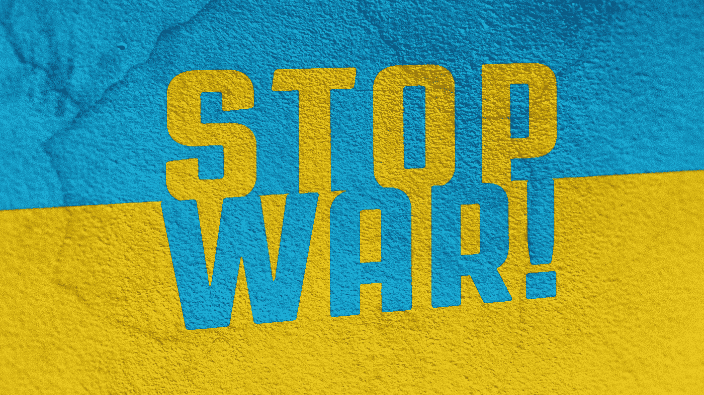

# 乌克兰战争是第一次 ESG 真正的考验吗？我们站在乌克兰一边，支持民主价值观。

> 原文：<https://medium.com/coinmonks/is-the-war-in-ukraine-a-first-esg-real-test-we-stand-with-ukraine-in-support-of-democratic-values-d60ccf5d2d77?source=collection_archive---------57----------------------->

2022 年 2 月 24 日，俄罗斯非法和不公正地入侵乌克兰，标志着欧洲历史上更黑暗的一章。自冷战以来，国际准则和规则遵循的是领土完整、禁止武力以及各国独立决定外交和安全事务的权利，所有这些现在都被普京政权破坏了。

Hermesnet 是一家全球性公司，创始人和员工来自俄罗斯、乌克兰、澳大利亚、英国、瑞典和孟加拉国。Hermesnet 的团队支持民主和乌克兰的自决权。俄罗斯的行为违背国际法，挑战欧洲安全秩序。我们不能袖手旁观，让普京决定欧洲或乌克兰的未来。在这个不确定的时代，我们必须捍卫民主和开放。Hermesnet 支持民主价值观、人权、法治和言论自由。

# ESG 的第一次真正考验

然而，对我们来说，这不仅是为了支持乌克兰，也是为了 ESG。近年来，这一直是银行和投资界的热门话题。现在是第一次 ESG 真正测试的时候了。我们想问几个棘手的问题:

1.  投资于俄罗斯的基金和在俄罗斯运营的公司的 ESG 风险是否得到了适当的评估和披露？
2.  **不吸取俄罗斯的教训，投资者还能继续在类似国家投资吗？**

彭博汇编的数据显示，在入侵前，将环境、社会和治理因素融入投资过程的基金持有[83 亿美元](https://www.bloomberg.com/news/articles/2022-03-08/esg-funds-had-8-3-billion-in-russia-assets-right-before-the-war)的俄罗斯资产。这些基金拥有俄罗斯国有企业，如俄罗斯天然气工业股份公司、俄罗斯石油公司、俄罗斯储蓄银行和俄罗斯政府债券。战争开始时，他们的投资者损失了数十亿美元。

离开俄罗斯的公司何时能够恢复运营也存在很大的不确定性。俄罗斯正在讨论将已经退出的外国公司的资产国有化的可能性。这使得越来越明显的是，对俄罗斯不友好的公司将可能因其决定离开而面临重大的物质惩罚。例如，网飞损失了超过 500 亿美元的市值，其中大部分是因为持续的乌克兰战争。雷诺自己估计在俄罗斯[的废弃资产约为 23 亿美元。](https://www.lexology.com/library/detail.aspx?g=fbba7fa3-5652-45d6-be12-6ca7cdf3601b#:~:text=Abandoning%20its%20Russian%20business%20will,could%20not%20remain%20in%20Russia.)还有很多其他例子。

随着乌克兰冲突的爆发，投资者和企业需要重新评估人权和良好治理在计算国家风险中的重要性。董事会和高级管理层必须致力于发挥领导作用，以确保风险管理团队和流程稳健且富有弹性。此外，他们还应提供情景规划和练习，为企业战略和资本支出的调整提供信息。

随着投资时和投资期间对 ESG 因素的日益关注，在专制制度下开展业务的成本将会上升，投资前执行彻底的尽职调查流程是这种关注的基础。许多民主治理薄弱的国家对外国投资者总是有吸引力的。然而，这无疑将迫使投资者至少更重视人权、法治和社会因素，以在未来通过外部利益相关者的 ESG 审查。

乌克兰冲突并没有从根本上改变 ESG [的版图本身](https://corpgov.law.harvard.edu/2022/03/16/the-false-promise-of-esg/)。然而，这场战争加强了采用更全面的 ESG 镜头以保持可信和经得起未来考验的论点。

不幸的是，许多专制国家与软弱的政府和严重的腐败作斗争，但仍然吸引资金。这些国家无疑将受到更严密的审查，以避免争议和资产冻结。因此，公司和投资者都必须实施更严格的环境、社会和公司治理政策，以便更快地发现危险信号和侵犯人权、治理和其他环境、社会和公司治理风险，从而减轻财务损失。

> 加入 Coinmonks [电报频道](https://t.me/coincodecap)和 [Youtube 频道](https://www.youtube.com/c/coinmonks/videos)了解加密交易和投资

# 另外，阅读

*   [3 商业评论](/coinmonks/3commas-review-an-excellent-crypto-trading-bot-2020-1313a58bec92) | [Pionex 评论](https://coincodecap.com/pionex-review-exchange-with-crypto-trading-bot) | [Coinrule 评论](/coinmonks/coinrule-review-2021-a-beginner-friendly-crypto-trading-bot-daf0504848ba)
*   [莱杰 vs n rave](/coinmonks/ledger-vs-ngrave-zero-7e40f0c1d694)|[莱杰 nano s vs x](/coinmonks/ledger-nano-s-vs-x-battery-hardware-price-storage-59a6663fe3b0) | [币安评论](/coinmonks/binance-review-ee10d3bf3b6e)
*   [Bybit Exchange 审查](/coinmonks/bybit-exchange-review-dbd570019b71) | [Bityard 审查](https://coincodecap.com/bityard-reivew) | [Jet-Bot 审查](https://coincodecap.com/jet-bot-review)
*   [3 commas vs crypto hopper](/coinmonks/3commas-vs-pionex-vs-cryptohopper-best-crypto-bot-6a98d2baa203)|[赚取加密利息](/coinmonks/earn-crypto-interest-b10b810fdda3)
*   最好的比特币[硬件钱包](/coinmonks/hardware-wallets-dfa1211730c6) | [BitBox02 回顾](/coinmonks/bitbox02-review-your-swiss-bitcoin-hardware-wallet-c36c88fff29)
*   [BlockFi vs 摄氏度](/coinmonks/blockfi-vs-celsius-vs-hodlnaut-8a1cc8c26630) | [Hodlnaut 审核](/coinmonks/hodlnaut-review-best-way-to-hodl-is-to-earn-interest-on-your-bitcoin-6658a8c19edf) | [KuCoin 审核](https://coincodecap.com/kucoin-review)