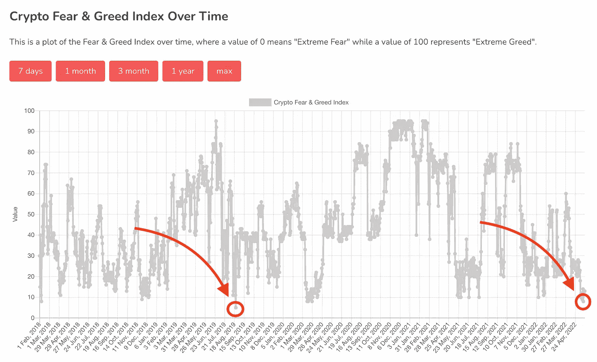
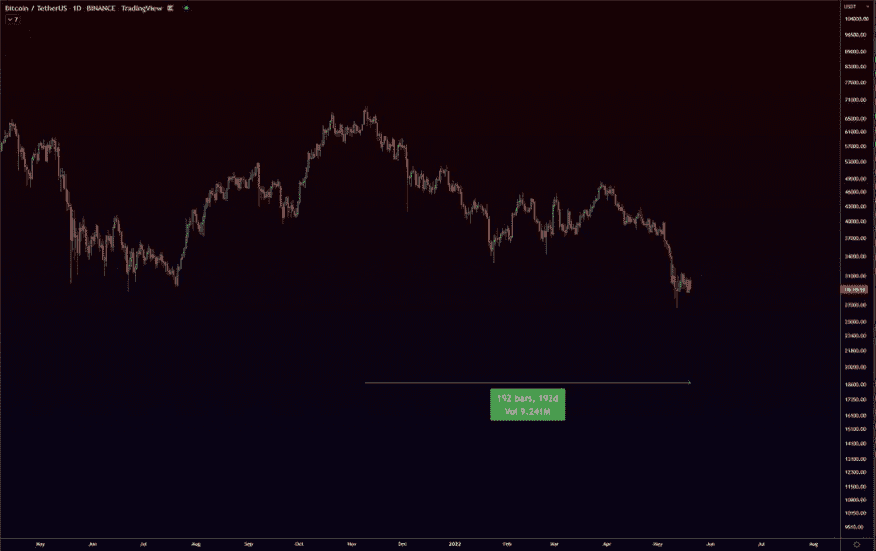
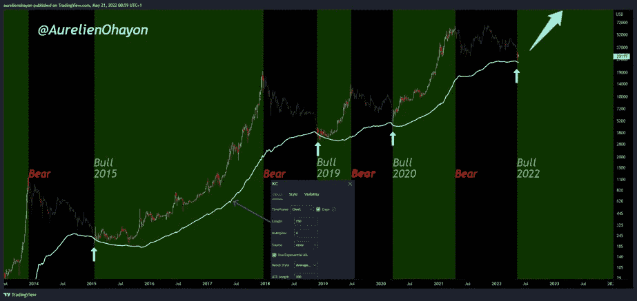

# 这是熊市的确认吗？

> 原文：<https://medium.com/coinmonks/is-this-the-confirmation-of-the-bearmarket-2ea41dc98d84?source=collection_archive---------31----------------------->

我们都注意到了，密码世界正在衰落。24 周前，比特币价格为 68000 美元，自那以来，比特币价格迅速下跌，我们甚至跌破了重要的 30000 美元关口。关于进入两年熊市的第一个传言正在流传。

但是我们真的处于熊市，还是牛市即将来临？

Photo by [Thomas Lefebvre](https://unsplash.com/@magellol?utm_source=medium&utm_medium=referral) on [Unsplash](https://unsplash.com?utm_source=medium&utm_medium=referral)

# 为什么是两年？

确切的说是 776 天，也正是新一轮比特币周期启动的时候。每 4 年就会有一次所谓的减半，矿工获得的比特币数量减半。这通常会导致价格上涨，因为许多人认为流通中的比特币会减少。然而，所有比特币的 91%已经被创造出来，所以这更多地是在提醒大家，比特币是有限的。**在大多数情况下，比特币的价格是一面心理镜子，代表着大众的情绪。**

 [## 比特币减半倒计时| CoinMarketCap

### 尽管拥有无限的智慧，比特币的匿名发明者中本聪认为只有 2100 万 BTC 会…

coinmarketcap.com](https://coinmarketcap.com/halving/bitcoin/) 

而[恐惧&贪婪指数](https://alternative.me/crypto/fear-and-greed-index/)已经在几天前的 22 日跌至上次的低点。2019 年 8 月。许多投资者担心他们的钱，因此考虑出售他们的硬币。

此外，最年轻的加密亿万富翁和以太坊联合创始人维塔利克·布特林(Vitalik Buterin)已经宣布，他不再是亿万富翁。正如你从评论中看到的，这引起了社区中许多人的不安。这可能是我们现在处于熊市的一个原因。

对于其他一些人来说，我们已经处于熊市很长时间了，大约从 2021 年 11 月开始。希望我们很快就会到达底部。

Source: [Twitter](https://twitter.com/easyeight08/status/1527678189530660865?s=21&t=nkodAhDq2xwDA1t0iQuEqg)

同样，其他人声称 2022 年牛市即将到来，而我们已经处于熊市。

Source: [Twitter](https://twitter.com/aurelienohayon/status/1527801311890120704?s=21&t=nkodAhDq2xwDA1t0iQuEqg)

你可以在推特上看到很多，每个人的看法都不一样，这是好事。尽管如此，我还是需要你们的一些诚实的意见。

# 你有什么看法？

有三种主要观点，我们在评论中不予理会。

你也可以证明你的观点。

**走吧！是时候澄清一下了！**

> 加入 Coinmonks [电报频道](https://t.me/coincodecap)和 [Youtube 频道](https://www.youtube.com/c/coinmonks/videos)了解加密交易和投资

# 另外，阅读

*   [3 商业评论](/coinmonks/3commas-review-an-excellent-crypto-trading-bot-2020-1313a58bec92) | [Pionex 评论](https://coincodecap.com/pionex-review-exchange-with-crypto-trading-bot) | [Coinrule 评论](/coinmonks/coinrule-review-2021-a-beginner-friendly-crypto-trading-bot-daf0504848ba)
*   [莱杰 vs n rave](/coinmonks/ledger-vs-ngrave-zero-7e40f0c1d694)|[莱杰 nano s vs x](/coinmonks/ledger-nano-s-vs-x-battery-hardware-price-storage-59a6663fe3b0) | [币安评论](/coinmonks/binance-review-ee10d3bf3b6e)
*   [Bybit Exchange 审查](/coinmonks/bybit-exchange-review-dbd570019b71) | [Bityard 审查](https://coincodecap.com/bityard-reivew) | [Jet-Bot 审查](https://coincodecap.com/jet-bot-review)
*   [3 commas vs crypto hopper](/coinmonks/3commas-vs-pionex-vs-cryptohopper-best-crypto-bot-6a98d2baa203)|[赚取加密利息](/coinmonks/earn-crypto-interest-b10b810fdda3)
*   最好的比特币[硬件钱包](/coinmonks/hardware-wallets-dfa1211730c6) | [BitBox02 回顾](/coinmonks/bitbox02-review-your-swiss-bitcoin-hardware-wallet-c36c88fff29)
*   [BlockFi vs 摄氏度](/coinmonks/blockfi-vs-celsius-vs-hodlnaut-8a1cc8c26630) | [Hodlnaut 审核](/coinmonks/hodlnaut-review-best-way-to-hodl-is-to-earn-interest-on-your-bitcoin-6658a8c19edf) | [KuCoin 审核](https://coincodecap.com/kucoin-review)