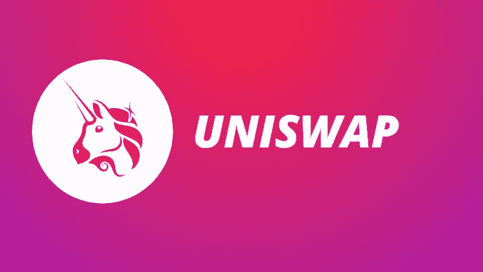

# 2022 年 Uniswap (UNI)投资好吗？

> 原文：<https://medium.com/coinmonks/is-uniswap-uni-a-good-investment-in-2022-477a36bc63db?source=collection_archive---------26----------------------->

Source photo [unishawp — Bing images](https://www.bing.com/images/search?view=detailV2&ccid=5ZtSrdmJ&id=93EEF7DD7E83E7999E345EE8C9FEC6C36ABADCA2&thid=OIP.5ZtSrdmJcBPIvLGbAxZBQQHaEK&mediaurl=https%3a%2f%2fcryptomang.com%2fpublic%2fstorage%2fcrypto-news%2fJanuary2021%2fjfvM42W74eA6wcITkIsj.jpg&cdnurl=https%3a%2f%2fth.bing.com%2fth%2fid%2fR.e59b52add9897013c8bcb19b03164141%3frik%3doty6asPG%252fsnoXg%26pid%3dImgRaw%26r%3d0&exph=450&expw=800&q=unishawp&simid=608055816301206144&FORM=IRPRST&ck=BCF8AF9210D320ED92906436B35C1AF2&selectedIndex=17&ajaxhist=0&ajaxserp=0)

因此，Uniswap 获得了“DeFi King”的称号。这是最知名、最大的分散式交易所。2020 年后，将发布公用事业和治理令牌 UNI 令牌。这些现在有超过 1000%的投资回报率。

由于其不断增长的用户基础和粉丝基础，我们相信代币价格趋势将继续上升，这是…