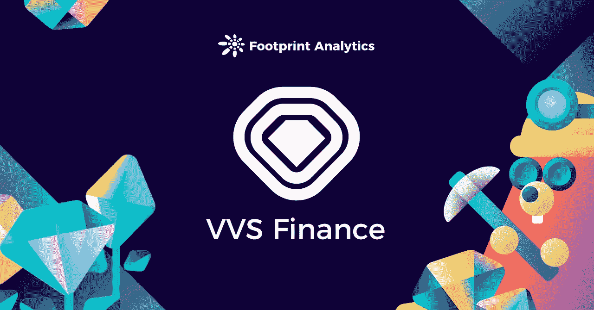
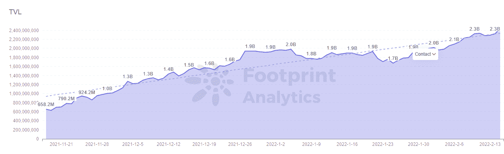
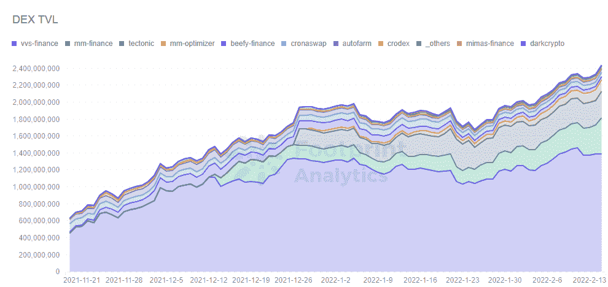
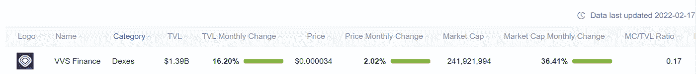

# VVS 金融是一项好的投资吗？

> 原文：<https://medium.com/coinmonks/is-vvs-finance-a-good-investment-d52e110bbaed?source=collection_archive---------6----------------------->

大多数人都知道 Crypto.com 是一个交易所和钱包应用，通过一系列高调的广告活动与北海巨妖和比特币基地等公司竞争。其中包括马特·达蒙的广告，勒布朗·詹姆斯的超级碗中场，以及前斯台普斯中心的冠名权。

然而，这家总部位于新加坡的公司自推出与 EVM 兼容的区块链 [Cronos](https://www.footprint.network/guest/dashboard/cronos-dashboard-fp-505d1c5f-07cd-4b2c-9a64-14c3e43b93e0?date=past90days&chain=Cronos&symbol=CRO&channel=u-apcVFj) 以来做得更多，自 11 月上线以来，其 DeFi 生态系统在 [TVL](https://www.footprint.network/guest/chart/tvl-of-chains-chain-temp-fp-7e024206-eaa9-45c9-a1fd-61f4b6741f88?channel=u-apcVFj) 已稳步增长至 23 亿美元。

[VVS 协议](https://www.footprint.network/guest/chart/tvl-over-time-chains-temp-fp-771bc25a-1fa1-4ba1-9e7f-a25f54f12df8#key=eyJwYXJhbWV0ZXJzIjpbeyJuYW1lIjoiRGF0ZSIsInNsdWciOiJkYXRlIiwiaWQiOiJhZTI0MjBjNiIsInR5cGUiOiJkYXRlL2FsbC1vcHRpb25zIiwic2VjdGlvbklkIjoiZGF0ZSIsImRlZmF1bHQiOiJwYXN0OTBkYXlzIiwiZmllbGRfaWRzIjpbNDM3LDQxM10sImZpZWxkX2lkIjpudWxsLCJoYXNPbmx5RmllbGRUYXJnZXRzIjp0cnVlfSx7Im5hbWUiOiJDaGFpbiIsInNsdWciOiJjaGFpbiIsImlkIjoiMjVmN2M0ODgiLCJ0eXBlIjoiY2F0ZWdvcnkiLCJkZWZhdWx0IjpbIkNyb25vcyJdLCJmaWVsZF9pZHMiOls0MzhdLCJmaWVsZF9pZCI6NDM4LCJoYXNPbmx5RmllbGRUYXJnZXRzIjp0cnVlfSx7Im5hbWUiOiJTeW1ib2wiLCJzbHVnIjoic3ltYm9sIiwiaWQiOiI0YWQ4NDJmNSIsInR5cGUiOiJjYXRlZ29yeSIsImRlZmF1bHQiOlsiQ1JPIl0sImZpZWxkX2lkcyI6WzQ1N10sImZpZWxkX2lkIjo0NTcsImhhc09ubHlGaWVsZFRhcmdldHMiOnRydWV9XSwicGFyYW1ldGVyVmFsdWVzIjp7ImFlMjQyMGM2IjoicGFzdDkwZGF5cyIsIjI1ZjdjNDg4IjpbIkNyb25vcyJdLCI0YWQ4NDJmNSI6WyJDUk8iXX0sInBhcmFtZXRlcl9tYXBwaW5ncyI6W3sicGFyYW1ldGVyX2lkIjoiYWUyNDIwYzYiLCJjYXJkX2lkIjoyOTg5LCJ0YXJnZXQiOlsiZGltZW5zaW9uIixbInRlbXBsYXRlLXRhZyIsImRheSJdXX0seyJwYXJhbWV0ZXJfaWQiOiIyNWY3YzQ4OCIsImNhcmRfaWQiOjI5ODksInRhcmdldCI6WyJkaW1lbnNpb24iLFsidGVtcGxhdGUtdGFnIiwiY2hhaW4iXV19XSwiZGFzaGJvYXJkVXVpZCI6IjUwNWQxYzVmLTA3Y2QtNGIyYy05YTY0LTE0YzNlNDNiOTNlMCJ9)是克罗诺斯链上最大的项目，截至 2 月 15 日占其总 TVL 的 59%。它已经是 TVL 的第七大指数，目前排在商人乔之后，在渗透作用之前。

什么是 VVS 金融？

VVS 金融是一个指数，提供通常的定义能力:互换，流动性池和赌注。

它代表非常非常简单的金融，使其 UVP 清晰——该平台旨在简化 DeFi。它通过游戏化和易于使用的界面来实现这一点。

当[评估一个加密项目的健康状况](https://www.footprint.network/guest/chart/protocols-tvl-market-cap-and-fdv-comparison-duplicate-fp-44f6a434-659c-441f-b54d-4267a6cf18e6?channel=u-apcVFjp-and-fdv-comparison-duplicate-fp-44f6a434-659c-441f-b54d-4267a6cf18e6?channel=u-apcVFj#secret=30C32D99C375165FF01A6771039484C4)时，它还会检查 Footprint 推荐给你看的许多[框:](https://www.footprint.network/article/5-charts-to-uncover-your-next-long-term-de-fi-investment-fp-618111ac-d2a82000-29a48da1)

*   大量的初始市值:VVS 金融公司的市值在成立后的头几个月里从 2000 万美元跃升至 1.7 亿美元，并在很大程度上反映了此后的总体市场趋势。
*   合理的交易量:VVS 金融的交易量大多保持在其市值的 5%至 20%之间。
*   价格行为:该协议的令牌 VVS 的价格行为是不稳定的，因为你会从一个新的 DEX 项目和一个新的链预期，但没有可疑的泵。

那么，为什么克罗诺斯上的第一个 AMM 和下一个 SushiSwap 或 PancakeSwap 的潜在竞争者最近吸引了这么多的争议呢？

VVS 金融的象征经济学是有问题的

VVS 的总流通供应量为 2.2 万亿，总供应量超过 36 万亿，将通过其排放计划在十年内增加到 100 万亿。

相比之下，以下是领先的 DEX 代币流通供应量数据(四舍五入到 100 万)。

寿司:1.27 亿个寿司

UNI swap:6.32 亿 UNI

煎饼互换:2.68 亿个蛋糕

平衡器:700 万平衡

作为唯一一个通胀如此严重的主要 DEX 指标(请注意，蛋糕没有硬上限，但有通缩机制来控制供应)，VVS 金融的 tokenomics 模型是一个异常值。

以下是一位自称持有人 dsx02 在 Reddit 上的一些合理批评:

*“我持有 VVS 和奎宁，但在看了令牌经济学后都卖了，他们真的很糟糕 100 万亿的 VVS 供应和 500 万亿的奎宁，从这个角度来看，VVS 比多杰多 1000 倍，多杰已经是一个疯狂膨胀的硬币，其价格受到了巨大的影响…他们计划仅在 2022 年就排放一半(50 万亿)，所以是的，我真的看不出它将如何升值，除非你根本不相信通货膨胀*

但是，VVS 高得令人难以置信的代币供应量对其长期潜力有影响吗？

虽然 100 万亿是巨大的，但其他代币的供应量要高得多，甚至是无限的，包括以太坊。

前面提到的蛋糕有无限的总供应量。

因此，总供应量不是衡量项目质量、优势或劣势的关键指标。重要的是它们将如何分配——根据哪种商业模式。如果有太多的供应流通，但没有足够的使用(例如，通过赌注或燃烧)，这将影响其令牌价格和内在价值。

如果 VVS 金融能够保持其在 Cronos 生态系统中的领先地位，并且 Cronos 能够继续增加其活动，该项目——本质上与 Crypto.com 的潜力相关——可能是一项不错的投资。

**什么是足迹分析**

足迹分析是一个一体化的分析平台，用于可视化区块链数据和发现见解。它清理和整合链上数据，因此任何经验水平的用户都可以快速开始研究令牌，项目和协议。凭借一千多个仪表板模板和一个拖放界面，任何人都可以在几分钟内构建自己的定制图表。发掘区块链数据，利用足迹进行更明智的投资。

*足迹网址:*[*https://www . Footprint . network*](https://www.footprint.network/)

*不和:*[*https://discord.gg/3HYaR6USM7*](https://discord.gg/3HYaR6USM7)

*推特:*[*https://twitter.com/Footprint_DeFi*](https://twitter.com/Footprint_DeFi)

*电报:*[*https://t.me/joinchat/4-ocuURAr2thODFh*](https://t.me/joinchat/4-ocuURAr2thODFh)

*Youtube:*[*https://www.youtube.com/channel/UCKwZbKyuhWveetGhZcNtSTg*](https://www.youtube.com/channel/UCKwZbKyuhWveetGhZcNtSTg)

> 加入 Coinmonks [电报频道](https://t.me/coincodecap)和 [Youtube 频道](https://www.youtube.com/c/coinmonks/videos)了解加密交易和投资

# 另外，阅读

*   [3 商业评论](/coinmonks/3commas-review-an-excellent-crypto-trading-bot-2020-1313a58bec92) | [Pionex 评论](https://coincodecap.com/pionex-review-exchange-with-crypto-trading-bot) | [Coinrule 评论](/coinmonks/coinrule-review-2021-a-beginner-friendly-crypto-trading-bot-daf0504848ba)
*   [莱杰 vs Ngrave](/coinmonks/ledger-vs-ngrave-zero-7e40f0c1d694) | [莱杰 nano s vs x](/coinmonks/ledger-nano-s-vs-x-battery-hardware-price-storage-59a6663fe3b0) | [币安评论](/coinmonks/binance-review-ee10d3bf3b6e)
*   [Bybit Exchange 评论](/coinmonks/bybit-exchange-review-dbd570019b71) | [Bityard 评论](https://coincodecap.com/bityard-reivew) | [Jet-Bot 评论](https://coincodecap.com/jet-bot-review)
*   [3 commas vs crypto hopper](/coinmonks/3commas-vs-pionex-vs-cryptohopper-best-crypto-bot-6a98d2baa203)|[赚取加密利息](/coinmonks/earn-crypto-interest-b10b810fdda3)
*   最好的比特币[硬件钱包](/coinmonks/hardware-wallets-dfa1211730c6) | [BitBox02 回顾](/coinmonks/bitbox02-review-your-swiss-bitcoin-hardware-wallet-c36c88fff29)
*   [BlockFi vs 摄氏](/coinmonks/blockfi-vs-celsius-vs-hodlnaut-8a1cc8c26630) | [Hodlnaut 点评](/coinmonks/hodlnaut-review-best-way-to-hodl-is-to-earn-interest-on-your-bitcoin-6658a8c19edf) | [KuCoin 点评](https://coincodecap.com/kucoin-review)
*   [Bitsgap 审查](/coinmonks/bitsgap-review-a-crypto-trading-bot-that-makes-easy-money-a5d88a336df2) | [Quadency 审查](/coinmonks/quadency-review-a-crypto-trading-automation-platform-3068eaa374e1) | [Bitbns 审查](/coinmonks/bitbns-review-38256a07e161)
*   [密码本交易平台](/coinmonks/top-10-crypto-copy-trading-platforms-for-beginners-d0c37c7d698c) | [Coinmama 审核](/coinmonks/coinmama-review-ace5641bde6e)