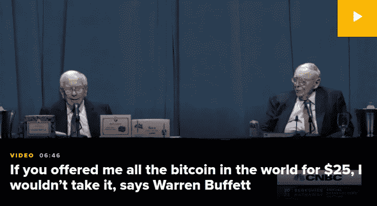
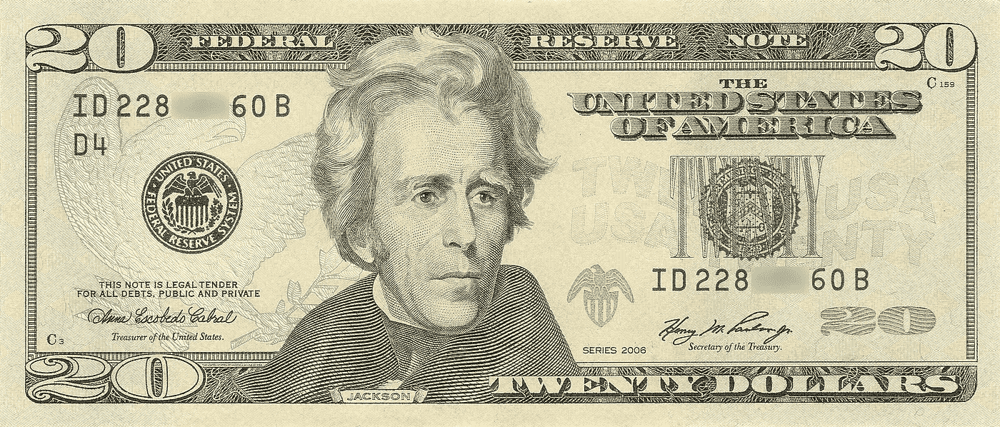
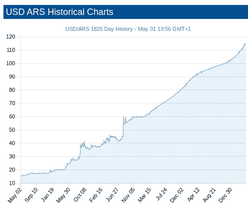
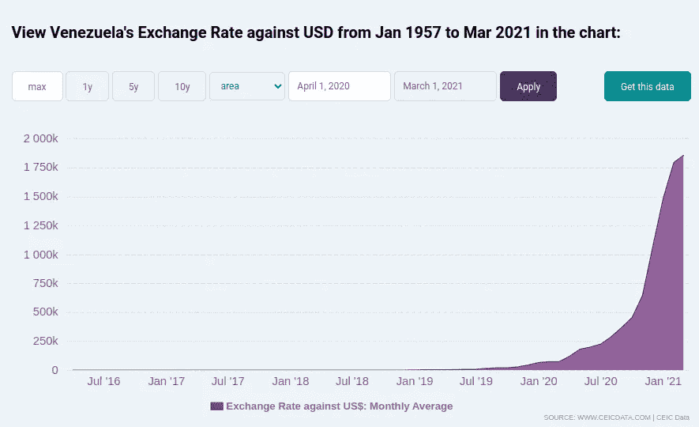
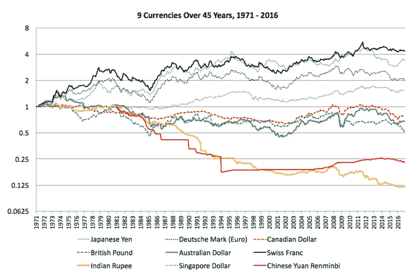
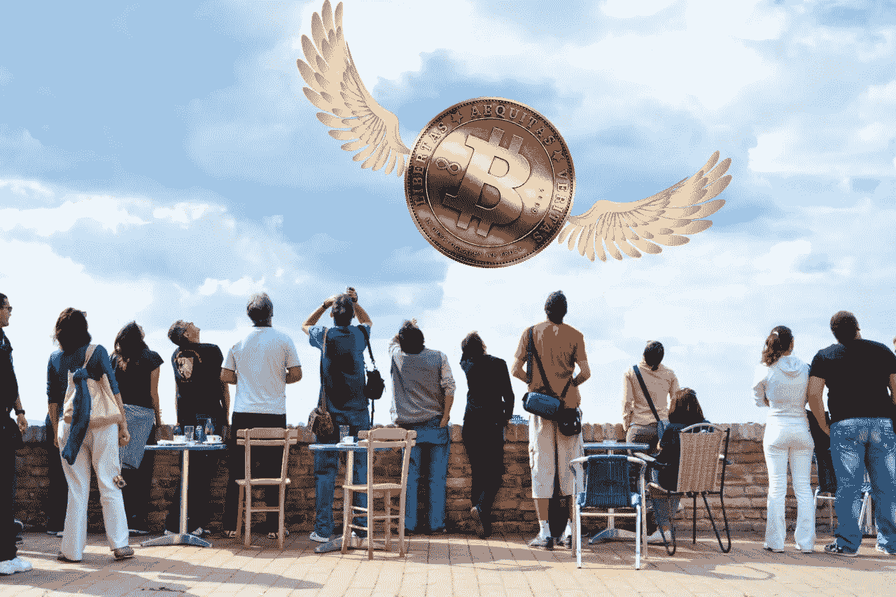
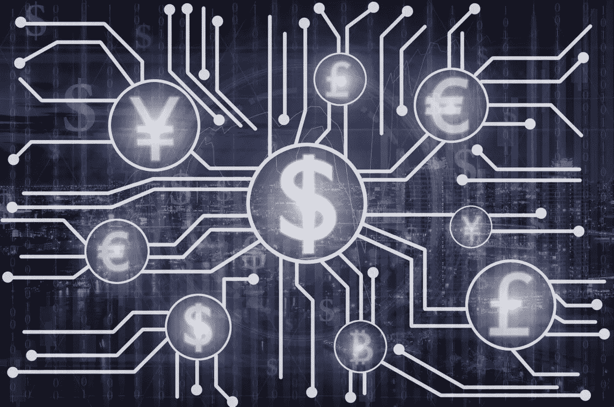

# 沃伦·巴菲特对加密的看法是正确的吗？

> 原文：<https://medium.com/coinmonks/is-warren-buffet-right-about-crypto-fb78a8117bd0?source=collection_archive---------3----------------------->

[https://www.cnbc.com/2022/04/30/warren-buffett-gives-his-most-expansive-explanation-for-why-he-doesnt-believe-in-bitcoin.html?utm_source=facebook](https://www.cnbc.com/2022/04/30/warren-buffett-gives-his-most-expansive-explanation-for-why-he-doesnt-believe-in-bitcoin.html?utm_source=facebook&utm_medium=news_tab)

在最近的一次 [**采访**](https://www.cnbc.com/2022/04/30/warren-buffett-gives-his-most-expansive-explanation-for-why-he-doesnt-believe-in-bitcoin.html?utm_source=facebook&utm_medium=news_tab) 中，沃伦·巴菲特声称比特币有“*没有价值*”，还有“*……它不产生任何东西，*”巴菲特说。它有一种魔力，人们把魔力附在许多东西上。”。他进一步阐述道:

> “如果你说……以美国所有农田 1%的权益，付给我们集团 250 亿美元，我今天下午就给你开张支票，”巴菲特说。“[对于]250 亿美元，我现在拥有 1%的农田。[如果]你给我这个国家所有公寓的 1%，你还想要 250 亿美元，我会给你写张支票，这很简单。现在，如果你告诉我你拥有世界上所有的比特币，并以 25 美元的价格卖给我，我不会接受，因为我会拿它做什么？无论如何我都得把它卖回给你。它不会做任何事情。公寓将产生租金，农场将生产食物。”

# 他是正确的吗？—这是 25 亿美元的问题。

如果你仔细阅读引文，你会发现他的论点的关键在于，比特币不*(与农田和房地产等资产相比)。*

*但在同一采访中，一个完全不同的断言:*

> *“资产要有价值，就必须向某人交付某种东西。只有一种货币被接受。你可以想出各种各样的东西——我们可以发行伯克希尔硬币……但归根结底，这是钱，”他说，举起一张 20 美元的钞票。“美国政府没有理由……让伯克希尔的钱取代他们的钱。”*

*这里的问题是美国政府接受另一种货币。这当然与前面所说的“生产任何东西”没有关系，因为 20 美元也不生产任何东西。*

*因此，有两个不同的视角来审视比特币的价值问题:*

1.  ***比特币相对于其内在“生产”价值的价值***
2.  ***被各国政府接受为法定货币***

*让我们简单地解决一件事:当巴菲特声称他不会为“所有的比特币”支付 25 美元时，这当然是幻想。即使按照他的标准，如今流通的比特币价值也是天文数字(> 1 万亿美元)。所以这是一个戏剧性的陈述，也是一个用来吸引注意力的“假头”*。成功了！**

****

## ****内在“生产”价值****

**拿出一张 20 美元的钞票，在安全的地方藏 10 年。它产生了什么？十年后，它不再能像以前那样购买那么多东西，而且*它也没有生产任何东西。当然，250 亿美元的美元不会产生任何东西，而 1%的美国农田或房地产会产生任何东西。***

***让我们进一步总结一下:你今天可以用 100 万美元购买一处房地产，它会产生租金、长期升值等收益。你用的那 100 万美元在同一时期不会产生任何结果。清楚了吗？很好。***

***现在让我们想象一下，我们今天用价值 100 万美元的比特币购买了同样的房地产，同样的最终结果，我们获得了一项用巴菲特的术语来说“产生价值”的资产。***

***那又怎样？无论哪种方式，一种货币被用来获得一项资产。***

> ***货币没有产生任何东西，而收购的资产产生了任何东西，这种观点是荒谬的。***

***但是等等，如果*“比特币归零”*，那么你将无法购买同样的财产。如果我们持有多种国际货币，同样会有问题。***

**以阿根廷比索为例，这是它在过去 5 年中对美元的贬值情况:**

****

**[https://www.exchangerates.org.uk/USD-ARS-exchange-rate-history.html](https://www.exchangerates.org.uk/USD-ARS-exchange-rate-history.html)**

**或者委内瑞拉玻利瓦尔对美元的汇率**

****

> **任何货币的购买力都会随着时间的推移而波动，包括美元。**

**如果你在过去 45 年里一直持有瑞士法郎或日元，你的购买力会显著提高。当然，如果你在过去十年里持有比特币，购买力会大得多。**

****

**[https://gfmasset.com/2016/12/45-year-historical-chart-of-9-major-currencies-against-the-us-dollar/](https://gfmasset.com/2016/12/45-year-historical-chart-of-9-major-currencies-against-the-us-dollar/)**

## ****被政府接受为法定货币****

**我们同意这是一个独立的问题。**

**瑞士法郎在美国不是法定货币，也从来不是，我不能用瑞士法郎在美国买东西，首先我需要把它们兑换成美元。比特币也不完全如此，有些东西我可以直接用 BTC 购买，但不管怎样，在大多数情况下，它需要先兑换成美元。**

**让我们回顾一下:**

*   **瑞士法郎**不生产任何东西**。**
*   **在过去的 40 多年里，瑞士法郎的价值已经超过了美元**
*   **瑞士法郎在美国不是法定货币**

**这是否意味着持有瑞士法郎是愚蠢的？瑞士法郎有可能在未来“归零”吗？(就像其他货币一样)。**

*   **BTCs **不生产任何东西****
*   **在过去的十年里，BTC 的价值已经超过了 19 亿美元**
*   **在美国，比特币不是法定货币**

**到目前为止，这个论点似乎是合乎逻辑的…**

> **美国政府让 BTC 成为法定货币的问题，与 BTC 是否有价值、是否是一个好的投资或“生产任何东西”的问题是完全不同的。**

****

**在采访中，他的商业伙伴大声说道…**

> **“在我的生活中，我试图避免愚蠢和邪恶的事情，让我在别人面前显得糟糕——而比特币做到了这三点，”芒格说。“首先，这是愚蠢的，因为它仍有可能变为零。它是邪恶的，因为它破坏了美联储的制度……第三，它让我们和中国的共产党领导人相比显得很愚蠢。他很聪明，在中国禁止了比特币。”**

**“法定货币”中的“法定”一词在这里很重要。如果卖家同意，我今天可以通过 BTC 从某人那里获得一项资产，这没有什么“非法”的。如果让另一种货币成为“法定货币”会削弱美联储，那我们就不要这么做了！**

**但所有这些荒谬的定位都回避了比特币和加密货币更深层次的潜力。**

> **一项创新在未来的潜力是我们在对其内在价值做出广泛陈述之前需要检查和理解的。**

****

## **跨境流动性**

**比特币可以简单地将钱从一个地方或一个人转移到另一个地方或一个人。别管什么“中央权威”的概念，如果我想轻松地给乌克兰的某个人汇 1000 美元，那么 BTC 是最佳选择。这实际上是如今成千上万人的真实场景。**

**即使在没有战争的国家，对于我想在欧洲租的公寓来说，通过 BTC 支付比通过 PayPal 或国际电汇支付更有优势，这样可以减少费用。**

**如果一种货币缺乏可信的中央权威，那么数十亿人会从使用这种货币中受益吗？**

> **美国(和发达国家)并不是一个很好的例子，说明为什么加密货币提供了巨大的资金转移潜力。**

**试着从美国转移任何数量的钱到另一个国家。你需要建立一个国际电汇，支付 25-50 美元或更多的费用，这取决于具体情况和你的银行政策，还要等好几天。如果收款实体没有银行账户，那么你的选择就大大减少了。**

**在 BTC(或其他加密方式)进行同样的传输只需点击几下鼠标，支付相对较少的“天然气”转让费，而且只需几秒钟而不是几天。**

****

## **可编程货币**

**食品券对于接受者和发行者都是非常有用的，因为它们有公认的使用规则。这带来了难以置信的沉重和僵化的基础设施。加密货币的潜力是使可编程货币能够用于任何类型的交易，跨越任何购买界限。**

**虽然“智能合约”仍处于相对初级阶段，但区块链的一些加密硬币，如以太坊(Ethereum)和卡尔达诺(Cardano)，就具备了这种潜力。**

**想象一下，如果我可以给你十几岁的孩子发一些密码，并轻松地对它进行编程，例如，它只能用于食物。或者在截止日期之前只能与一组特定的在线商家一起使用的其他金额。可编程货币的机会是无穷无尽的。**

## **创新和金钱**

**创新通常很难合理化，直到它的有用性变得显而易见。尤其是在阻碍创新的领域。**

> **我们上一次有关于货币的创新想法是什么时候？**

## **大胆的预测**

**标记这篇文章的网址，10-15 年后重新打开。**

**加密货币预测:**

1.  **不管 BTC(一种特定的硬币)未来的价格如何，加密货币的重要性将在未来十年内**显著增加，特别是在发展中国家。人们不应将 BTC 视为一项投资，而应着眼于更广泛的加密前景。****
2.  **当前加密货币的基础设施还不成熟，**在应用于主流应用之前，我们需要对这个管道系统进行一些改进。新技术总是如此——老生常谈的“等到软件的第 3 版”。****
3.  **加密货币的价值将首先在缺乏中央权威金融机构的发展中国家浮出水面。如果你在美国、日本或西欧，很可能会迟到。**
4.  **下一代加密货币形式的可编程货币将像在线支付一样改变支付处理。在互联网出现的最初几年，有多少比例的公众进行了在线支付？**

## **那么这里的自助餐错了吗？**

**他说*“比特币不产生任何东西”*，这是正确的，美元或任何其他货币也是如此。**

**他说*“我不会为所有的比特币支付 25 美元”*，那当然是*可笑的*。**

**他说*“美国政府没有理由让(伯克希尔或比特币)的钱取代他们的钱。”这可能是正确的，但与内在价值问题无关，尤其是在国际背景下。***

**1962 年，科幻作家亚瑟·C·克拉克在他的书《未来概貌:对可能性极限的探究》中阐述了他著名的三大定律。**

****

**biography.com**

**这些所谓的“法律”是:**

1.  **当一位杰出但年长的科学家说某事是可能的，他们几乎肯定是对的。当他们说某事不可能时，他们很可能是错的。**

**…将“科学家”替换为“投资者”或“金融专家”。巴菲特声称不可能的事情用密码可能是错误的。**

**2.发现可能的极限的唯一方法是冒险越过它们，走向不可能。**

**…我们绝对应该耐心地、睁大眼睛冒险进入加密领域**

**3.任何足够先进的技术**都和魔法**没什么区别。**

**神奇！比特币有一种魔力，人们给很多东西都加上了魔法。”—自助餐**

**人们把很多足够先进的技术和魔法混淆了。**

> **加入 Coinmonks [电报频道](https://t.me/coincodecap)和 [Youtube 频道](https://www.youtube.com/c/coinmonks/videos)了解加密交易和投资**

# **另外，阅读**

*   **[5 款最佳加密交易终端](https://coincodecap.com/crypto-trading-terminals) | [最佳 DeFi 应用](https://coincodecap.com/best-defi-apps)**
*   **[比特币基地 vs 瓦济克斯](https://coincodecap.com/coinbase-vs-wazirx) | [比特鲁点评](https://coincodecap.com/bitrue-review) | [波洛涅克斯 vs 比特鲁](https://coincodecap.com/poloniex-vs-bittrex)**
*   **[德国最佳加密交易所](https://coincodecap.com/crypto-exchanges-in-germany) | [Arbitrum:第二层解决方案](https://coincodecap.com/arbitrum)**
*   **[币安交易机器人](/coinmonks/binance-trading-bots-d0d57bb62c4c) | [OKEx 评论](/coinmonks/okex-review-6b369304110f) | [阿塔尼评论](https://coincodecap.com/atani-review)**
*   **[最佳加密交易信号电报](/coinmonks/best-crypto-signals-telegram-5785cdbc4b2b) | [MoonXBT 评论](/coinmonks/moonxbt-review-6e4ab26d037)**