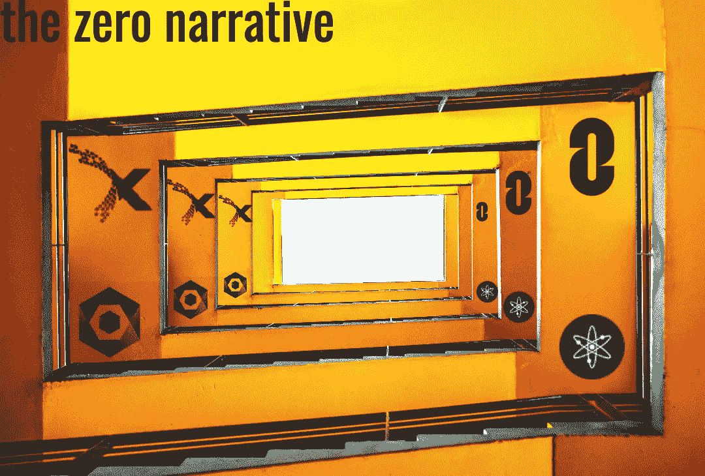

# Zero 是密码的未来吗？

> 原文：<https://medium.com/coinmonks/is-zero-the-future-of-crypto-246b2d1a14cd?source=collection_archive---------2----------------------->

Solana、AVAX 和 FTM 等第 1 层项目主导了 2020 年的牛市。第 0 层区块链互连会是下一个重头戏吗？

Image: PixTeller

# 加密层

叙事主导了密码空间。秘密“层”的概念无疑属于叙事范畴。

给加密项目分配“层”的概念大致基于开放系统…